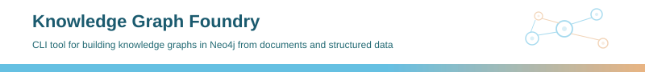

A CLI tool that reads your documents and builds a knowledge graph in Neo4j. Point it at a folder of PDFs, manuals, or data files - it extracts entities, relationships, and specifications, resolves duplicates across documents, and loads a queryable graph. No predefined schema required - the tool discovers the ontology from your data, or you can seed one to guide extraction.

Built as a simpler, CLI-driven alternative to [Neo4j LLM Graph Builder](https://github.com/neo4j-labs/llm-graph-builder).

## What It Does

**Input**: one or more files or directories (PDF, DOCX, TXT, MD, JSON, JSONL, CSV, XLSX)

**Output**: a Neo4j knowledge graph with entities, relationships, specifications, and provenance - queryable via Cypher

The pipeline:

1. **Parses** documents into text (PDF via pymupdf4llm, DOCX via python-docx)
2. **Chunks** text into overlapping token windows
3. **Extracts** entities and relationships from each chunk using an LLM (Claude, GPT-4, or any litellm-supported model)
4. **Resolves** duplicates - fuzzy name matching, embedding similarity, and Bayesian cross-type deduplication merge entities that refer to the same thing across documents
5. **Loads** the graph into Neo4j with APOC-based merge, vector and fulltext indexes, and provenance linking every entity back to its source chunk and document

The tool handles multi-document corpora where the same entities appear across files. A product mentioned in a datasheet, a user manual, and a brochure gets consolidated into one graph node with merged properties and multiple source references.


## Quick Start

```bash
# Install
make install

# Configure (Neo4j connection + LLM provider)
kgf init
# Edit .kgf/config.yml with your Neo4j and LLM credentials

# Ingest unstructured documents - PDF, TXT, MD, DOCX (default, --unstructured is implicit)
kgf ingest data/raw/ --batch --fluid

# Ingest structured data - JSON, JSONL, CSV, XLSX (automatic file type filtering)
kgf ingest data/raw/ --structured --batch --fluid

# Multiple inputs with repeatable --input / -i option
kgf ingest --input data/raw/ --input /other/docs/ --batch --fluid
kgf ingest -i file1.pdf -i file2.pdf -i data/raw/ --batch --fluid

# Query the graph
# Open Neo4j Browser at http://localhost:7474
# MATCH (p:Product)-[:HAS_SPECIFICATION]->(s:Specification) RETURN p.name, s.name, s.value, s.unit
```

## How Ontology Discovery Works

By default, KGF runs in **free extraction** mode - the LLM discovers entity types from your documents without constraints. As documents are processed, the tool tracks type frequencies, detects convergence, and builds an ontology as a side effect. After processing enough documents for the type distribution to stabilise, the schema "cures" (freezes) and remaining documents are extracted with type enforcement.

You can also **seed an ontology** in any format (OWL, YAML, markdown, plain text) to guide extraction from the start. The LLM normalises whatever format you provide into a canonical schema.

A `resolution_intent` in the config tells the LLM what the knowledge graph is for - "compare medical devices across manufacturers" or "map software architecture dependencies" - which dramatically improves extraction relevance from the first document.

## Configuration

Configuration uses `.kgf/config.yml` with `${ENV_VAR:default}` interpolation from `.env`:

```yaml
neo4j:
  uri: ${NEO4J_URI:bolt://localhost:7687}
  user: ${NEO4J_USERNAME:neo4j}
  password: ${NEO4J_PASSWORD:}

llm:
  provider: bedrock                          # bedrock | openai | anthropic
  model: eu.anthropic.claude-sonnet-4-20250514-v1:0
  temperature: 0.0                           # deterministic extraction
  timeout: 120                               # seconds per LLM call

extract:
  chunk_size: 2000                           # tokens per chunk
  chunk_overlap: 200                         # overlap between consecutive chunks
  concurrency: 4                             # parallel extraction threads
  use_embeddings: true                       # embedding-based entity resolution
  embedding_model: amazon.titan-embed-text-v2:0
  bayesian_resolution: true                  # Bayesian type inference
  deferred_dedup: true                       # accumulate cross-type evidence across docs

ontology_buffer:
  resolution_intent: "describe your use case here"
  flush_on_complete: true                    # write discovered ontology to disk

curing:
  enabled: true                              # fluid -> cured lifecycle
  min_documents: 3                           # docs before curing can trigger
  max_fluid_documents: 20                    # force-cure safety net
```

## Technical Details


### Entity Resolution

Entities are resolved across documents through multiple signals:
- **Levenshtein fuzzy matching** within the same type (configurable threshold)
- **Embedding cosine similarity** via FAISS for semantic matching
- **Bayesian cross-type deduplication** combining name identity prior, description similarity, embedding similarity, and co-occurrence evidence
- **Hierarchy-boosted resolution** where sibling types under a shared parent get elevated merge priors
- **Deferred dedup** accumulates evidence for ambiguous pairs across documents, resolving at curing time
- **LLM escalation** for high-entropy cases where statistical signals are inconclusive

### Curing and Convergence


The fluid-to-cured lifecycle uses statistical convergence detection:
- Jensen-Shannon divergence between consecutive type distributions
- Shannon entropy delta tracking
- Chao1 species richness estimation for type coverage
- Optional generative curing advisory with graph query tool for ambiguous decisions
- Post-cure drift detection with remap rate monitoring

### Event System

All pipeline decisions emit blinker signals to a JSONL event log (41 signal types across extraction, resolution, curing, loading) for post-run analysis and debugging.

### Supported Formats

Use `--unstructured` (default) or `--structured` to select the pipeline - the flags are mutually exclusive and file type filtering is automatic based on the chosen mode.

- **Unstructured** (`--unstructured`, default): PDF, TXT, MD, DOCX
- **Structured** (`--structured`): JSON, JSONL, CSV, XLSX with automatic schema inference
- **Ontology seeds**: OWL, YAML, JSON, markdown, plain text

## Technology Stack

- Python 3.12, uv package manager
- **LLM**: litellm + instructor (structured output with validation retry)
- **CLI**: typer
- **Parsing**: pymupdf4llm (PDF), python-docx (DOCX)
- **Chunking**: tiktoken
- **Graph**: neo4j driver, APOC procedures
- **Resolution**: python-Levenshtein, faiss-cpu, numpy, boto3 (embeddings)
- **Ontology**: owlready2 (OWL/RDF), pydantic (schema validation)
- **Events**: blinker (signal dispatch)

## Makefile Targets

- `make install` - create environment and install package
- `make test` - run tests (352 tests)
- `make lint` / `make format` - check / fix code style
- `make build` - build distributable wheel
- `make clean` - remove compiled files and caches

## Project Organization

```
├── kg_builder_cli/
│   ├── cli.py              <- CLI entry points (typer)
│   ├── config.py           <- Central module config, logger, paths
│   ├── settings/           <- YAML loading, defaults, env interpolation
│   ├── curing/             <- Fluid schema curing, metrics, drift detection
│   ├── extraction/         <- Parsing, chunking, LLM extraction, entity resolution
│   ├── loading/            <- Batch Cypher loading, indexes, validation
│   ├── ontology/           <- Ontology buffer, OWL import, hierarchy evolution
│   ├── events/             <- Blinker signals, event types, handlers
│   └── types/              <- Pydantic data models
├── tests/                  <- pytest test suite + benchmark scorecard
├── docs/
│   ├── KGF_DESIGN.md       <- Canonical design document
│   └── benchmarks/         <- Versioned benchmark results with forensics
├── data/
│   ├── raw/                <- Immutable source data
│   ├── interim/            <- Intermediate transforms
│   └── processed/          <- Final datasets
└── .kgf/                   <- Runtime config, evolved ontology, event logs
```

## References

- [Neo4j LLM Graph Builder](https://github.com/neo4j-labs/llm-graph-builder) - reference implementation for LLM-powered knowledge graph construction from unstructured data
- [CodeGraphContext](https://github.com/CodeGraphContext/CodeGraphContext) - code indexing and graph analysis platform using tree-sitter AST parsing with Neo4j/KuzuDB/FalkorDB backends
