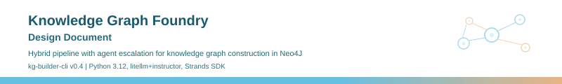

## 1. Introduction

kg-builder-cli is a Python CLI tool for building knowledge graphs from structured and unstructured data, loading them into Neo4J. It uses LLMs to identify entities and relationships, with optional ontology constraints to control graph structure. The pipeline executes as direct `litellm+instructor` single-shot calls for throughput, with Strands agents engaged at specific escalation points where adaptive evidence gathering improves decision quality. The tool is a simpler, CLI-driven alternative to the Neo4J LLM Graph Builder web application.

Where Neo4J LLM Graph Builder provides a web-based UI with minimal structured data support (treating everything as unstructured text), kg-builder-cli offers a terminal-first workflow with first-class support for both structured records and free-form documents. The hybrid architecture - direct pipeline execution with targeted agent escalation - enables adaptive ontology evolution and evidence-based resolution without imposing agent overhead on the hot extraction path.

**Key facts**:
- Python 3.12, uv package manager, litellm+instructor (pipeline), Strands Agents SDK (escalation)
- Three CLI commands: `kgf ingest`, `kgf query`, `kgf update`
- Supports PDF, TXT, MD, DOCX (unstructured) and JSON, JSONL, CSV, XLSX (structured)
- Adaptive ontology buffer that evolves during ingestion
- Ontology seeds in any format (OWL, YAML, JSON, markdown, plain text) with LLM normalization
- Neo4J graph database with dual indexing (vector + fulltext)
- Instructor/Pydantic for structured LLM output enforcement
- Agent memory for operational knowledge persistence across runs

## 2. System Architecture

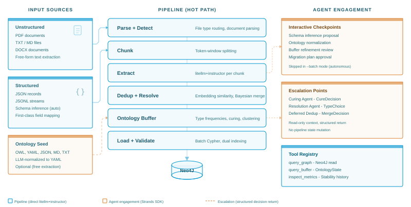

The system follows a hybrid architecture. Pipeline functions execute as direct `litellm+instructor` single-shot calls on the hot path, with Strands agents engaged at specific escalation points where adaptive evidence gathering improves decision quality. Three existing call sites convert to agents where benchmark forensics identified measurable quality gaps from hardcoded branching, plus one new agent-native command (`kgf query`).

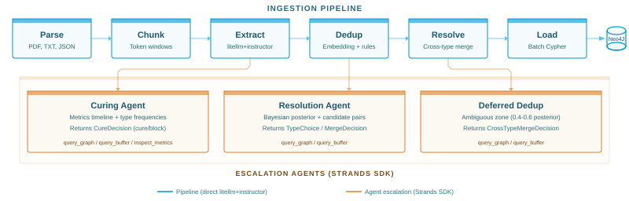

### Interactive vs Autonomous Agent Mode

Strands agents are invoked at interactive checkpoints and escalation points, returning structured decisions to the pipeline. Pipeline functions execute independently of the agent framework on the hot path - the `--batch` flag controls whether checkpoint decisions require user input or proceed autonomously.

- **Interactive mode** (default) - the pipeline pauses at defined checkpoints where the agent presents proposals, diagnostics, and Y/n confirmations. The user reviews and directs decisions through conversation: schema inference proposals, ontology normalization diagnostics, ontology buffer refinement reviews, migration plan approvals, and first-run initialization questions
- **Autonomous mode** (`--batch`) - the pipeline proceeds through interactive checkpoints without pausing. The agent returns decisions using sensible defaults, accepts proposals automatically, and the pipeline logs every autonomous decision to a run report for post-run review

Activities across the pipeline fall into two categories:

**Interactive checkpoints** (agent pauses in interactive mode, decides autonomously in batch mode):
- Schema inference proposal and confirmation (Section 7.3)
- Ontology normalization diagnostic and confirmation (Section 5.2)
- Ontology buffer refinement review (Section 5.5)
- Migration plan approval (Section 11.3)
- First-run initialization questions (Section 3)

**Direct execution** (no agent interaction in either mode):
- Document parsing, chunking, schema signal extraction
- LLM extraction per chunk, atomic facts extraction
- Entity deduplication, entity resolution
- Ontology buffer accumulation (type frequencies, variant detection)
- Batch Cypher loading, index creation
- Post-load validation, ontology buffer flush

Individual pipeline functions (parse, chunk, extract, dedup, resolve, load) are importable and testable independently of the agent framework. The pipeline orchestrates their sequencing. Agents handle interactive checkpoints and escalation decisions, but the pipeline functions themselves are deterministic and agent-independent.

### Batch Decision Logging

In autonomous mode (`--batch`), all decisions the agent makes at interactive checkpoints are logged to a run report at `.kgf/runs/<timestamp>.yml`. The report captures:
- Schema inferred (Y/N) with summary of proposed and accepted schema
- Ontology normalization tier used (1/2/3) with diagnostic output
- Refinement decisions applied (types promoted, variants merged, candidates pruned)
- Validation results (orphan counts, coverage scores, type distribution)
- Escalation invocations (curing, type resolution, deferred dedup) with call_type, model, duration, token counts, structured decision, and reasoning
- Escalation failures with error type and message

### Scale and Performance Targets

The architecture targets small-to-medium scale knowledge graph construction:

- **Document volume**: 10-10,000 documents per graph
- **Entity volume**: 1,000-100,000 entities per graph
- **Chunk throughput**: limited by LLM API rate limits (concurrency default 4)
- **Loading throughput**: 500-entity batches, typically 1,000-5,000 entities/second depending on Neo4J configuration

At larger scales (100,000+ documents, 1M+ entities), architectural changes would be needed: streaming extraction instead of in-memory accumulation, distributed entity resolution with ANN indexing, and incremental loading with write-ahead logs. These are out of scope for v1.

### Non-Goals (v1)

The following are explicitly out of scope for v1:

- Not distributed ingestion - single-machine, single-process pipeline
- Not internet-scale graph construction - targets 10-10,000 documents, not millions
- Not multi-backend - Neo4j only, no pluggable graph database abstraction
- Not perfect ontology before first run - the system is designed to discover and evolve schema
- Not real-time streaming - batch ingestion with optional interactive checkpoints
- Not multi-tenant - single graph per Neo4j database, no user isolation

### Mode Compatibility Matrix

Several modes interact across the pipeline. The table below defines allowed combinations and behavior at intersections.

| Mode A | Mode B | Compatible | Behavior |
|--------|--------|------------|----------|
| `--batch` | `--fluid` | Yes | Fluid phase runs autonomously, curing decisions logged to run report |
| `--batch` | `--ontology seed.yml` | Yes | Seeded extraction with autonomous decisions at checkpoints |
| `--fluid` | `--ontology seed.yml` | Yes | Seed types pre-loaded as priors in the ontology buffer, fluid discovery continues beyond seed. See Section 14.3 entry scenarios |
| `--fluid` | `--cure` | Yes | Force-cures after first document (useful for testing) |
| `--fluid` | `extraction_mode: graph_reader` | Yes | Curing tracks entity/relationship type stability only (FactNodes not tracked) |
| `--fluid` | `extraction_mode: hybrid` | Yes | Curing tracks entity/relationship types; facts pass through to consolidation |
| `--fluid` | `use_embeddings: true` | Yes | Embeddings generated per-document during fluid phase, used during consolidation resolution |
| `--ontology seed.yml` | `extraction_mode: *` | Yes | All extraction modes work with ontology seeds |
| interactive | `--fluid` | Yes | Curing event shown to user for confirmation before flush |
| `--batch` | `--cure` | Yes | Force-cure without user confirmation |

**Key rules**:
- Fluid curing with an ontology seed uses the seed as a prior - types from the seed get elevated initial signals in the ontology buffer, but the LLM can still discover additional types from data (Section 14.3)
- `graph_reader` mode extracts FactNodes alongside entities - curing detection only monitors entity and relationship types, not fact stability
- All extraction modes (`entity_relationship`, `graph_reader`, `hybrid`) work in both seeded and free extraction, with or without fluid curing

### Reference Benchmark Dataset

All performance and quality evaluation uses a single reference dataset: 23 PDF documents about CPAP (Continuous Positive Airway Pressure) devices, stored at `data/external/cpap-datasheets-and-manuals.zip` (~63 MB). The collection covers datasheets, product brochures, user manuals, clinical guides, and product catalogues from multiple manufacturers - providing variety in document structure, page count, and content density.

The dataset remains zipped in `data/external/` and is extracted to `data/raw/cpap-benchmark/` only during benchmark runs. Raw data is never modified.

#### Performance Metrics

Each benchmark run records timing and throughput for every pipeline stage:

- **Parse** - wall time per document, pages parsed, images extracted
- **Chunk** - chunks produced per document, average chunk token count
- **Extract** - wall time per chunk, LLM calls, tokens consumed (input + output), entities and relationships per chunk
- **Dedup/Resolve** - candidate pairs evaluated, merges performed, wall time
- **Load** - batches sent, entities/second, relationships/second, total Neo4J transaction time
- **End-to-end** - total wall time from `kgf ingest` invocation to completion, peak memory usage

Results are saved to `.kgf/runs/<timestamp>_benchmark.yml` alongside the standard batch decision log. The `--benchmark` flag on `kgf ingest` enables extended timing instrumentation.

#### Quality Metrics

Quality evaluation measures the graph output against the source documents:

- **Entity coverage** - ratio of domain-relevant concepts in the source documents that appear as entities in the graph (manual spot-check against a curated entity list per document)
- **Relationship accuracy** - sample of 50 relationships checked against source text for correctness (true positive rate)
- **Duplicate rate** - percentage of entity pairs in the graph that refer to the same real-world concept (lower is better, measured after resolution)
- **Ontology coherence** - percentage of entity types in the graph that map to confirmed ontology types vs `NEW_`-prefixed types
- **Confidence distribution** - histogram of confidence scores across entities and relationships, flagging bimodal or uniformly high distributions as suspect

Quality results are saved to `.kgf/runs/<timestamp>_quality.yml`. A baseline quality profile is established on the first benchmark run and subsequent runs compare against it to detect regressions.

#### Benchmark Workflow

Running the benchmark is a single command:

```
kgf ingest data/raw/cpap-benchmark/ --benchmark --batch
```

This runs the full pipeline in autonomous mode with extended instrumentation. The benchmark flag adds timing hooks around each pipeline stage and produces both performance and quality output files. Quality metrics that require manual evaluation (entity coverage spot-check, relationship accuracy sampling) are flagged in the output for human review.

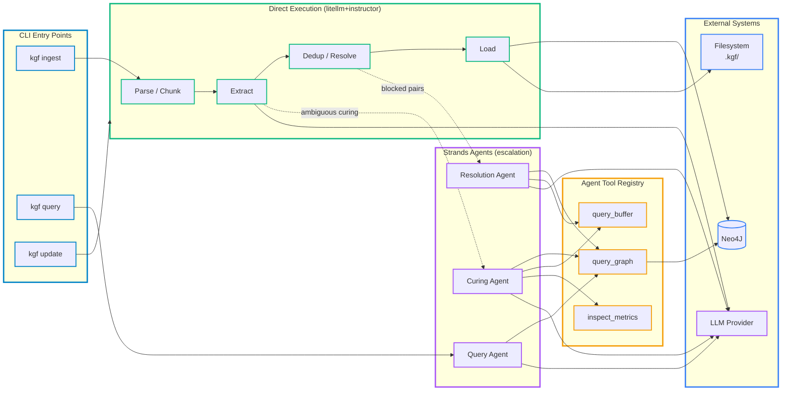

The CLI layer is thin - typer parses arguments and invokes pipeline functions directly. The pipeline runs as sequential single-shot `litellm+instructor` calls with no agent overhead on the hot path. Strands agents are spawned only at specific escalation points where the current hardcoded branching limits decision quality, and for the `kgf query` command which is naturally conversational.

### LLM Engagement Matrix

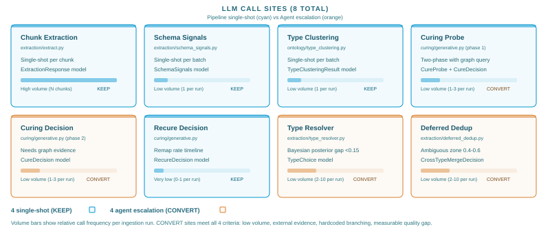

Seven call sites in the pipeline use LLM inference. Four remain single-shot `litellm+instructor` calls; three convert to Strands agents where benchmark forensics identified quality gaps from hardcoded branching.

| Call Site | LLM Call | Strands Agent | Volume/Run |
|-----------|:--------:|:-------------:|------------|
| Chunk extraction | Yes | No | ~159 |
| Type clustering | Yes | No | 1 |
| Schema signals | Yes | No | 1/doc |
| Generative curing | No | **Yes** | 1-6 |
| Type resolver | No | **Yes** | 5-15 |
| Deferred dedup | No | **Yes** | 2-10 |
| kgf query | No | **Yes** | On-demand |

| Call Site | Module | Rationale |
|-----------|--------|-----------|
| Chunk extraction | `extraction/extract.py` | Hot path, no tools needed, structured output sufficient |
| Type clustering | `curing/type_clustering.py` | One-shot semantic merge, no external evidence required |
| Schema signals | `extraction/schema_signals.py` | Lightweight pre-pass, no decision branching |
| Generative curing | `curing/generative.py` | Hand-coded ReAct loop with `_is_ambiguous_for_query()` gate, needs flexible tool use |
| Type resolver | `extraction/type_resolver.py` | Hardcoded evidence gates limit quality; 15 blocked pairs at posteriors 0.45-0.60 |
| Deferred dedup | `extraction/deferred_dedup.py` | Same blocked-pair pattern, accumulated evidence needs adaptive querying |
| kgf query | new | Natural agent use case - multi-turn conversational Cypher generation |

### Agent Conversion Criteria

A call site converts from single-shot to Strands agent only when all four conditions hold:

1. **Low volume** - fewer than 20 calls per ingestion run (agent spawn overhead acceptable)
2. **External evidence required** - the decision improves with access to graph state, buffer contents, or metrics history
3. **Hardcoded branching** - the current implementation uses manual if/else dispatch that limits the LLM's ability to gather the evidence it needs
4. **Measurable quality gap** - benchmark forensics identified specific failures traceable to the hardcoded pattern (blocked pairs, missed curing windows, ambiguous classifications)

Call sites that fail any condition remain single-shot. Chunk extraction fails conditions 1-3 (high volume, no tools needed, no branching). Type clustering fails conditions 2-3. Schema signals fails condition 2.

### Targeted Agents

Three pipeline escalation agents plus one new command agent. Each agent has a focused tool set and returns structured output via Pydantic models.

**Curing Agent** - replaces the two-phase flow in `curing/generative.py` where `llm_should_cure()` manually constructs a `CureProbe`, checks `_is_ambiguous_for_query()`, optionally queries the graph, then makes a second LLM call for `CureDecision`. The agent receives metrics timeline and type frequencies as system context, then autonomously decides whether to gather additional evidence from the graph or buffer before returning a `CureDecision` to the pipeline.

- **Tools**: `query_graph`, `query_buffer`, `inspect_metrics`
- **Structured output**: `CureDecision` (action: cure/block, confidence, reasoning)
- **Replaces**: `_is_ambiguous_for_query()` gate, manual two-phase dispatch, `CureProbe` intermediate model
- **Invocation**: from `cli.py._ingest_fluid()` when generative curing is enabled and metric-based check is inconclusive

**Resolution Agent** - replaces `type_resolver._llm_resolve()` and `deferred_dedup._llm_resolve_pair()` where the LLM receives a fixed context window and cannot request additional evidence about entity relationships or type distributions. The agent receives a candidate pair with Bayesian posterior and can query the graph for relationship patterns, co-occurrence, and type exemplars before deciding.

- **Tools**: `query_graph`, `query_buffer`
- **Structured output**: `TypeChoice` (for type resolution) or `CrossTypeMergeDecision` (for deferred dedup)
- **Replaces**: fixed-context LLM calls in `_llm_resolve()` and `_llm_resolve_pair()`
- **Invocation**: from `type_resolver` when posterior gap < 0.15 between top candidates; from `deferred_dedup.resolve_all()` for pairs in the ambiguous zone (0.4-0.6 posterior)

**Query Agent** - new `kgf query` command providing multi-turn conversational graph exploration. The agent receives the current graph schema and maintains conversation history for follow-up queries, generating Cypher from natural language and presenting results.

- **Tools**: `query_graph` (with schema introspection mode)
- **Structured output**: none (conversational)
- **Invocation**: `kgf query` CLI command

### Agent Tool Registry

Three read-only tools wrapping existing functions. All tools are stateless and safe to call in any order. Escalation agents must not mutate pipeline state - they receive read-only context and return structured decisions (`CureDecision`, `MergeDecision`, `TypeChoice`) that the calling pipeline function applies.

| Tool | Wraps | Used By | Returns |
|------|-------|---------|---------|
| `query_graph` | `graph_query.query_graph()` | Curing, Resolution, Query agents | `GraphQueryResult` (entity counts, relationship patterns, entity search results) |
| `query_buffer` | `buffer.snapshot()` | Curing, Resolution agents | `OntologyState` (type frequencies, exemplars, hierarchy, resolution guide, coverage) |
| `inspect_metrics` | Stability metrics history | Curing agent | Metrics timeline (JSD, entropy delta, Chao1 coverage, type accumulation rate per document) |

## 3. CLI Commands

The CLI exposes three entry points. `kgf ingest` and `kgf update` execute pipeline functions directly, with Strands agents engaged at interactive checkpoints and escalation points. `kgf query` is fully agent-native for conversational graph exploration.

### `kgf ingest`

Build the knowledge graph from source data. Handles initialization, extraction, loading, and schema inference as a unified workflow.

```
kgf ingest [<source>] [--input <path>]... [--structured | --unstructured] [options]
```

| Option | Default | Description |
|--------|---------|-------------|
| `[<source>]` | optional | Positional path to file or directory (backward-compatible shorthand) |
| `--input` / `-i` | none | Path to file or directory; repeatable to specify multiple inputs (e.g. `-i file1.pdf -i data/raw/`) |
| `--structured` | `False` | Use structured pipeline (JSON, JSONL, CSV, XLSX); mutually exclusive with `--unstructured` |
| `--unstructured` | `True` | Use unstructured pipeline (PDF, TXT, MD, DOCX); default when neither flag is set; mutually exclusive with `--structured` |
| `--schema` | from config | Path to schema description file for structured data |
| `--infer-schema` | `False` | Force schema inference even if schema exists |
| `--ontology` | from config | Path to ontology YAML file (free extraction if omitted) |
| `--model` | from config | LLM model identifier |
| `--chunk-size` | from config | Token chunk size for document splitting (unstructured only) |
| `--chunk-overlap` | from config | Token overlap between chunks (unstructured only) |
| `--concurrency` | from config | Parallel LLM requests |
| `--merge-strategy` | from config | How to handle existing nodes: `merge`, `replace`, `skip` |
| `--batch-size` | from config | Cypher batch size for bulk loading |
| `--extract-only` | `False` | Run extraction without loading into Neo4J |
| `--batch` | `False` | Autonomous mode - agent makes all decisions without prompting |
| `--keep-extractions` | `False` | Save extraction JSON to `.kgf/extractions/` |

**Workflow**:

The ingest workflow executes the pipeline directly: detect input type, extract entities and relationships, deduplicate, normalize, and load into Neo4J. Strands agents engage only at interactive checkpoints and escalation points.

- **Initialization**: three scenarios depending on current state (see Section 14.3 for full entry scenario matrix):
  - **No `.kgf/`, no graph** - fresh setup. The pipeline creates `.kgf/` with default `config.yml`, `schemas/`, `extractions/`, `memory/`, `migrations/`, and `runs/` directories. In interactive mode the initialization checkpoint asks questions about the target graph and generates tailored configuration
  - **No `.kgf/`, graph exists** - recovery. The pipeline introspects the Neo4J graph (labels, relationship types, property keys, `OntologyType` nodes, `SchemaVersion` nodes) and reconstructs the schema and ontology YAML files. Presents the recovered schema to the user: "recovered schema from existing graph with N entity types and M relationship types"
  - **`.kgf/` exists, graph exists** - validation. The pipeline compares the schema file against the current graph state and reports drift: new labels in graph not in schema, properties on entities not described in schema, `SchemaVersion` mismatches. Drift is reported as warnings, not errors
- **Input detection**: pipeline mode is controlled by `--structured` / `--unstructured` (default). File type filtering is automatic - structured mode accepts extensions defined in `STRUCTURED_EXTENSIONS` (JSON, JSONL, CSV, XLSX), unstructured mode accepts extensions defined in `UNSTRUCTURED_EXTENSIONS` (PDF, TXT, MD, DOCX). Files not matching the active mode are skipped with a warning
- **Schema inference**: for structured data without `--schema`, the pipeline samples records directly, proposes a schema at the interactive checkpoint, and saves it to `.kgf/schemas/` before proceeding (see Section 7.3)
- **Ontology buffer**: without `--ontology` the pipeline runs free extraction, building the ontology progressively. With `--ontology` it starts constrained but refines during processing. The buffer tracks type frequencies, variant mappings, and coverage scores (see Section 5)
- **Extract + load**: by default the pipeline extracts and loads in a single run. Use `--extract-only` to stop after extraction, or `--keep-extractions` to save intermediate JSON alongside loading

### `kgf query`

Query the knowledge graph using natural language or Cypher.

```
kgf query [question] [options]
```

| Option | Default | Description |
|--------|---------|-------------|
| `[question]` | none | Natural language question (interactive mode if omitted) |
| `--cypher` | `False` | Pass raw Cypher instead of natural language |
| `--format` | `table` | Output format: `table`, `json`, `graph`, `text` |
| `--limit` | `25` | Maximum result rows |

**Workflow**:

The query agent translates natural language questions to Cypher queries using the current graph schema as context. It queries the graph via the `query_graph` tool, formats results, and can enter an interactive conversational loop where follow-up questions build on previous context.

- **Schema-aware** - the agent inspects the graph schema (labels, relationship types, property keys) before generating queries, ensuring valid Cypher
- **Dual retrieval** - uses vector index for semantic similarity and fulltext index for keyword matching, choosing the appropriate path based on the question type
- **Interactive mode** - when invoked without a question, enters a conversational loop where the agent maintains context across questions. "Show me all engineers" followed by "what skills do they have?" works as expected
- **Status** - `kgf query --status` displays node counts by label, relationship counts by type, and index statistics

### `kgf update`

Evolve the knowledge graph - update schemas, run migrations, re-process data, and refine the ontology.

```
kgf update <subcommand> [options]
```

#### `kgf update schema`

Update an existing schema for structured data.

```
kgf update schema <schema-file> [options]
```

| Option | Default | Description |
|--------|---------|-------------|
| `<schema-file>` | required | Path to the schema file to update |
| `--source` | from config | Data source to re-sample for schema comparison |
| `--dry-run` | `False` | Show proposed changes without applying |
| `--migrate` | `True` | Generate and execute migration plan for the graph |

The update workflow diffs the current schema against fresh data samples, proposes changes at the interactive checkpoint, and optionally generates a migration plan for the existing graph.

#### `kgf update ontology`

Refine the ontology based on accumulated extraction evidence.

```
kgf update ontology [options]
```

| Option | Default | Description |
|--------|---------|-------------|
| `--source` | from config | Re-process source data to gather fresh type evidence |
| `--prune` | `False` | Remove low-frequency types that did not reach confirmation threshold |
| `--merge-variants` | `True` | Apply variant detection to consolidate similar types |

Triggers an ontology refinement pass using the buffer's accumulated frequency and coverage data. Can optionally re-process source data to gather fresh evidence.

#### `kgf update graph`

Re-process previously ingested data with updated schema or ontology.

```
kgf update graph [options]
```

| Option | Default | Description |
|--------|---------|-------------|
| `--source` | from config | Data source to re-ingest |
| `--schema` | from config | Updated schema to apply |
| `--incremental` | `True` | Only process records affected by schema changes |
| `--full` | `False` | Re-process all records from scratch |

The update workflow uses the migration plan from `kgf update schema` to selectively re-process affected records rather than re-ingesting everything. For structural changes (new entity types, relationship retyping), the pipeline executes Cypher transformations directly against Neo4J. The Strands agent engages only at the migration plan approval checkpoint.

## 3.1 Terminal UI Harness

The CLI renders all output through a terminal UI harness built with `textual` (Textualize). The harness replaces plain loguru terminal output with a structured layout that provides live pipeline visibility and interactive agent communication.

### Layout

Three-panel design:

- **Left panel (chat/log)** - scrollable area showing agent messages, pipeline progress, and user interaction. In interactive mode, accepts user input at interactive checkpoints. In autonomous mode (`--batch`), becomes a read-only scrolling log of autonomous decisions and pipeline progress
- **Top-right panel (live stats)** - updated per-chunk and per-document. Counters: documents processed (N/M), chunks processed, entities extracted (running total), relationships extracted, facts extracted, coverage score (current), LLM calls made, tokens consumed, elapsed time
- **Bottom-right panel (ontology buffer)** - current buffer state showing confirmed types with frequency counts, pending candidates, variant mappings. Updated after each document's feedback loop

### Interactive Mode

The chat panel accepts user input at interactive checkpoints. The agent presents proposals, diagnostics, and Y/n prompts inline. The user types responses directly in the chat panel. Between checkpoints, the panel shows pipeline progress messages.

### Autonomous Mode

The chat panel becomes a scrolling log of autonomous decisions and pipeline progress. No input accepted - the panel is read-only. Each autonomous decision is prefixed with `[AUTO]` for visual distinction.

## 4. Resource Directory and Configuration

### `.kgf/` Directory Structure

The CLI operates on a `.kgf/` directory that lives in the target project (not in the CLI tool's own repository). Any project that wants to build a knowledge graph creates this folder containing all resources the CLI needs.

```
my-project/
  .kgf/
    config.yml              # main configuration (Neo4J connection, LLM settings, defaults)
    ontology.yml            # ontology definition (optional)
    schemas/                # schema descriptions for structured data
      employees.md
      products.yml
    extractions/            # extraction output files
      2026-03-09_document.json
      2026-03-09_records.json
    memory/                 # agent memory (data profiles, user preferences, resolution history)
      source_employees.yml
      source_documents.yml
    migrations/             # schema migration history
      2026-03-09_employees_v2.yml
    runs/                   # batch mode run reports (autonomous decision logs)
      2026-03-09T14-30-00Z.yml
  data/
    raw/
      documents/
      records.jsonl
```

The CLI looks for `.kgf/` in the current working directory. All paths in `config.yml` are relative to the project root unless absolute.

### `config.yml` Reference

```yaml
# Neo4J connection
neo4j:
  uri: bolt://localhost:7687
  user: neo4j
  password: \${NEO4J_PASSWORD}       # resolved from .env or environment

# LLM settings
llm:
  provider: bedrock                  # bedrock | openai | anthropic
  model: us.anthropic.claude-sonnet-4-20250514
  temperature: 0.0
  region: eu-central-1               # AWS region (bedrock only)
  profile: default                   # AWS profile (bedrock only)

# Extraction defaults
extract:
  chunking_strategy: token            # token | semantic
  chunk_size: 2000                   # token chunk size (unstructured only, token strategy)
  chunk_overlap: 200                 # token overlap between chunks (unstructured only, token strategy)
  concurrency: 4                     # parallel LLM requests
  extraction_mode: hybrid             # entity_relationship | graph_reader | hybrid
  subgraph_splitting: false           # split large schemas into subgraph extractions per chunk
  rolling_context_window: 0           # pass N most recent extractions as context for sequential chunks
  evidence_spans: false               # request character offsets (start, end) into chunk text for each extracted element
  source_frequency: false             # count independent chunks and documents corroborating each triple
  describe_images: false              # run vision model on extracted PDF images
  vision_model: null                  # vision model for image description (e.g., llava:7b, gpt-4o)
  use_embeddings: false               # generate entity embeddings for semantic resolution
  embedding_model: amazon.titan-embed-text-v2:0  # embedding model ID
  resolution_threshold: 0.85         # Levenshtein threshold for fuzzy entity resolution
  name_threshold: 0.65               # name similarity threshold (when embeddings enabled)
  embedding_threshold: 0.80          # cosine similarity threshold (when embeddings enabled)

# Ontology buffer settings
ontology_buffer:
  seed_from: null                    # ontology seed file in any format (OWL, JSON, MD, TXT, YAML)
  intent: null                       # free-text use case guiding ontology inference and extraction
  seed_depth: 2                      # max subclass depth to import from OWL
  seed_filter: null                  # restrict OWL import to branch (e.g., "BiologicalEntity")
  refine_every_n_docs: 5             # trigger refinement after N documents
  coverage_threshold: 0.5            # low coverage triggers looser extraction
  min_frequency_to_confirm: 2        # type must appear in N+ documents to be confirmed
  min_frequency_to_emerge: 1         # type appears in constrained prompt immediately after first discovery
  flush_on_complete: true            # write refined ontology to disk after run
  post_load_reasoning: false          # run OWL reasoning / Cypher subclass propagation after loading

# Schema curing (fluid-to-stable ontology evolution)
curing:
  enabled: false                      # enable two-phase fluid/cured ingestion
  min_documents: 3                   # minimum docs before curing can trigger
  max_fluid_documents: 20            # force-cure failsafe after N docs
  coverage_delta_threshold: 0.05     # coverage must stabilize below this delta
  stability_window: 3                # consecutive docs with no new types required
  auto_cure: true                    # automatically cure when conditions met

# Loading defaults
load:
  merge_strategy: merge              # merge | replace | skip
  batch_size: 500                    # Cypher batch size for bulk loading
  create_indexes: true               # auto-create indexes for entity labels
  validate: true                     # run post-load validation checks (orphan nodes, relationship counts)

# Agent memory
memory:
  enabled: true                      # persist operational knowledge across runs
  max_entries_per_source: 100        # cap memory entries per data source
  ttl_days: 90                       # expire stale memory entries after N days

# Paths (relative to project root)
paths:
  ontology: null                     # path to ontology YAML (free extraction if null)
  schema: null                       # path to schema description for structured data
  memory: .kgf/memory/        # agent memory storage directory
  migrations: .kgf/migrations/ # schema migration history
```

### Resolution Order

Configuration resolution follows highest-wins precedence:

1. CLI flags (`--chunk-size 4000`)
2. `.kgf/config.yml` values
3. Built-in defaults

### Secrets

Secrets use `\${VAR_NAME}` syntax and are resolved from `.env` (loaded by `python-dotenv`) or environment variables. The YAML file itself should never contain plaintext secrets.

`.env` (secrets only):

```env
NEO4J_PASSWORD=secret
AWS_ACCESS_KEY_ID=...               # optional, if not using AWS profile
AWS_SECRET_ACCESS_KEY=...           # optional, if not using AWS profile
```

### Data Sources

The graph builder accepts two categories of input data, determined automatically by file extension.

**Unstructured data** - free-form text documents (PDF, TXT, MD, DOCX). The LLM extracts entities and relationships generatively by chunking the text and interpreting each chunk to produce graph triples.

**Structured data** - JSON or JSONL files containing records that follow a known schema. The schema is described in a separate schema description file (markdown, YAML, or plain text) that the LLM interprets generatively to understand field meanings, entity mappings, and relationship patterns. The `--schema` option points to this description file. For structured data, chunking options (`--chunk-size`, `--chunk-overlap`) do not apply - each JSON record (or batch of records) is sent to the LLM as a discrete unit alongside the schema description.

## 5. Ontology System

The ontology system governs what entity types, relationship types, and property schemas the extraction pipeline recognizes. It supports three modes of operation: free extraction (no ontology, types discovered from data), constrained extraction (ontology loaded at start), and seeded extraction (domain knowledge provided in any format as a suggestive starting point). All modes converge through the ontology buffer, which evolves during ingestion.

### 5.1 Sources and Format Detection

The ontology buffer accepts input in any format - the only requirement is that the input conveys domain knowledge about entity types, relationships, or graph structure. The system normalizes all inputs to the canonical YAML ontology format before the buffer consumes them.

| Format | Detection | Normalization method |
|--------|-----------|---------------------|
| OWL/RDF (`.owl`, `.rdf`, `.ttl`) | File extension | Programmatic via owlready2 - classes, properties, hierarchy extracted directly |
| YAML (`.yml`, `.yaml`) | File extension | Validated against canonical schema, passed through if conforming |
| JSON (`.json`) | File extension | Programmatic parse (Tier 1), LLM repair if validation fails (Tier 2) |
| Markdown (`.md`) | File extension | LLM interprets prose, extracts entity types, relationships, constraints |
| Plain text (`.txt`) | File extension | LLM interprets free-form description, extracts ontology elements |
| Any other | Fallback | LLM reads content as-is, attempts ontology extraction |

**Source precedence** (highest wins):

1. **Ontology seed** (`ontology_buffer.seed_from`): any file in any supported format. The system detects the format and normalizes accordingly. Read-only input - never modified. **The seed is suggestive, not prescriptive** - it provides starting vocabulary and domain context, but extraction is free to discover types and connections the seed did not anticipate
2. **YAML ontology** (`paths.ontology`): the canonical application schema. If both seed and YAML are provided, the YAML takes precedence for overlapping type definitions
3. **Empty** (free extraction): no seed, no YAML. The buffer starts empty and builds the ontology from scratch

After the run completes, the refined ontology is always flushed as YAML to `.kgf/ontology.yml` regardless of the original source format.

### 5.1a Use Case Intent

The `ontology_buffer.intent` field accepts free-text describing the primary purpose of the knowledge graph. This intent guides every stage of ontology construction and extraction - from seed normalization through type discovery to entity resolution.

When an intent is provided, the system injects it into LLM prompts at three points: ontology normalization (Tier 2 and Tier 3 prompts receive the intent so the LLM prioritizes types and relationships relevant to the use case), extraction prompts (the intent shapes what the LLM considers noteworthy in each chunk), and type clustering at curing time (the LLM evaluates discovered types against the stated purpose when deciding which types to merge or preserve).

The intent is especially critical during the first documents when the ontology is being discovered from scratch. Without intent, the LLM invents ad-hoc types that fragment the graph (33 emergent types for a domain that needs 8-12). With intent, even the free prompt (used for doc 1 before any types are discovered) produces domain-appropriate types - doc 1 discovers all final types with 0 new types needed from doc 2 onwards, because the intent steers extraction toward the right categories from the start.

Without an intent, extraction operates in general-purpose mode - capturing all entity types and relationships the LLM identifies without domain-specific prioritization.

**Example** (CPAP device benchmark dataset):

```yaml
ontology_buffer:
  intent: >-
    Quantitatively and qualitatively compare CPAP devices to allow patients
    and doctors to choose the device best suited to their needs, and to
    diagnose issues related to sleep apnea treatment.
  seed_from: null
```

This intent steers the system toward extracting technical specifications (pressure ranges, noise levels, humidifier capacity), clinical parameters (AHI thresholds, leak detection sensitivity), comfort features (mask compatibility, ramp settings), and comparative dimensions (weight, size, power consumption) - rather than generic entities like manufacturer addresses or regulatory body names that would dominate in general-purpose extraction.

### 5.2 Three-Tier Normalization Pipeline

All non-YAML, non-OWL inputs pass through a normalization pipeline that converts domain knowledge into the canonical YAML ontology format. The end goal is a functioning ontology tree that is proper, acyclic, and ready to be enhanced during generative discovery. The pipeline uses three tiers of increasing LLM involvement, selecting the cheapest tier that succeeds for each input format.

**What the normalizer extracts**:
- Entity types with descriptions and aliases
- Relationship types with source/target constraints
- Property schemas with types and validation rules
- Type hierarchies (parent-child, IS_A relationships)
- Constraints and cardinality hints

#### Tier 1 - Programmatic Parse

For JSON and other structured formats, the normalizer executes a format-specific parser directly in Python. The parser extracts entity types, relationship types, properties, and hierarchy from the input. If the parser fails, it iterates - adjusts parsing logic, retries up to 3 attempts. This handles well-structured inputs without LLM involvement.

Tier 1 is the default path for JSON, YAML-like structures, and any input with recognizable programmatic structure. The normalizer examines the input, runs the parser, and validates the output against the canonical Pydantic schema.

#### Tier 2 - LLM-Assisted Repair

If Tier 1 succeeds but validation fails (cycles in IS_A hierarchy, dangling relationship targets, orphan types, inconsistent constraints, incomplete property schemas), the LLM receives only the specific issues for targeted repair - not the entire input for re-interpretation. Surgical fixes: "these types form a cycle, which edge to remove?" or "this relationship references type X which does not exist, should it be created or is this a variant?"

Hallucination risk is minimal because the LLM is constrained to fixing validated issues, not generating an ontology from scratch. The repair prompt includes the full parsed ontology for context but asks only about the specific validation failures.

#### Tier 3 - Full LLM Interpretation

For markdown, plain text, prose descriptions, or formats where all Tier 1 parsing attempts failed, the LLM interprets the whole input. This is the most expensive path with the highest hallucination risk. The LLM receives the raw input alongside the canonical YAML schema definition (as a Pydantic model) and instructions to map every identifiable domain concept to the schema. Instructor enforces the output structure with retry on validation failure. The normalizer is conservative - it only emits types and relationships it can confidently identify from the input. Ambiguous concepts are flagged with `confidence: low` for user review.

Post-normalization validation compares output against source to flag potential hallucinations: type count mismatch (LLM produced significantly more types than the source text mentions), relationship types not mentioned in source text, and property schemas with no textual basis.

#### Diagnostic Output

After any tier completes, the engine outputs a diagnostic report:
- Source format detected (JSON, markdown, plain text, etc.)
- Tier used (1, 2, or 3)
- Entity types extracted (count)
- Relationship types extracted (count)
- Hierarchy depth
- Validation issues found and how resolved (cycles removed, missing targets created, variants merged)

In interactive mode, the diagnostic is presented to the user with a continue Y/n prompt. In autonomous mode (`--batch`), the diagnostic is logged to the run report and auto-accepted.

**Worked example** - a markdown file describing a healthcare domain (Tier 3):

```markdown
Patients visit hospitals and are treated by doctors. Each patient has a diagnosis
which links to a condition from the ICD-10 catalogue. Doctors specialize in one or
more medical fields. Medications are prescribed for specific conditions.
```

Normalizes to:

```yaml
entity_types:
  - name: Patient
    description: A person receiving medical care
    source: seed_normalized
    confidence: high
  - name: Hospital
    description: A healthcare facility where patients are treated
    source: seed_normalized
    confidence: high
  - name: Doctor
    description: A medical professional who treats patients
    source: seed_normalized
    confidence: high
  - name: Condition
    description: A medical condition or diagnosis from ICD-10
    source: seed_normalized
    confidence: high
  - name: Medication
    description: A pharmaceutical prescribed for conditions
    source: seed_normalized
    confidence: high
  - name: MedicalField
    description: A medical specialty area
    source: seed_normalized
    confidence: medium

relationship_types:
  - name: VISITS
    source: Patient
    target: Hospital
  - name: TREATED_BY
    source: Patient
    target: Doctor
  - name: HAS_DIAGNOSIS
    source: Patient
    target: Condition
  - name: SPECIALIZES_IN
    source: Doctor
    target: MedicalField
  - name: PRESCRIBED_FOR
    source: Medication
    target: Condition
```

Diagnostic output: `Tier 3 | 6 entity types | 5 relationship types | depth 1 | 0 validation issues`

The normalized output is presented to the user for review before being loaded into the buffer (interactive checkpoint). The user can adjust, add, or remove types in the interactive session. Once confirmed, the normalized ontology is saved alongside the original source file for auditability.

### 5.3 OWL/RDF Programmatic Import

When the seed is an OWL/RDF file, owlready2 extracts the ontology programmatically without LLM involvement:

| OWL concept | Maps to | Notes |
|-------------|---------|-------|
| `owl:Class` | entity type | Name from class, description from `rdfs:comment` |
| `rdfs:subClassOf` | type hierarchy | Used for prompt context, depth limited by `seed_depth` |
| `owl:ObjectProperty` | relationship type | `rdfs:domain` -> source type, `rdfs:range` -> target type |
| `owl:DatatypeProperty` | property schema | Attached to the entity type from `rdfs:domain` |
| `owl:TransitiveProperty` | relationship flag | Marked for post-load inference via reasoner |
| `owl:disjointWith` | advisory warning | Logged when violated, not enforced - data may bridge OWL boundaries |

Large reference ontologies (NCIt has 170,000+ classes, SNOMED has 350,000+) are not suitable for direct use as extraction constraints. The `seed_depth` and `seed_filter` parameters ensure only a manageable subset is imported.

The seed is advisory, not binding. The extraction pipeline treats seed-sourced types as suggestions with higher initial confidence, but the buffer promotes discovered types that appear consistently in the data even without a seed counterpart. The final ontology can contain types and connections the seed never defined.

### 5.4 YAML Ontology Format

YAML file defining allowed entity types, relationship types, and optional property schemas. Default location: `.kgf/ontology.yml`.

```yaml
entity_types:
  - name: Person
    description: A human individual
    aliases: ["Individual", "Human", "Employee"]
    extraction_strategy: llm                # llm | regex | hybrid
    properties:
      - name: role
        type: string
      - name: age
        type: integer
        required: false
        min_value: 0
        max_value: 150

  - name: Organization
    description: A company, institution, or group
    aliases: ["Company", "Institution", "Corp"]
    extraction_strategy: hybrid
    properties:
      - name: industry
        type: string
        allowed_values: ["Technology", "Finance", "Healthcare", "Manufacturing"]
      - name: founded_year
        type: integer
        min_value: 1800

  - name: Technology
    description: A tool, framework, or technical concept
    aliases: ["Tool", "Framework", "Software"]
    extraction_strategy: llm

  - name: EmailAddress
    description: An email address extracted from text
    extraction_strategy: regex
    extraction_patterns:
      - "[a-zA-Z0-9._%+-]+@[a-zA-Z0-9.-]+\\.[a-zA-Z]{2,}"

relationship_types:
  - name: WORKS_AT
    source: Person
    target: Organization

  - name: USES
    source: Organization
    target: Technology

  - name: FOUNDED
    source: Person
    target: Organization
```

#### Schema Comments as Domain Context

The ontology YAML file supports standard YAML comments (`#`). Comments serve a dual purpose: they document the intent and construction rationale for human readers, and they are parsed and included as context in LLM prompts during query generation. This means a well-commented schema file directly improves the quality of natural language queries against the graph.

```yaml
# CPAP Device Comparison Schema
# Intent: enable quantitative and qualitative comparison of CPAP devices
# for patient/doctor decision-making and sleep apnea diagnosis.
# Device specifications (pressure, noise, weight) are modeled as properties
# rather than separate entities to enable direct comparison queries.

entity_types:
  - name: CPAPDevice
    description: A specific CPAP device model with measurable specifications
    # Properties chosen to enable head-to-head comparison tables
    properties:
      - name: pressure_range_cmh2o
        type: string         # e.g., "4-20" - stored as string for range notation
      - name: noise_level_dba
        type: float
      - name: weight_kg
        type: float
```

When the query agent generates Cypher, it includes relevant schema comments in its system prompt, giving the LLM context about why types and properties exist and how they relate to the use case. This bridges the gap between graph structure and query intent.

**Entity aliases** map alternative surface forms to a canonical type. During extraction the LLM (or regex matcher) recognizes any alias and normalizes it to the parent type name. This reduces type sprawl without requiring the ontology buffer to discover variants at runtime.

**Property validation rules** constrain extracted values at parse time. Supported rules: `min_value`/`max_value` for numeric bounds, `pattern` for regex validation, `allowed_values` for enumerated strings, and `required` flag (defaults to `false`). Entities with properties that fail validation are flagged in the extraction output for review rather than silently dropped.

**Extraction strategy** controls how each entity type is identified. `llm` (default) uses the language model, `regex` uses the `extraction_patterns` list for deterministic matching, and `hybrid` runs regex first then passes candidates to the LLM for classification and property extraction. Regex-only types skip the LLM entirely, reducing cost for high-confidence patterns like email addresses or identifiers.

**Pydantic model generation** - during extraction, ontology entity types are converted to Pydantic response models. Each entity type becomes a Pydantic class with `Field` descriptions drawn from the ontology, `field_validator` functions for property validation rules (min/max bounds, allowed values, regex patterns), and `json_schema_extra` for few-shot examples. The Instructor library enforces these models against LLM output with automatic retry on validation failure. Entity types should use distinct field names (e.g., `medication_name` instead of just `name`) to avoid LLM confusion when multiple types share the same property structure - these disambiguated names are mapped back to canonical property names during loading.

#### Type Hierarchy (H5g)

The ontology YAML supports a `type_hierarchy` section defining parent-child subsumption relationships between entity types. The design draws from OntoType (Komarlu et al., KDD 2024) which demonstrates coarse-to-fine entity typing using type hierarchy as a structural prior - resolving entities from parent to child types progressively without labeled training data. AFET (Ren et al., EMNLP 2016) further validates that entities can carry multiple valid types at different hierarchy levels, informing our multi-facet label approach for cross-parent pairs. The ontology-grounded disambiguation strategy is supported by Feng et al. (KDD Workshop 2024) who show that IS_A hierarchy structure improves type assignment consistency over purely textual similarity. See `references/ontology/` for full paper summaries.

Children are specializations of the parent, and entities matching any child type are implicitly members of the parent category. When the hierarchy is available, sibling types under a shared parent receive a boosted Bayesian prior (0.95) during cross-type resolution - a strong merge signal that the model evaluates alongside description similarity, embedding cosine, and co-occurrence. The hierarchy is evidence, not an override - the Bayesian model makes all merge decisions. In fluid mode (no ontology seed), the hierarchy starts empty and is discovered from cross-type duplicate patterns via the buffer's self-evolving mechanism - validated by survey evidence (Bian et al., 2025; da Cruz et al., 2025) that LLM-driven ontology evolution from data is an effective approach for schema discovery.

```yaml
type_hierarchy:
  - name: Part
    description: Physical part of a device (component or accessory)
    children: [Component, Accessory]
  - name: Behavior
    description: Device capability or configurable parameter
    children: [Feature, Setting]
```

Parent types (`Part`, `Behavior`) are structural categories that never appear as entity types themselves - they exist only to define the subsumption relationship. The hierarchy is a dedup resolution strategy, not general ontology guidance - it materializes inside the resolution/buffer machinery only when cross-type duplicate patterns demand it. The hierarchy informs `_resolve_cross_type()` by boosting the Bayesian prior for sibling pairs and gets flushed to `ontology.yml` for the next run's resolution, but is NOT injected into extraction prompts as type guidance. Extraction prompts use only `resolution_intent` + `resolution_guide` (prose guidance) for type disambiguation.

**Self-evolving buffer**: the hierarchy materializes automatically as evidence accumulates during ingestion - no external orchestration required. After `record_cross_type_stats()` records new cross-type pair observations, the buffer checks whether any type pair has reached the encounter frequency threshold (`GUIDE_EVOLUTION_MIN_ENCOUNTERS`, default 3). If so, it calls `evolve_type_hierarchy()` and `evolve_resolution_guide()` internally. The next `snapshot()` reflects the evolved state. Document boundaries are irrelevant - only encounter frequency matters. A single long document with enough cross-type encounters triggers evolution just as effectively as multiple short documents.

```
Doc 1: resolve -> record_cross_type_stats(humidifier: Component/Accessory, 2 encounters)
        buffer: pair_freq=2 < 3 -> no evolution

Doc 2: resolve -> record_cross_type_stats(humidifier: Component/Accessory, 2 encounters)
        buffer: pair_freq=4 >= 3 -> EVOLVE
        -> "Part" -> [Component, Accessory] created

Doc 3: snapshot() includes hierarchy
        -> resolve: siblings under Part -> prior=0.95 (boosted)
        -> Bayesian model evaluates full posterior -> decides merge/block
```

#### Resolution Intent and Resolution Guide (H5g)

Two complementary prose sections guide type disambiguation, each with a single source of truth:

**`resolution_intent`** lives in `config.yml` only (under `ontology_buffer.resolution_intent`) and is never stored in or loaded from `ontology.yml`. It is the user-authored immutable extraction use case - describing what the knowledge graph should capture and how entities should be typed when boundaries between siblings are ambiguous. The system never modifies this value. It flows into extraction prompts via `OntologyState` at snapshot time.

```yaml
# config.yml
ontology_buffer:
  resolution_intent: |
    When a physical part could be either Component or Accessory, prefer Component.
    Use Accessory only for items sold separately that are not integral to device
    operation (e.g., carrying case, extra tubing kit).

    When a parameter could be either Feature or Setting, prefer Feature for
    capabilities the device provides (e.g., ramp, auto-start). Use Setting only
    for user-adjustable numeric parameters (e.g., pressure level, humidity level).

    AHI, therapy pressure, ramp time, and altitude are always Specification when
    they carry a numeric value or range. They are Setting only when describing
    the user-adjustable configuration without a specific value.

    Entities like humidity, pressure relief, and supplemental oxygen that appear
    as both a Feature (the capability) and a Specification (the measured value)
    should be typed as Feature. The numeric specification should be a separate
    Specification entity linked via HAS_SPECIFICATION.
```

**`resolution_guide`** lives in `ontology.yml` only and is the evolved section that accumulates learned disambiguation rules. When `resolution_guide_evolution` is enabled (default true), the system generates new rules during ingestion. The guide stems from the `resolution_intent` and evolves to serve it better - covering type dominance, relationship patterns, merge/split decisions, and any other resolution-relevant knowledge the system discovers. The user can review, edit, or prune the guide between runs.

**Evolution triggers**: the resolution guide evolves as part of the buffer's self-evolving mechanism. When `record_cross_type_stats()` detects that any type pair has reached the encounter frequency threshold, it triggers `evolve_resolution_guide()` alongside `evolve_type_hierarchy()`. The guide starts empty and stays empty until very strong evidence justifies adding a rule. A deduplication set (`_evolved_guide_keys`) prevents repeated evolution calls from producing duplicate rules.

**Conservative evolution policy**: the system generates a guide rule only when all of the following conditions hold for a cross-type duplicate pattern:

- **Recurrence**: the same normalized entity name appears with conflicting types in >= 3 cross-type pair encounters (`GUIDE_EVOLUTION_MIN_ENCOUNTERS`, default 3). Encounters count the number of times a name appeared with conflicting types during resolution, not document count - a single long document with 3 Component/Accessory conflicts for the same entity triggers the threshold just as effectively as 3 separate documents
- **Consistency**: one type dominates with >= 75% frequency across all occurrences (e.g., "humidifier" is Component 12 times, Accessory 3 times - Component dominates at 80%)
- **Hierarchy coverage**: the conflicting types are siblings under the same hierarchy parent (if a hierarchy exists). Pairs without a shared parent are left to the Bayesian model, not codified as guide rules

When these thresholds are not met, the pattern is considered genuinely ambiguous and no rule is generated. The guide accumulates slowly - a 10-document run might produce 0-2 rules. This prevents premature codification of disambiguation patterns that may not generalize beyond the current corpus. The user can always edit `resolution_intent` in `config.yml` (permanent, never modified by system) or `resolution_guide` in `ontology.yml` (evolvable) based on domain knowledge.

Rules that are generated follow a concise format: entity name, preferred type, and the evidence basis. Each rule carries a run-stamped comment marker so the user can trace when and why it was added.

```yaml
resolution_guide: |
  # Auto-generated from v21 extraction patterns
  "mask fit" should always be typed as Feature, not Setting or Specification.
  "ahi" with a numeric value is Specification; without a value it is Feature.
  "ramp time" as a user-adjustable parameter is Setting; as a measured value
  with specific minutes is Specification.
  # Auto-generated from v22 extraction patterns
  "heated humidifier" is always Component (integral device part), never Accessory.
```

Both sections are injected into the extraction prompt as a resolution guidance block after the property definitions, with the `resolution_intent` (from config) appearing first as "Use case context" and the `resolution_guide` (from ontology) appearing as "Learned disambiguation rules". Combined length is capped at `MAX_RESOLUTION_PROMPT_TOKENS` (default 500, internal constant in `defaults.py`). The intent is always included in full; the guide is truncated from the end if the combined length exceeds the limit.

This two-layer design acknowledges that type disambiguation knowledge accumulates over time. The `resolution_intent` in `config.yml` captures the domain expert's invariant understanding - it is the single source of truth for extraction focus and never persisted to `ontology.yml`. The `resolution_guide` in `ontology.yml` captures what the system has learned from data - it stems from the intent and evolves to serve it better. The first run may produce many cross-type duplicates because the guide is empty. Each subsequent run produces fewer as the guide grows. The KGF system automates discovery of ambiguous boundaries, while the user curates both layers to make the ontology precise.

#### Persisted Type Exemplars (H5g)

The `type_exemplars` section stores representative entity instances per type, used as few-shot disambiguation examples in extraction prompts. Exemplars are auto-flushed from the accumulated type exemplars at the end of each ingestion run (top N by frequency per type, configurable via `max_type_exemplars`), and the user can curate them between runs.

```yaml
type_exemplars:
  Component:
    - name: humidifier
      description: Integrated humidifier component with water chamber
    - name: air filter
      description: Physical air filtration element in the device
  Accessory:
    - name: carrying case
      description: Protective travel case sold separately
    - name: mask cushion
      description: Replaceable silicone cushion for the mask
  Feature:
    - name: ramp
      description: Gradually increases pressure from a lower starting point
    - name: auto-start
      description: Automatically begins therapy when user breathes into mask
  Setting:
    - name: pressure level
      description: User-adjustable therapy pressure in cmH2O
  Specification:
    - name: weight
      description: Device weight measurement (e.g., 1.33 kg)
```

Exemplars complement the type hierarchy by providing concrete disambiguation examples. The hierarchy defines structural relationships between types; exemplars show what each type looks like in practice. Together they give the LLM both the rule (Component vs Accessory boundary) and the instances (humidifier is Component, carrying case is Accessory).

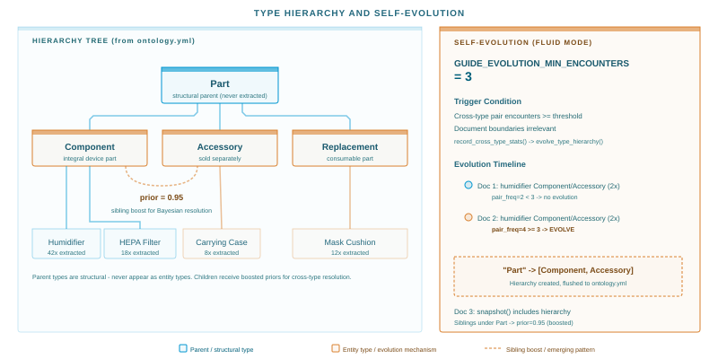

### 5.5 Ontology Buffer

The ontology buffer is the central mechanism that makes the extraction pipeline adaptive. Rather than treating the ontology as a static input file read once at startup, the buffer holds the evolving ontology in memory throughout the entire ingestion run. Every document processed contributes back to it, so later documents benefit from what earlier documents taught the system.

#### Initialization Modes

The buffer is initialized from one of three sources:

- **From seed** (domain-informed mode): an ontology seed file in any format. All non-YAML, non-OWL inputs pass through LLM normalization (Section 5.2). OWL/RDF files are normalized programmatically via owlready2 (Section 5.3). The normalized output is validated against Pydantic models before loading into the buffer. The seed is suggestive, not prescriptive - extraction is explicitly allowed to go beyond it
- **From YAML** (constrained mode): loads `.kgf/ontology.yml` as the starting schema. New types discovered during extraction can still be proposed, but require higher confidence to be accepted
- **Empty** (free extraction mode): the buffer starts with no types defined. The first few documents establish the initial ontology, which then stabilizes as more documents are processed

When both seed and YAML are configured, the YAML takes precedence for overlapping type definitions. The seed fills in types not covered by the YAML. In all cases, the buffer is free to evolve beyond its initial state. Seed-sourced types carry higher initial confidence but discovered types that appear consistently across documents are promoted equally. The final flushed ontology represents what the data actually contains, not what the seed prescribed.

#### Buffer Contents

The buffer tracks:

- **Entity types**: name, description, frequency count (how often this type has appeared across chunks), source (`seed`, `seed_normalized`, `yaml`, `discovered`), confidence (`high`, `medium`, `low`)
- **Relationship types**: name, source type, target type, frequency count, transitive flag (from OWL `TransitiveProperty` if OWL seed)
- **Type hierarchy**: parent-child subsumption relationships between entity types (from YAML `type_hierarchy`, OWL `subClassOf`, or self-evolved from cross-type duplicate patterns). Used exclusively in cross-type resolution as a Bayesian prior boost for sibling pairs - not injected into extraction prompts. The buffer maintains a `child_to_parent` lookup for O(1) shared-parent checks. In fluid mode (no ontology seed), the hierarchy starts empty and self-evolves via `_maybe_evolve()` when encounter frequency reaches `GUIDE_EVOLUTION_MIN_ENCOUNTERS` (default 3). Evolution is triggered automatically by `record_cross_type_stats()` and explicitly after every document via `_maybe_evolve()` in both direct and fluid ingestion paths - no external orchestration needed
- **Resolution intent**: user-authored immutable extraction use case, sourced from `resolution_intent` in `config.yml` (not from ontology YAML). Passed into `OntologyState` at snapshot time. Never stored in or loaded from `ontology.yml`
- **Resolution guide**: evolved disambiguation rules, loaded from `resolution_guide` in ontology YAML. When `resolution_guide_evolution` is enabled (default true), the system appends learned rules as cross-type encounter evidence accumulates. Rules are deduplicated via `_evolved_guide_keys` to prevent repeated evolution calls from producing duplicates
- **Type exemplars**: representative entity instances per type, loaded from `type_exemplars` in ontology YAML and updated during extraction. Top N by frequency per type (configurable via `max_type_exemplars`). Exemplars are injected into extraction prompts via `_build_entity_types_block()` as few-shot examples
- **Type variants**: raw type labels the LLM has produced that map to a canonical type (e.g., "Human" -> "Person", "Corp" -> "Organization")
- **Disjoint constraints**: type pairs the seed considers incompatible (from OWL `disjointWith` or normalizer inference), logged as warnings during extraction but not enforced - the data may legitimately contain entities that bridge seed-defined boundaries
- **Coverage score**: fraction of recently extracted types that match existing buffer entries, measured per document
- **Property schemas**: per-type property definitions discovered during extraction, tracking property name, inferred value type (string, numeric, boolean, list), and observation frequency

#### Property Schema Evolution

The buffer tracks property schemas alongside entity and relationship types. When extraction produces entities with properties, the buffer records which property keys appear for each entity type and how often. Property promotion follows the same frequency logic as type confirmation:

- **Frequency >= min_frequency_to_confirm**: property is promoted to the canonical schema for its type and included in extraction prompts as an expected field
- **Frequency < threshold**: property remains a candidate, not surfaced in prompts
- **Type inference**: property values are classified by observed type (string, numeric, boolean, list) based on majority vote across observations. When a property appears with conflicting types across documents, the most frequent type wins and a warning is logged
- **Conflict resolution**: if two entity types define the same property name with different value types (e.g., `pressure` as numeric on Specification but string on Feature), each type maintains its own property schema independently - no cross-type property unification

Property schemas are included in the ontology YAML flush and in extraction prompts via `_build_property_defs_block()`. This creates a feedback loop: early documents discover properties, later documents get prompted to extract them consistently, and the final ontology captures the full property schema per type.

#### Schema Signal Extraction

Before full extraction, each document goes through a lightweight first pass that identifies what categories and entity types are likely present in the text. This is a cheaper LLM call that returns only type signals, not full entities.

```
Scan the following text and list the categories of entities and
relationships you would expect to find. Do not extract specific
entities - only list the types.

Text:
{first_N_chunks_concatenated}

Return JSON:
{
  "entity_types": ["Person", "Organization", "Technology", ...],
  "relationship_types": ["WORKS_AT", "FOUNDED", ...]
}
```

The detected signals are compared against the ontology buffer to compute a coverage score. High coverage (> 0.8) means the buffer already knows about most types in this document - extraction can proceed with tight constraints. Low coverage (< 0.5) means the document contains unfamiliar territory - the extraction prompt loosens constraints and the buffer prepares to accept new types.

This coverage score is also a drift detection signal. If coverage drops across a batch of documents, it indicates the source material is shifting away from the ontology's domain.

#### Feedback Loop

After each document's chunks are extracted, the results feed back into the buffer:

1. **Type accumulation**: new entity types and relationship types increment their frequency counters. Types that appear only once in a single document are held as candidates. Types that appear across multiple documents are promoted to confirmed
2. **Variant detection**: the LLM is asked to check if any new types are variants of existing buffer types. For example, if the buffer has "Organization" and extraction produces "Company", the LLM evaluates whether these are the same concept. If yes, "Company" is added as a variant mapping to "Organization"
3. **Relationship pattern validation**: new relationship types are checked for consistency - do the source and target types make sense? A relationship "WORKS_AT" from Person to Technology would be flagged as suspicious

#### Refinement Triggers

Ontology refinement does not run after every single document - that would be too expensive. Instead, refinement triggers on:

- **Document count threshold**: every N documents (configurable, default 5)
- **Coverage drop**: when coverage falls below a threshold for consecutive documents
- **New type accumulation**: when more than M candidate types are pending promotion

The refinement pass sends the current buffer state and pending candidates to the LLM:

```
You are maintaining a knowledge graph ontology. Here is the current
ontology state:

Entity types: {buffer_entity_types_with_frequencies}
Relationship types: {buffer_relationship_types}
Pending candidates: {candidate_types_with_frequencies}
Type variants detected: {variant_mappings}

Based on the extraction evidence so far, propose refinements:
1. Which candidates should be promoted to confirmed types?
2. Which candidates are variants of existing types?
3. Should any existing types be merged or renamed?
4. Are any relationship type constraints missing?

Return the updated ontology as JSON.
```

#### DAG Validation

The ontology type hierarchy must be a directed acyclic graph - cycles in IS_A relationships are nonsensical (A is-a B is-a A). The buffer runs a topological sort on the type hierarchy at each refinement checkpoint. Detection is programmatic (no LLM cost), but resolution is LLM-assisted.

When a cycle is detected, the cycle edges and their participating types are passed to the LLM with context about each type's description, frequency, and source origin. The LLM decides which edge to remove or reclassify - it may determine that one IS_A relationship should actually be a HAS_PART or RELATED_TO, or that two types were incorrectly distinguished and should be merged. The LLM's resolution is presented to the user for confirmation in interactive mode, or applied automatically in batch mode with a warning logged.

DAG validation runs:
- After ontology normalization (when a freeform seed is converted to canonical YAML)
- After each buffer refinement pass
- Before the final buffer flush

Relationship type constraints (source/target type pairs) are not required to be acyclic - a `REPORTS_TO` relationship from Person to Person is valid. DAG enforcement applies only to the type hierarchy (IS_A edges between entity types).

#### Buffer Flush

At the end of the ingestion run, the final buffer state is written to `.kgf/ontology.yml`. The flush writes: `entity_types`, `relationship_types`, `type_hierarchy` (reflecting confirmed types grouped by parent), `resolution_guide` (evolved rules appended when `resolution_guide_evolution` is enabled), and `type_exemplars` (top N by frequency per type). Note that `resolution_intent` is NOT flushed - it lives exclusively in `config.yml`. This means:

- **Free extraction** produces an ontology as a side effect - the next run can start constrained
- **Constrained extraction** produces a refined ontology that incorporates what the documents actually contained
- The flushed ontology includes frequency data as comments, so the user can see which types were common vs rare
- **Resolution guide evolution**: when `resolution_guide_evolution` is enabled, the buffer self-evolves during ingestion at three trigger points: (1) inline from `record_cross_type_stats()` when encounter evidence crosses the threshold, (2) explicitly after every document in both direct and fluid ingestion paths, and (3) a final `_maybe_evolve()` before flush. The `resolution_intent` remains in `config.yml` and is never written to `ontology.yml`. This creates a knowledge accumulation loop where each run teaches the ontology about its own ambiguities

### 5.6 Post-Load OWL Reasoning

When an OWL seed is configured, the pipeline can optionally run a post-load reasoning pass using the owlready2 HermiT reasoner. This materializes implicit relationships in Neo4J that were not explicitly extracted:

- **Subclass propagation**: if Rex is a Dog and Dog is subclass of Animal, Rex gets an `INSTANCE_OF` edge to Animal
- **Transitive closure**: for properties marked as `owl:TransitiveProperty` (e.g., `REPORTS_TO`, `PART_OF`), the reasoner computes the full transitive chain
- **Consistency checking**: disjoint class constraints from the OWL ontology flag entities that were incorrectly assigned to incompatible types during extraction

**Reasoning pipeline**:

1. Export the loaded Neo4J graph as RDF triples (using n10s or direct serialization)
2. Load the RDF into owlready2 alongside the original OWL ontology
3. Run the HermiT reasoner via `sync_reasoner()`
4. Collect inferred triples that are new (not already in the graph)
5. Import the inferred relationships back into Neo4J

For simpler inference patterns (subclass propagation only), a Cypher-based approach avoids the RDF export round-trip:

```cypher
MATCH (i)-[:INSTANCE_OF]->(c)-[:SUBCLASS_OF*]->(sup)
MERGE (i)-[:INSTANCE_OF]->(sup)
```

For lightweight continuous inference, APOC periodic rules can run inside Neo4J:

```cypher
CALL apoc.periodic.repeat(
  "subclassRule",
  "MATCH (i)-[:INSTANCE_OF]->(c)-[:SUBCLASS_OF]->(sup)
   MERGE (i)-[:INSTANCE_OF]->(sup)",
  60
);
```

Post-load reasoning is most valuable when the domain has deep type hierarchies (biomedical, industrial, organizational), downstream queries need to find entities by ancestor type, or transitive relationships are important for graph traversal. It adds processing time and is not necessary for flat ontologies. Default is off, configured via `post_load_reasoning: true` in the ontology_buffer config section.

### 5.8 Schema Curing - Fluid-to-Stable Ontology Evolution

Schema curing provides a middle path between pre-defined ontology seeds and fully unconstrained free extraction. Instead of committing to a schema before seeing the data, the system starts with an empty ontology and an intent prompt, lets the schema evolve during ingestion, and holds all graph data in memory while the schema is "fluid". Only when the schema stabilizes ("cures") does the system flush everything to Neo4j. The curing lifecycle is formalized as a finite state machine in Section 14, where CURING and STABLE are the primary ontology lifecycle states.

**Key facts**:
- Disabled by default (`curing.enabled = false`) - existing seeded workflow unchanged
- CLI flags: `--fluid` / `--no-fluid` to enable/disable, `--cure` to force-cure after first document
- No re-extraction: post-cure type enforcement uses Levenshtein matching (`_enforce_ontology_types` with min_score=0.7 - types below threshold are kept as-is to prevent semantic corruption)
- Two-layer type normalization: deterministic surface collapsing (always-on) + LLM-assisted semantic clustering (one call at curing time)
- No new dependencies (no NetworkX) - existing entity list operations handle cross-document merging

The ingestion loop operates in two phases. During the fluid phase, each document is extracted normally but results accumulate in a `FluidAccumulator` instead of loading to Neo4j. After each document, the `CuringDetector` evaluates three convergence conditions. When all three are met - or the failsafe triggers - a curing event fires: the accumulated results are consolidated (type enforcement, deduplication, entity resolution) and batch-flushed to Neo4j. Remaining documents process in the cured phase with direct per-document loading.

**Curing detection algorithm** - three detection paths, checked in priority order:

1. **Metric-based convergence** (`CuringDetector.is_converged()`) - strongest signal, all three conditions must hold for `stability_window` consecutive documents:
   - JSD below `jsd_convergence_threshold` (default 0.01)
   - Entropy delta below `entropy_delta_threshold` (default 0.05)
   - Type accumulation rate equals 0 (no new types appearing)

2. **Metric plateau** (`CuringDetector.is_plateau()`) - distribution shape has stabilized even if occasional new types trickle in. All conditions must hold for `stability_window` consecutive documents:
   - JSD below `jsd_convergence_threshold` (default 0.01)
   - Entropy delta below `plateau_entropy_delta` (default 0.1, looser than convergence threshold)
   - Coverage delta below `coverage_delta_threshold` (default 0.05)
   Unlike `is_converged()`, plateau detection does not require type accumulation rate to be zero. This handles domains where most types are discovered early but a long tail of rare types continues to appear without changing the distribution shape.

3. **Heuristic fallback** (`CuringDetector.is_cured()`) - four conditions must ALL be true:
   - Minimum documents processed (`min_documents`, default 3)
   - Coverage convergence: coverage delta below threshold for the last N documents
   - Type stability: no new entity types for `stability_window` (default 3) consecutive documents
   - **Chao1 coverage floor**: `chao1_coverage >= min_chao1_coverage` (default 0.5) - blocks curing when species richness estimation indicates significant undiscovered types. Backward compatible: if Chao1 is not available in metrics, the guard is skipped. The 0.5 threshold allows curing to trigger mid-corpus (doc 6-7 in a 10-doc set) rather than only at the safety net, enabling more documents to benefit from the cured ontology. Previous default of 0.7 was never reached in 10-doc corpora (max observed: 0.394)

The CLI checks these in order: `is_converged()` first (strictest), then `is_plateau()` (looser), then `is_cured()` (heuristic). The first path that returns True triggers curing.

**Failsafe** - `max_fluid_documents` (default 20) is a safety net that force-cures when reached. It exists to prevent resource exhaustion when signal-based convergence detection fails. When triggered, a warning is logged identifying why signal-based curing did not fire first. The failsafe is checked after all three signal-based detectors, ensuring it only fires as a last resort.

**Generative curing advisory** - when `generative_curing` is enabled (default false), an LLM advisory layer replaces metric-based curing checks. After `min_documents`, the LLM receives the complete metric history as a timeline, the type list with frequencies, domain intent, and recent type discovery, then returns a structured decision `{should_cure: bool, reasoning: str}`.

The LLM acts as a structured evaluator following explicit decision rules embedded in the prompt. It receives the complete metric history as a per-document timeline and applies quantitative rules that reference concrete values from that history. The LLM's unique contribution is domain understanding - judging whether the type list is semantically complete for the stated intent - which metrics alone cannot assess. All other decision rules are quantitative and verifiable from the timeline data.

The metric history is presented as a per-document timeline table:

```
Doc | JSD     | Entropy D | Type Accum | Chao1 Cov | Heaps B | New Types
  1 | 0.4523  | 0.3100    | 3.0        | 0.600     | 0.890   | Person, Device, Org
  2 | 0.1200  | 0.0800    | 1.0        | 0.750     | 0.450   | Standard
  3 | 0.0050  | 0.0200    | 0.0        | 0.950     | 0.120   | (none)
```

The cure prompt specifies explicit rules: CURE if the type list covers the domain intent's categories AND JSD has been below 0.05 for 2+ consecutive docs AND no more than 1 new type in the last 2 docs AND Chao1 coverage above 0.7. BLOCK if the intent implies missing categories OR type accumulation rate exceeded 1.0 in the latest doc OR Chao1 below 0.5. This structured approach makes decisions reproducible - the same metric history and type list produce the same outcome.

On any LLM failure, the system transparently falls through to existing metric-based checks (`is_converged`, `is_plateau`, `is_cured`). The `max_fluid_documents` safety net always applies regardless of LLM decision, preventing infinite fluid phase.

For drift decisions: when `check_drift()` flags sustained remap rates, the LLM receives the remap history timeline (per-document remap rate) and applies structured rules: RE-CURE if 3+ distinct remapped types are genuinely missing from the cured ontology AND remap rate sustained above 30%. DISMISS if remapped types are synonyms/variants of existing cured types OR remap rate dropped below 20% in the window. Returns `{should_recure: bool, reasoning: str}`. On LLM failure, falls back to the `re_cure_on_drift` boolean.

Cost: one or two sync LLM calls per document in fluid phase (after `min_documents`), one per drift event in cured phase.

### LLM advisor prompts

The cure evaluator receives a structured prompt with the full metric timeline, type list with frequencies, and explicit decision rules. The prompt injects all context as formatted data - no hidden state:

```
You are an ontology curing evaluator. Given the metric history and type list
below, decide whether to CURE (freeze the ontology) or CONTINUE (keep
discovering types).

Domain intent: {intent}
Documents processed: {docs_processed}
Total entities: {total_entities}
Type count: {type_count}
Coverage (Chao1): {coverage}

Type list (sorted by frequency, descending):
- Person: 42
- Device: 38
- Organization: 15
...

Metric history (one row per document):
Doc | JSD     | Entropy D | Type Accum | Chao1 Cov | Heaps B | New Types
----|---------|-----------|------------|-----------|---------|----------
  1 | 0.4523  | 0.3100    | 3.0        | 0.600     | 0.890   | Person, Device, Org
  2 | 0.1200  | 0.0800    | 1.0        | 0.750     | 0.450   | Standard
  3 | 0.0050  | 0.0200    | 0.0        | 0.950     | 0.120   | (none)

Decision rules:

CURE if ALL of these are true:
1. The type list covers the major entity categories implied by the domain intent
2. JSD has been below 0.05 for at least 2 consecutive documents in the history
3. No more than 1 new type appeared in the last 2 documents
4. Chao1 coverage is above 0.7 (most types have been discovered)

BLOCK CURE if ANY of these are true:
1. The domain intent mentions entity categories not yet represented in the type list
2. Type accumulation rate was above 1.0 in the most recent document
3. Chao1 coverage is below 0.5 (many types remain undiscovered)
4. Fewer than {min_documents} documents have been processed

Graph query (optional):
You may request ONE graph query if the metrics are genuinely ambiguous and
you need to verify a hypothesis. Set needs_query=True and specify query_type.
Only do this if the data above is insufficient to decide.
Do NOT request a query if the metrics clearly indicate cure or continue.
```

The first-pass response uses `CureProbe` - a structured model that always includes `should_cure` (best guess) plus optional `needs_query`, `query_type`, `query_filter_type`, and `query_filter_name` fields. This avoids Optional bool issues with instructor by requiring the decision upfront while allowing the LLM to request verification. If the query is honoured (ambiguity gate passes), a second call with `CureDecision` receives the original prompt enriched with graph query results.

The drift evaluator receives a separate prompt for re-cure decisions after `check_drift()` triggers:

```
You are an ontology drift evaluator. Given the remap history and cured type
list below, decide whether to RE-CURE (re-enter fluid phase) or DISMISS the
drift.

Domain intent: {intent}
Cured ontology types: {cured_types}
Current stability: JSD={jsd}, entropy_delta={entropy_delta}

Remap history (one row per cured-phase document):
Doc | Remap Rate
----|----------
  1 | 35.00%
  2 | 40.00%
  3 | 38.00%

Decision rules:

RE-CURE if ALL of these are true:
1. At least 3 distinct remapped entity types are NOT synonyms or surface
   variants of any cured ontology type
2. Remap rate has been above 30% for the entire remap history window
3. The remapped types represent entity categories genuinely missing from
   the cured ontology for the stated intent

DISMISS DRIFT if ANY of these are true:
1. The remapped types are synonyms, abbreviations, or formatting variants
   of existing cured types
2. Remap rate dropped below 20% in any document in the remap window
3. The remapped entities are from a single anomalous document (not a
   sustained trend)
```

The drift response uses `RecureDecision` with `should_recure: bool` and `reasoning: str`. Both prompts enforce strict decision rules with explicit thresholds - the LLM's unique contribution is semantic judgement on type list completeness and synonym detection, not threshold evaluation.

**Graph query tool** - in ambiguous cases, the LLM may request a single graph query before deciding. During fluid phase, queries execute against the in-memory FluidAccumulator (entity counts by type, relationship pattern counts, entity name search). During cured phase (drift evaluation and LLM escalation), queries execute against Neo4j. The LLM receives a `GraphQueryResult` with a summary and up to 20 records, then makes its final decision in a second call. Maximum `generative_max_tool_calls` (default 2) queries per decision. The query is only honoured when metrics are genuinely ambiguous (JSD 0.02-0.08 or Chao1 0.5-0.75 for curing; top-2 posterior gap < 0.15 for type resolution).

**Early stopping** - when generative curing is enabled, the system tracks consecutive LLM "cure" votes across documents. If the LLM returns `should_cure=True` for enough consecutive documents, curing triggers automatically. The threshold is `generative_patience` (default 0.4) as a fraction of `max_fluid_documents` - so 0.4 * 20 = 8 consecutive document-level cure votes, with a minimum of 3 regardless of fraction. This prevents indefinite deferral when the LLM is confident but the caller keeps asking. The counter resets whenever the LLM votes "don't cure".

Check order (fluid phase):
1. `force_cure` flag - user override
2. `generative_curing` + LLM - LLM decides (sees metrics, types, intent). On failure, falls through to metric checks (3-5)
2a. `patience_exceeded()` - early stop after N consecutive cure votes
2b. LLM says cure - cure
2c. LLM says don't cure - skip metrics, wait
2d. LLM fails - fall through to metrics (3-5)
3. `is_converged()` - metric-based convergence (when generative off or LLM failed)
4. `is_plateau()` - metric plateau
5. `is_cured()` - heuristic fallback
6. `max_fluid_documents` - safety net (ALWAYS, even after LLM says no)

Check order (cured phase drift):
1. `check_drift()` false - no action
2. `check_drift()` true + `generative_curing` - LLM decides re-cure or dismiss. On failure, falls back to `re_cure_on_drift` boolean
3. `check_drift()` true + no generative - `re_cure_on_drift` boolean applies

**Data flow**:

```
Document 1..N (fluid phase)
  -> ingest_document() -> ExtractionResult
  -> FluidAccumulator.add_result()
  -> OntologyBuffer.accumulate_from_result()
  -> StabilityMetrics.record(buffer.frequencies()) -> metrics dict
  -> CuringDetector.record(coverage, new_types, metrics)
  -> CuringDetector: is_converged() | is_plateau() | is_cured()? -> Curing Event

Curing Event:
  -> OntologyBuffer.snapshot() (cured ontology)
  -> cluster_types() (single LLM call - semantic synonym clustering)
  -> apply_type_mapping() + normalize_entity_ids() (remap types, regenerate IDs)
  -> FluidAccumulator.consolidate(cured_ontology, type_frequencies, skip_type_enforcement=True)
     -> normalize_entity_ids() + deduplicate() + resolve_entities(type_frequencies)
  -> load_extraction() (single batch flush to Neo4j - Document, Chunk, Entity, and Relationship nodes)

Cured-phase per-document loading:
  -> load_doc_chunks() creates Document and Chunk nodes with HAS_CHUNK and NEXT_CHUNK relationships
  -> load_extraction(skip_doc_chunks=True) creates Entity nodes and typed relationships only (skips Document, Chunk, HAS_CHUNK, HAS_ENTITY, NEXT_CHUNK)
  This two-step split preserves per-document Document-Chunk linkage while using consolidated entities from resolution.

Document N+1..M (cured phase)
  -> ingest_document() -> ExtractionResult
  -> resolve_against_graph() (query Neo4j for existing entities, apply description similarity gate, remap types/IDs, rewire relationships)
  -> load_doc_chunks() (load Document + Chunk nodes, preserving per-document linkage)
  -> load_extraction(skip_doc_chunks=True) (load entities + relationships only)
  -> StabilityMetrics.record() + CuringDetector.record() (post-cure metric tracking)
```

**Post-cure drift detection** - once cured, the system monitors whether the cured ontology continues to fit incoming documents. During cured-phase ingestion, type enforcement remaps entities whose extracted types do not match the cured ontology. A high remap rate signals that the document's domain is drifting away from the cured schema.

The `CuringDetector` tracks remap rate per document via `check_drift(remap_rate)`. When the remap rate exceeds `drift_remap_threshold` (default 0.3, meaning 30% of entities required remapping) for `drift_window` (default 3) consecutive documents, the detector signals drift. The default behavior is warning-only: a WARN log identifies the drift rate and consecutive document count, giving the operator visibility into schema mismatch. When `re_cure_on_drift` is enabled (default false), the system re-enters the fluid phase - resetting the accumulator, clearing the cured flag, and allowing the ontology to re-evolve from the current buffer state plus incoming documents.

Remap count is tracked in `ExtractionMetadata.remap_count`, populated during type enforcement in `ingest_document()`. The remap rate is computed as `remap_count / max(len(entities), 1)` per document.

Configuration:
- `drift_remap_threshold: 0.3` - fraction of entities remapped that signals drift
- `drift_window: 3` - consecutive documents above threshold to trigger drift
- `re_cure_on_drift: false` - opt-in automatic re-curing on detected drift

**Configuration** (in `config.yml`):
```yaml
curing:
  enabled: true
  min_documents: 3
  max_fluid_documents: 20
  coverage_delta_threshold: 0.05
  stability_window: 3
  auto_cure: true
  metrics_variance_window: 5
  enforcement_threshold: 0.5          # min % of total entities for type to survive curing
  jsd_convergence_threshold: 0.01     # JSD below this for stability_window docs triggers metric-based convergence
  entropy_delta_threshold: 0.05       # entropy delta below this for metric-based convergence
  plateau_entropy_delta: 0.1          # entropy delta threshold for plateau detection (looser than convergence)
  drift_remap_threshold: 0.3          # remap rate above this signals schema drift
  drift_window: 3                     # consecutive docs above threshold to trigger drift warning
  re_cure_on_drift: false             # opt-in re-curing when drift detected
  generative_curing: false            # LLM-assisted curing decisions (metrics as input)
  generative_patience: 0.4            # fraction of max_fluid_documents as consecutive document cure votes to auto-trigger (0.4 * 20 = 8 docs, min 3)
  generative_max_tool_calls: 2        # max graph queries per LLM decision

extract:
  ...existing fields...
  cross_type_merge_threshold: 0.6        # Bayesian posterior threshold for cross-type entity merges
  deferred_dedup: false                   # opt-in deferred cross-type dedup buffer
  deferred_dedup_ambiguous_lower: 0.4     # posterior below this always blocks immediately
  deferred_dedup_llm_escalation: false    # opt-in LLM resolves ambiguous deferred pairs at curing
```

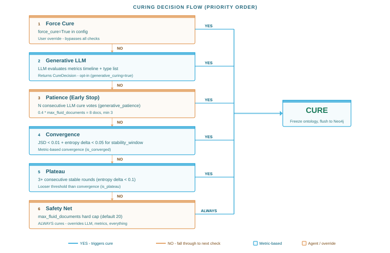

> **Note - config exposure policy**: Not all configuration parameters will be exposed in the user-facing config file. Expert-level tuning parameters (thresholds, likelihood ratios, boost caps) will be hardcoded in `kg_builder_cli/config/defaults.py` with detailed documentation explaining purpose, value, and meaning. Only high-level feature toggles and parameters that meaningfully affect pipeline behavior for non-expert users will appear in the config YAML. The `defaults.py` file serves as the authoritative reference for all parameter semantics. This separation is pending implementation - currently all parameters are in `ExtractConfig`.

**Stability metrics** - tracked after each document in both fluid and cured phases for empirical evaluation of convergence signals. All metrics are pure Python (`math` stdlib only). The `StabilityMetrics` class is purely computational - it does not make curing decisions. During the fluid phase, metrics feed the `CuringDetector` for convergence detection. Post-cure, metrics continue to be recorded for each document (JSD, Chao1 coverage, entropy delta) using the same `StabilityMetrics` tracker, providing visibility into whether the cured schema remains stable as new documents are ingested. The `is_converged()` method on `CuringDetector` consumes JSD, entropy delta, and type accumulation rate directly from the metrics stream.

| Metric | Key | What It Measures | Stability Signal |
|--------|-----|------------------|------------------|
| Shannon entropy | `entropy_shannon` | Type distribution diversity | Delta approaches 0 |
| KL divergence | `kl_divergence` | Distribution shift between consecutive docs | Approaches 0 |
| Jensen-Shannon divergence | `js_divergence` | Symmetric bounded distribution distance [0,1] | Approaches 0 |
| Type accumulation rate | `type_accumulation_rate` | New types per document (dV/dN) | Equals 0 |
| Gini coefficient | `gini_coefficient` | Frequency inequality (0=equal, 1=dominated) | Delta approaches 0 |
| Zipf R-squared | `zipf_r_squared` | Log-log linear fit quality (mature ontologies are Zipfian) | Exceeds 0.85, stabilizes |
| Heaps' beta | `heaps_beta` | Vocabulary growth rate (V = K*N^beta) | Approaches 0 |
| Chao1 coverage | `chao1_coverage` | Observed/estimated total types (species richness) | Approaches 1.0 |
| ACE estimate | `ace_estimate` | Abundance-based total type estimate | Converges to observed |
| Rolling variance | `*_var` suffixed | Variance of key metrics over last W docs | Approaches 0 |

The metrics draw from three established fields. Entropy and divergences (Shannon, KL, JSD) are information theory fundamentals - JSD is the most robust being symmetric, bounded, and always defined. Gini and Zipf capture distributional maturity - real schemas have moderate Gini, and natural ontologies follow power laws with R-squared above 0.85 when mature. Heaps' beta comes from computational linguistics where vocabulary growth follows V = K*N^beta - when beta drops below ~0.1, vocabulary is saturating. Chao1 and ACE come from ecology species richness estimation - they predict "how many types exist that we haven't seen yet" based on singleton/doubleton frequencies, and when Chao1 coverage approaches 1.0, nearly all types have been discovered.

**Proposed curing mechanism** - the current three-condition heuristic (coverage delta, type stability, min documents) is the production gate. The proposed replacement would use a composite score from the tracked metrics, weighted by empirical analysis of which signals best predict the right curing moment across benchmark datasets. The evaluation approach:

1. Run fluid ingestion on benchmark corpora, logging all metrics after each document
2. Identify the "ideal" curing point by comparing ontology quality at each possible curing document against the final ontology
3. Correlate each metric's convergence pattern with proximity to the ideal curing point
4. Select 3-5 metrics with strongest predictive power, define thresholds
5. Replace the three-condition heuristic with a weighted composite check

Until this analysis is complete, the existing heuristic remains the sole decision maker and all metrics are observational only.

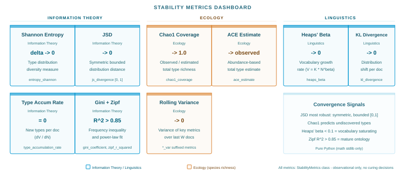

**Module structure**:
- `kg_builder_cli/curing/__init__.py` - module init
- `kg_builder_cli/curing/detector.py` - `CuringDetector` class with `is_converged()` (metric-based) and `is_cured()` (heuristic fallback) detection
- `kg_builder_cli/curing/accumulator.py` - `FluidAccumulator` class storing `ExtractionResult` objects
- `kg_builder_cli/curing/metrics.py` - `StabilityMetrics` class computing information-theoretic metrics
- `kg_builder_cli/curing/type_clustering.py` - LLM-assisted semantic type clustering at curing time
- `kg_builder_cli/curing/merge_validation.py` - post-LLM merge validation with 3-metric composite scorer

**Merge validation** - guards against LLM over-merging at curing time. After the LLM proposes type merges via `cluster_types()`, a validation layer scores each proposed merge using three metrics: name similarity (0.55 weight, SequenceMatcher ratio + Jaccard on PascalCase word sets), description coherence (0.35 weight, Jaccard on significant words from entity descriptions), and frequency ratio (0.10 weight, min/max frequency). Merges below `merge_confidence_threshold` (default 0.4) are reverted to identity (type maps to itself). The clustering prompt instructs the LLM to "merge ONLY genuine synonyms or formatting variants" with "when in doubt, keep types separate" to prevent semantically destructive merges (e.g. Mode->Role, Gas->Accessory).

**Two-layer type normalization** - addresses surface variant proliferation (e.g. Standard/Regulatory_Standard/SafetyStandard as 3 types for 1 concept). The deterministic layer applies `normalize_type_name()` - a PascalCase normalizer that splits on spaces, underscores, hyphens, and camelCase boundaries. The ontology buffer tracks a `_canonical_map` mapping normalized forms to first-seen raw forms, collapsing surface variants during accumulation. ID normalization runs after type enforcement to avoid stale IDs. Cross-type resolution builds type priority dynamically from buffer frequency counts. The LLM-assisted layer (`type_clustering.py`) makes one structured-output call at curing time to cluster semantic synonyms that deterministic normalization cannot catch (Standard vs RegulatoryStandard). No pre-clustering type pruning - the LLM clustering step handles type consolidation based on semantic understanding rather than frequency alone.

**Type exemplars for few-shot extraction guidance** - the ontology buffer stores representative entity instances per type, functioning as few-shot examples during extraction. Instead of providing the LLM with only type names ("Component", "Specification"), the extraction prompt includes concrete examples: `"Component (e.g., Humidifier, Tubing, HEPA Filter)"`. This helps the LLM infer type boundaries from instances rather than abstract labels, reducing type misassignment at extraction time rather than correcting it post-hoc.

The buffer maintains `_type_exemplars: dict[str, list[TypeExemplar]]` where `TypeExemplar` is a Pydantic model with `name`, `entity_type`, and `frequency` fields. Each type maps to up to `max_type_exemplars` (configurable, default 5) representative entities. Exemplars accumulate during the fluid phase via `accumulate_from_result()`: for each extracted entity, the buffer checks the canonical type and adds the entity as an exemplar if the slot is available, deduplicating by case-insensitive normalized name (so "HEPA Filter" and "hepa filter" count as one exemplar with combined frequency). When the exemplar list is full, the lowest-frequency exemplar is replaced if the new entity has higher frequency. When the schema cures, exemplars freeze alongside the ontology snapshot as tuples sorted by descending frequency, and are included in the extraction prompt for all cured-phase documents.

The extraction prompt formats exemplars inline with allowed types in `_build_entity_types_block()`: `"- Component: A physical part (e.g., Humidifier, Tubing, HEPA Filter) (seen 42x)"`. The exemplar hint is injected between the type description and the frequency label. This gives the LLM concrete anchors for each type without adding a separate few-shot section to the prompt. The `max_type_exemplars` parameter controls the tradeoff between prompt informativeness and token budget - initial value of 5 will be tuned based on benchmark experiments measuring type assignment accuracy vs exemplar count.

**TypeExemplar model** (`types/ontology.py`):
- `name: str` - entity name (e.g., "Humidifier")
- `entity_type: str` - canonical type (e.g., "Component")
- `frequency: int` - occurrence count across extraction results

**Data flow integration**:
- Fluid phase: `OntologyBuffer.accumulate_from_result()` updates exemplars alongside type frequencies
- Curing event: exemplars freeze with `OntologyBuffer.snapshot()`
- Extraction prompt: `_build_extraction_prompt()` includes exemplars when available
- Cured phase: frozen exemplars guide type assignment for remaining documents

**Bayesian type resolution** - a post-extraction resolution layer that models type assignment as Bayesian inference. Where type exemplars reduce ambiguity at extraction time (prevention), Bayesian resolution handles the residual ambiguity that exemplars do not catch (correction). The system maintains a prior probability distribution over types from the ontology buffer's normalized frequencies, then updates it with evidence from multiple signals to produce a posterior distribution for each entity.

The prior `P(type)` is the buffer's type frequency distribution, normalized to probabilities. For each entity, the resolver considers only the top-k candidate types (configurable, default 3) by prior probability. This keeps the computation lightweight - with 10 types in a cured ontology, most entities have at most 2-3 plausible types.

Evidence sources update the prior via a Naive Bayes style scoring approximation. For each entity `e` and each candidate type `t_k`, the posterior is computed as a product of likelihood signals under a conditional independence assumption:

```
P(t_k | e) = P(t_k) * P(name | t_k) * P(rels | t_k) * P(co | t_k) * P(desc | t_k) / Z
```

where `Z` is the normalization constant ensuring the posterior sums to 1 across all candidates. The independence assumption does not hold strictly - relationship context, co-occurrence patterns, and description semantics are correlated in practice. Despite this, the Naive Bayes decomposition works well as a scoring function because the bounded likelihood ranges (each signal returns values in [0.5, 2.0]) prevent any single correlated signal from dominating, and the posterior is used for ranking rather than calibrated probability estimation. Each likelihood returns 1.0 (neutral) when evidence is absent.

The four evidence signals:

1. **Exemplar similarity** `P(name | t_k)` - range [0.5, 1.5]. FAISS cosine similarity between the entity embedding and each candidate type's exemplar embeddings. The raw cosine similarity `sim` (clipped to min 0.01) is shifted by +0.5 to produce a likelihood in [0.51, 1.5]. When the candidate type has no match in the top-k results, returns 0.5 (slight penalty). When no embeddings are available, returns 1.0 (neutral - no evidence to contribute)
2. **Relationship context** `P(rels | t_k)` - range [1.0, 2.0]. Counts relationships involving the entity whose type name contains (or is contained by) the candidate type name. Returns `1.0 + (matching_rels / total_rels)`. An entity in `HAS_COMPONENT` relationships gets a boost for `Component`. No relationships returns 1.0 (neutral)
3. **Co-occurrence pattern** `P(co | t_k)` - range [1.0, 2.0]. Counts entities extracted from the same chunk(s) whose type matches the candidate. Returns `1.0 + (matching_entities / total_co_entities)`. A chunk with 3 Component entities and 1 Specification produces P(co|Component) = 1.75, P(co|Specification) = 1.25. Empty chunk context returns 1.0 (neutral)
4. **Description semantics** `P(desc | t_k)` - range [1.0, 2.0]. Bag-of-words intersection between the entity's description and the descriptions stored in each candidate type's exemplars. Text is lowercased, split on whitespace, filtered to remove stop words (`a, an, the, is, are, of, for, in, to, and, or, with, that, this`) and tokens shorter than 3 characters before overlap scoring. For each exemplar, computes `|intersection| / min(|entity_words|, |exemplar_words|)` and takes the maximum overlap across exemplars. Returns `1.0 + max_overlap`. This is a lightweight low-weight signal - bag-of-words overlap is brittle with technical jargon, so the bounded range [1.0, 2.0] ensures it nudges rather than dominates. No description or no exemplar descriptions returns 1.0 (neutral)

The posterior `P(type | evidence)` determines the resolution path. When posterior entropy is low (below `type_resolution_entropy_threshold`, default 0.8), the resolver assigns the winning type deterministically - no LLM call needed. When posterior entropy exceeds the threshold and `llm_escalation` is enabled, the resolver makes a synchronous LLM call via instructor+litellm presenting the entity, posterior probabilities, and type exemplars for a structured type choice. On LLM failure or when `llm_escalation` is disabled, falls back to argmax.

**Resolution audit logging** - each Bayesian resolution is logged at DEBUG level with the prior, top-k posterior probabilities, winning signal contributions, and final entropy. This diagnostic trace enables post-hoc analysis of false type assignments without requiring full re-runs. The log format is: `entity_name | prior={...} | posteriors={...} | entropy={:.3f} | assigned={type}`.

**Configuration**:
```yaml
extract:
  bayesian_resolution: false         # opt-in, enables Bayesian type resolution in cured phase
  llm_escalation: false              # opt-in, LLM fallback for high-entropy posterior
ontology_buffer:
  max_type_exemplars: 5              # max example entities stored per type for few-shot guidance
  type_resolution_top_k: 3           # candidate types considered per entity
  type_resolution_entropy_threshold: 0.8  # posterior entropy above this triggers LLM escalation or argmax
```

**Cold-start behavior**: when `bayesian_resolution=true` but no exemplar index exists (first document, no buffer yet), the pipeline falls back to `_enforce_ontology_types()` (Levenshtein-based remapping). The Bayesian resolver only activates after curing when exemplars and type frequencies are available.

**Type enforcement minimum score** - `_enforce_ontology_types()` requires a minimum Levenshtein similarity of 0.7 before remapping a type. Below this threshold, the entity keeps its original type. This prevents semantically destructive remaps like Mode->Role (0.50) or Gas->Accessory (0.33) while preserving legitimate remaps like MedicalCondition->Medical Condition (0.97). Types that don't match any ontology type above the threshold remain in the graph with their extracted type.

**Skip double type enforcement** - type clustering at curing time produces canonical type assignments via LLM-assisted semantic analysis. `FluidAccumulator.consolidate()` receives `skip_type_enforcement=True` when type clustering has already run, since the clustering output IS the canonical type assignment. Both consolidation call sites in `cli.py` (curing event flush and final flush) skip enforcement. The `_enforce_ontology_types()` function still runs during per-document extraction (step 4b in `unstructured.py`) where it serves as first-pass type normalization before clustering has occurred.

**FAISS candidate search** - the exemplar similarity signal uses a FAISS IndexFlatIP index built at curing time from L2-normalized 1024-dimensional Amazon Titan v2 embeddings. The `ExemplarIndex` class stores one embedding per exemplar entity, organized by type. At query time, the entity name embedding is L2-normalized and searched against the index for top-k nearest neighbors - the cosine similarities (inner products on normalized vectors) serve as the `P(name|type)` likelihood. The index is CPU-only (no GPU dependency) and rebuilt per curing event from the frozen exemplar set. When embeddings are unavailable (cold start or `use_embeddings=False`), the resolver falls back to normalized Levenshtein similarity between entity names and exemplar names.

**Module structure**:
- `kg_builder_cli/extraction/exemplar_index.py` - `ExemplarIndex` class wrapping FAISS IndexFlatIP for embedding-based type candidate search
- `kg_builder_cli/extraction/type_resolver.py` - `BayesianTypeResolver` class with `resolve(entity, context) -> str` method, plus `ResolverContext` dataclass carrying relationships, chunk entities, and entity embedding
- `kg_builder_cli/extraction/schema_signals.py` - `SchemaSignals` model and `extract_schema_signals()` for lightweight pre-extraction type discovery, plus `compute_coverage()` for measuring buffer coverage against detected signals
- Integrates at step 4b in `unstructured.py`: when `bayesian_resolution=true` and an exemplar index is available, replaces `_enforce_ontology_types()` with `_resolve_types_bayesian()`. The exemplar index is built at curing time in `cli.py._build_exemplar_index()` by generating embeddings for all frozen exemplar entities

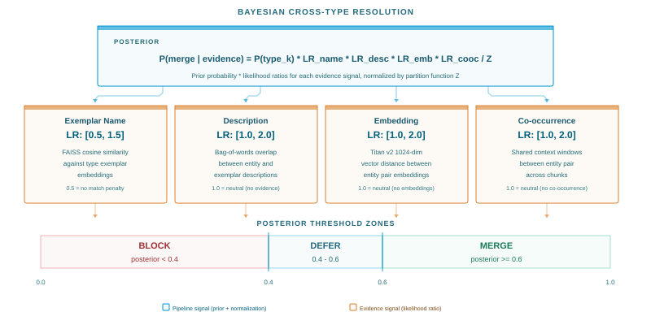

**Schema signal extraction** (opt-in, `extract.schema_signal_extraction: false`) - before full extraction, each document goes through a lightweight LLM pre-pass on the first 3 chunks. The `extract_schema_signals()` function uses instructor+litellm to return `SchemaSignals` (entity_types, relationship_types) without extracting specific entities. The detected signals are compared against the ontology buffer via `compute_coverage()` to measure how well the buffer covers the document's domain. New type signals not already in the buffer are accumulated automatically. This enables the buffer to anticipate types before full extraction encounters them.

**Post-load reasoning** (opt-in, `ontology_buffer.post_load_reasoning: false`) - after loading entities and relationships into Neo4j, the system can run Cypher-based subclass propagation. The `run_subclass_propagation()` function in `loading/reasoning.py` executes a single Cypher query that traverses `SUBCLASS_OF*` chains and creates missing `INSTANCE_OF` edges to ancestor classes. This provides lightweight OWL-style transitive inference without requiring an external reasoner or RDF round-trip. Returns the count of new edges inferred for logging

## 6. Unstructured Ingestion Pipeline

The unstructured pipeline transforms free-form text documents into a knowledge graph. Documents are parsed, chunked, extracted through LLM calls constrained by the evolving ontology buffer, deduplicated, resolved, and loaded into Neo4J.

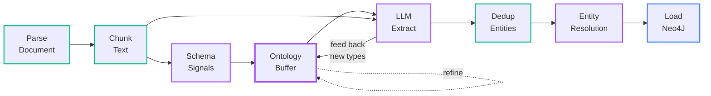

The diagram shows the feedback loop at the center of the pipeline. The ontology buffer receives schema signals before extraction and new types after extraction, refining itself periodically. This adaptive loop means the system gets progressively better at extraction as it processes more documents.

### 6.1 Pipeline Overview

1. Parse document into plain text, preserving page/section metadata where available
2. Split text into overlapping chunks sized for the LLM context window
3. Initialize the ontology buffer (from seed, YAML, or empty - see Section 5.5)
4. For each document (or batch of documents):
   a. Run schema signal extraction - lightweight LLM pass to detect category/type signals
   b. Estimate coverage - compare detected signals against the ontology buffer
   c. Extract entities and relationships per chunk, constrained by the current buffer state
   d. Feed extraction results back into the buffer - accumulate new types, frequencies, relationship patterns
   e. Periodically trigger ontology refinement - LLM proposes additions or merges
5. Deduplicate entities across all chunks by exact `(type, id)` match
6. Resolve remaining duplicates via escalating-cost entity resolution pipeline
7. Flush the final refined ontology buffer to disk as `ontology.yml`
8. Load merged graph into Neo4J

### 6.2 Document Parsing

Each format requires a different parser to extract clean text. Parsers are implemented behind a common adapter interface - a function that accepts a file path and returns a list of `TextSegment` objects with uniform source metadata. Adding support for a new format (XLSX, HTML, CSV, PPTX) requires only registering a new adapter function that conforms to the same contract.

#### Parser Adapter Interface

```python
def parse_<format>(file_path: Path) -> list[TextSegment]:
    """Parse a document into text segments with source metadata."""
    ...
```

Each adapter is responsible for extracting clean text and attaching provenance metadata (file path, page number or line offset, section title where available). The dispatcher selects the adapter based on file extension, falling back to plain text for unrecognized formats. New adapters are registered in a format-to-parser mapping dict, making the system extensible without modifying the dispatcher logic.

#### Format Adapters

| Format | Parser | Notes |
|--------|--------|-------|
| PDF | `pymupdf4llm` | Converts to structured Markdown with layout, tables, and image extraction |
| TXT / MD | built-in | Read as-is |
| DOCX | `python-docx` | Extracts paragraph text, ignores formatting |
| XLSX | `openpyxl` | Sheet-per-segment, row data as text or structured records |
| CSV | built-in | Row batches as text segments |
| HTML | `beautifulsoup4` | Extracts visible text, strips markup |

The adapter layer enables mixed-format ingestion - a directory containing PDFs, spreadsheets, and text files can be processed in a single `kgf ingest` run with each file routed to the appropriate parser. This metadata propagates through chunking into the final extraction output, enabling traceability from any entity back to its source location.

#### PDF Parsing with pymupdf4llm

PDF parsing uses `pymupdf4llm` rather than raw `pymupdf`. Built on top of PyMuPDF, pymupdf4llm converts complex PDFs into structured Markdown with layout reconstruction, table preservation, and image handling:

```python
import pymupdf4llm

# Basic text + tables as Markdown
md_text = pymupdf4llm.to_markdown("document.pdf")

# With image extraction to disk
md_text = pymupdf4llm.to_markdown("document.pdf",
                                  write_images=True,
                                  image_path="extracted_images/")

# Per-page chunks for RAG pipelines
chunks = pymupdf4llm.to_markdown("document.pdf", page_chunks=True)
```

The layout model (`pymupdf.layout`) activates ONNX-based block detection for realistic table structures and figure placement. Tables are converted to Markdown table syntax, figure captions are preserved, and images are referenced by path in the output Markdown.

#### Image Description Enrichment

PDFs containing charts, plots, diagrams, or photographs lose critical information when only text is extracted - a survival curve, an architecture diagram, or a data visualization may carry the core insight of a document section, yet plain text extraction produces only the figure caption. The image description pipeline addresses this by running extracted images through a vision model and injecting the resulting descriptions back into the parsed text before chunking:

1. Extract text as Markdown with `write_images=True` (images saved to disk, referenced in Markdown)
2. Parse image references from the Markdown output
3. Send each image to a vision model with a description prompt
4. Replace image references in the Markdown with the original reference plus a text description block

This produces Markdown that contains both the original text and natural-language descriptions of all visual content. When this enriched text is chunked and sent to the extraction LLM, entities and relationships depicted in charts and diagrams become extractable. The vision model is configurable separately from the extraction LLM. Image description is configured via `describe_images: true` in config.

#### Tables and Images as Graph Elements

Tables and images extracted from PDFs can be stored as separate element nodes (`TableElement`, `ImageElement`) in Neo4J, linked to their parent Chunk via `HAS_ELEMENT`. This preserves the original structure as a distinct graph element that downstream queries can target directly.

Tables are stored as markdown or HTML text in a node property. Images can be stored as base64 in a node property or as an external file path. Both element types can carry their own embeddings for similarity search - images use multimodal embedding (CLIP) for visual similarity, while tables use text embedding of their markdown representation.

Simpler pipelines can inline table text and image descriptions directly into chunk text during parsing. Element nodes improve retrieval precision when documents contain many tables or figures.

### 6.3 Chunking Strategies

#### Token-Based Chunking

Default strategy using `langchain-text-splitters.TokenTextSplitter`. Character-based splitting risks cutting mid-word or mid-sentence, while token-based splitting aligns with LLM context limits.

- `chunk_size`: 2000 tokens (default) - sized to give the LLM enough context per chunk
- `chunk_overlap`: 200 tokens (default) - ensures entities spanning chunk boundaries appear in at least one complete chunk

**Chunk identity**: each chunk gets a deterministic ID derived from SHA1 of its content. This allows idempotent re-processing - re-running extraction on the same document produces the same chunk IDs and can be merged cleanly.

**Chunk linking**: chunks maintain sequential order via metadata (chunk index within document). This is preserved in the extraction output and in Neo4J as a `NEXT_CHUNK` relationship chain.

#### Semantic Chunking

As an alternative to token-based splitting, semantic chunking uses embedding similarity to detect natural topic boundaries. Instead of cutting at fixed token intervals, the chunker generates embeddings for sliding windows of text and splits where cosine similarity between consecutive windows drops below a configurable threshold.

Configured via `chunking_strategy: semantic` in config. The embeddings generated during chunking are retained on the resulting chunk objects, avoiding redundant embedding calls downstream. Semantic chunking works best for documents with clear topic transitions - research papers, structured reports, policy documents.

#### Parent-Child Chunking

Large chunks may contain diverse topics producing noisy embeddings that reduce similarity search accuracy. The parent-child model splits each chunk (parent) into smaller sub-chunks (children) and embeds only the children. During retrieval, similarity search matches against child embeddings for precise semantic targeting, then traverses to the parent chunk for full surrounding context.

In Neo4J this is represented as `(:Chunk)-[:HAS_CHILD]->(:Chunk {is_child: true})` with embeddings stored on child nodes only. Configured via `parent_child_chunking: true` in config, with `child_chunk_size` controlling the sub-chunk token size.

#### Page and Section Structure

For documents with clear page boundaries (PDFs) or section headers, the lexical graph can include Page and Section nodes that capture the document's structural hierarchy.

Page nodes sit between Document and Chunk: `(:Document)<-[:PART_OF]-(:Page)<-[:PART_OF]-(:Chunk)` with a `NEXT_PAGE` chain. Section and Subsection nodes enable retrieval of complete document sections: `(:Document)<-[:HAS_SECTION]-(:Section)<-[:HAS_SUBSECTION]-(:Subsection)<-[:PART_OF]-(:Chunk)`.

Page metadata (page number) is preserved on chunks and Page nodes provide page-level reconstruction via `NEXT_PAGE` chains. Section detection relies on title/header elements identified during parsing, producing `Section` and `Subsection` nodes linked to the Document.

### 6.4 LLM Extraction

Each chunk is sent to the LLM with a prompt that instructs it to extract entities and relationships in a structured format. The prompt is dynamically constructed from the current ontology buffer state.

#### Pydantic Response Models

During extraction, ontology entity types are converted to Pydantic classes that serve as structured response models for the LLM. Each entity type becomes a class with `Field` descriptions drawn from the ontology, `field_validator` functions for property validation, and `json_schema_extra` providing few-shot examples.

The Instructor library wraps LLM calls and enforces Pydantic models against the response - validation failures trigger automatic retry with the error message, allowing the LLM to self-correct. Entity types should use distinct field names per type (e.g., `medication_name` instead of `name`) to prevent LLM confusion when multiple types share the same JSON structure. These are mapped back to canonical property names during loading.

For large ontologies, a nested `ResponseModel` groups all types into a single structured response rather than a flat union list. When the schema is very large, subgraph splitting extracts entity subgraphs in separate LLM calls per chunk - higher cost but lower failure rate. Configured via `subgraph_splitting: true`.

#### Extraction Modes

The extraction prompt adapts based on buffer state and coverage:

- **High coverage, constrained**: buffer has confirmed types matching the document's signals. Prompt uses strict `ONLY these types` language
- **Low coverage, constrained**: buffer exists but doesn't cover this document well. Prompt uses known types but adds `If you encounter entities that don't fit these types, extract them with your best type label and flag them as NEW`
- **Free extraction**: no buffer types yet. Prompt gives the LLM full freedom. Extracted types feed into the buffer

#### Prompt Structure

```
You are a knowledge graph extraction system. Extract entities and relationships
from the following text.

[If buffer has confirmed types:]
Use these entity types: {entity_types_with_descriptions}
Use these relationship types: {relationship_types_with_source_target}
[If coverage is high:] Do NOT create types outside this list.
[If coverage is low:] If entities don't fit these types, use your best
judgment and prefix the type with NEW_ to flag it for review.

[If custom instructions provided:]
Additional instructions: {custom_instructions}

Rules:
- Treat dates, numbers, revenues, and quantitative values as properties on
  entities, not as separate nodes
- Each entity must have a unique id (lowercase, underscores, type-prefixed)
- Each entity must have a name and type
- Include a brief description for each entity based on the text
- Relationships must reference entity ids

Return JSON:
{
  "entities": [{"id": "...", "name": "...", "type": "...", "description": "...", "properties": {}}],
  "relationships": [{"source": "...", "target": "...", "type": "...", "description": "..."}]
}

Text:
{chunk_text}
```

#### Chunk Batching

For efficiency, multiple small chunks can be combined into a single LLM call. The trade-off: larger batches reduce API calls but may reduce extraction quality. Default is one chunk per call with parallel requests controlled by `concurrency`.

#### Rolling Context Window

For documents where extraction order matters (instructional manuals, sequential processes), later chunks may reference entities introduced earlier without restating them. A rolling context window passes the N most recent extraction results as additional context in the prompt, maintaining continuity across chunks.

Configured via `rolling_context_window: N` in config (default 0 = disabled). Higher values increase prompt token usage but improve extraction completeness for sequential documents.

#### Concurrency Model

The `concurrency` config option controls parallel LLM calls for chunk extraction within a single document. Multiple chunks are extracted in parallel (up to `concurrency` simultaneous calls), but the ontology buffer feedback loop operates at the document boundary - all chunks from a document are extracted, then results are collected and fed back into the buffer before the next document begins. This means:

- **Intra-document**: chunks extracted in parallel, results accumulated
- **Inter-document**: sequential processing to maintain buffer consistency
- **Rate limiting**: optional token bucket rate limiter (RFC 4697) enforces a global request rate across all worker threads. Configured via `llm.rate_limit.requests_per_second` in config. When omitted, no rate limiting is applied (zero overhead). Each worker calls `acquire()` before the LLM API call, blocking until a token is available. Thread-safe via `threading.Lock`. API-level rate limit errors (HTTP 429) additionally trigger per-call backoff via litellm

### 6.5 Atomic Facts Extraction

Alongside entity-relationship extraction, the pipeline supports a parallel track that decomposes chunk text into atomic facts - the smallest indivisible statements that can stand alone as true or false claims. Where entity-relationship extraction captures the structural skeleton, atomic facts capture fine-grained detail: specific dosages, exact dates, measurements, conditions, and qualifications.

Each atomic fact is stored as a `FactNode` in Neo4J, linked to its source chunk via `HAS_FACT`. Every fact node carries an embedding vector for semantic similarity search - the foundation for the Graph Reader retrieval pattern (85% precision, 95% recall on detail-oriented queries).

Three extraction modes control which tracks run:
- `extraction_mode: entity_relationship` (default) - standard entity and relationship extraction only
- `extraction_mode: graph_reader` - atomic facts only, no entity-relationship extraction
- `extraction_mode: hybrid` - both tracks run per chunk, producing entities, relationships, and atomic facts

Hybrid mode is recommended for production workloads. The cost is roughly 2x the LLM calls per chunk compared to single-track modes.

### 6.6 Entity Deduplication

The same entity often appears across multiple chunks and documents. Deduplication uses a three-layer pipeline that progressively catches duplicates from exact matches through fuzzy variants to cross-type conflicts.

**Layer 1 - Name and type normalization with deterministic ID hashing** (`normalization.py`, `dedup.py`): entity names are normalized before ID generation by stripping generic suffixes (system, device, unit, equipment, therapy, machine, apparatus, instrument, module, assembly), removing articles (a, an, the), lowercasing, and collapsing whitespace. Entity types are normalized via `normalize_type_name()` which splits on spaces, underscores, hyphens, and camelCase boundaries, then reassembles as PascalCase - so "Safety Standard", "safety_standard", "SafetyStandard" all become "SafetyStandard". The normalized type and name feed into a deterministic ID hash: `sha1("{normalized_type}:{normalized_name}")` truncated to 12 hex characters, prefixed with the lowercase normalized type. This means "humidifier system" and "humidifier" produce the same ID and collapse during deduplication, and type surface variants generate identical IDs. Type enforcement runs before ID normalization so that remapped types produce correct IDs. Entities sharing the same `(type, id)` tuple are merged: longest name and description kept, `source_chunks` unioned, confidence averaged, properties merged. Relationships are deduplicated by `(source, target, type)` tuple. This layer handles 80%+ of duplicates at zero API cost.

**Cross-document deduplication (at load time)**: `MERGE` operations ensure `(type, id)` uniqueness across the entire graph. Because IDs are deterministic from normalized names, the same real-world entity from different documents produces the same ID and merges cleanly on load.

### 6.7 Entity Resolution

Beyond exact ID matching, the pipeline runs a post-dedup resolution step to catch entities the LLM produced under different names that normalization alone could not collapse.

**Layer 2 - Multi-signal fuzzy resolution** (`resolution.py`): entities are grouped by type, then within each type block all pairs are compared using normalized-name Levenshtein similarity. When embeddings are available (Titan v2, 1024-dim), a dual-threshold gate applies - both signals must pass for a merge:

- Name similarity >= 0.65 AND cosine similarity >= 0.80

When embeddings are unavailable, the fallback uses normalized-name Levenshtein alone at threshold 0.85. Pairs exceeding the threshold are connected via Union-Find, and each connected component is merged into a canonical entity (longest name, longest description, unioned source chunks, averaged confidence). Brute-force pairwise comparison is used since entity counts per type block remain under 2,000 in practice.

**Layer 3 - Cross-type resolution** (`resolution.py`): entities with identical normalized names across different types are candidates for merging. The Bayesian posterior model makes all merge decisions - the hierarchy provides evidence signals that modify the prior, not a bypass around the model. When the ontology includes a type hierarchy (Section 5.4, H5g), sibling types under the same parent (e.g., Component and Accessory under Part) receive a boosted prior of 0.95, while types under different parents receive a multi-facet signal. The model evaluates the full posterior from all evidence before deciding. This means siblings with very different descriptions can still be blocked despite the high prior, and multi-facet pairs with sufficient evidence can still merge with both labels preserved. This hierarchy signal is controlled by `extract.hierarchy_resolution` (default true).

The Bayesian posterior model combines multiple evidence signals. The posterior `P(same_entity | evidence)` is computed from: (1) a prior based on name identity and hierarchy - identical normalized names get prior=0.8, siblings under shared parent get prior=0.95 (boosted), fuzzy matches get prior=0.2; (2) description similarity likelihood ratio (Jaccard on filtered word sets, floored at 0.3 to prevent descriptions that naturally diverge across types from vetoing merges); (3) embedding cosine similarity likelihood ratio (when available, strong signal); (4) source chunk co-occurrence likelihood ratio (shared chunks indicate same-document context). These combine via odds form: `posterior_odds = prior_odds * LR_desc * LR_emb * LR_cooc`. Merges proceed when the posterior exceeds `cross_type_merge_threshold` (default 0.6). For multi-facet pairs (types under different hierarchy parents) that merge, both type labels are preserved via `entity.labels` for multi-label loading. Multi-facet pairs with posteriors >= 0.3 also merge with both labels preserved, recognizing that different-parent types suggest dual roles even at moderate evidence levels.

Type priority for approved merges is built dynamically from the ontology buffer's frequency counts - higher frequency types get higher priority. A static fallback table (Specification > Component > Feature > WorkMode > Product > MedicalCondition > Standard > Organization) covers cases where no frequency data is available. After cross-type merging, relationship endpoints are rewired from the dropped entity's ID to the surviving canonical entity's ID.

**Embedding generation** (`embeddings.py`): when `config.extract.use_embeddings` is enabled, entity embeddings are generated via Amazon Titan Text Embeddings v2 (`amazon.titan-embed-text-v2:0`) through Bedrock. Input text per entity follows the format `"{type}: {name} - {description[:200]}"`, producing 1024-dimensional vectors stored on the entity and persisted to Neo4j for downstream vector search. Embeddings are generated after deduplication but before resolution.

**Ontology schema consolidation**: a final consolidation pass after all documents are processed catches remaining type sprawl from the last few documents whose feedback was never refined. This pass uses the buffer's variant mappings to rename all entities to their canonical types before loading.

**Cross-type merge review**: cross-type merges are the highest-risk resolution operation because they silently change an entity's type. To control this risk, all cross-type merges are logged to a review report at `.kgf/runs/<timestamp>_cross_type_merges.yml` containing the merged entity names, original types, surviving type, and the priority scores that determined the outcome. When entity names are short (3 characters or fewer) or when the priority gap between the two types is 1 (adjacent ranks), the merge is flagged as `review: true` in the report. In interactive mode, flagged merges are presented to the user for confirmation before proceeding. In batch mode, flagged merges proceed automatically but are prominently logged as warnings. This operational control catches the cases where cross-type merging is most likely to produce false merges without blocking the pipeline.

**Bayesian posterior details** (v19 fix) - the previous description-only gate blocked 56 cross-type duplicates in benchmark v18 because entities with different types naturally have divergent descriptions (e.g., "humidifier" as Component describes internal function, as Accessory describes purchase options). The Bayesian model treats each signal as independent evidence rather than a binary gate, so a strong name match (prior=0.8) can overcome weak description similarity. The likelihood ratio for descriptions is floored at 0.3 (never fully vetoes), embeddings provide a strong secondary signal when available, and chunk co-occurrence provides a weak positive signal for same-document entities. Configuration: `extract.cross_type_merge_threshold: 0.6`.

**Deferred cross-type dedup** (v21, H5f) - the hard threshold at 0.6 creates a permanent decision boundary where pairs in the ambiguous zone (posterior 0.4-0.6) are blocked immediately, losing the opportunity to accumulate evidence across documents. The deferred dedup buffer (`deferred_dedup.py`) introduces three-zone logic to replace the binary merge/block decision:

- posterior >= 0.6 -> merge immediately (unchanged)
- 0.4 <= posterior < 0.6 -> defer to buffer (NEW)
- posterior < 0.4 -> block immediately (unchanged)

The buffer stores `DeferredPair` records keyed by `(normalized_name, sorted_type_pair)`. Each pair tracks: posteriors from each encounter, accumulated shared chunk count, relationship target overlap (topology signal), descriptions from both type variants, and document range. After each document extraction, `update_evidence()` scans the new entities and relationships to accumulate co-occurrence, relationship target overlap, and descriptions for existing deferred pairs.

At curing time, `resolve_all()` recomputes a final posterior for each pair by combining: the mean of per-encounter posteriors, a topology boost from relationship target Jaccard overlap (capped at +0.15), a co-occurrence boost from accumulated shared chunks (capped at +0.10), and a description similarity boost (capped at +0.10). Pairs clearing 0.6 after accumulation merge into the highest-priority type. Pairs still in the ambiguous zone with 2+ encounters can be escalated to the LLM when `deferred_dedup_llm_escalation=true`. The LLM receives the entity name, both types with descriptions, evidence summary, and optional graph context from Neo4j. It returns a structured `CrossTypeMergeDecision` (should_merge, chosen_type, reasoning) via instructor+litellm following the same pattern as `BayesianTypeResolver._llm_resolve()`.

The topology signal is a new evidence dimension not available to the per-encounter posterior. It measures Jaccard overlap of relationship targets between the two type variants - if "humidifier" as Component connects to (CPAP, water chamber, heating element) and "humidifier" as Accessory connects to (CPAP, replacement parts), the shared target "CPAP" provides a merge signal. High target overlap (many shared neighbors) strongly indicates same entity viewed from different perspectives.

Configuration: `extract.deferred_dedup: false` (opt-in), `extract.deferred_dedup_ambiguous_lower: 0.4`, `extract.deferred_dedup_llm_escalation: false`. When `deferred_dedup` is disabled, the pipeline falls back to the binary merge/block behavior (merge at 0.6, block below). Implementation: `kg_builder_cli/extraction/deferred_dedup.py` (DeferredPair, DeferredDedupBuffer, MergeDecision), integrated into `resolution.py` (_resolve_cross_type) and `accumulator.py` (FluidAccumulator.consolidate).

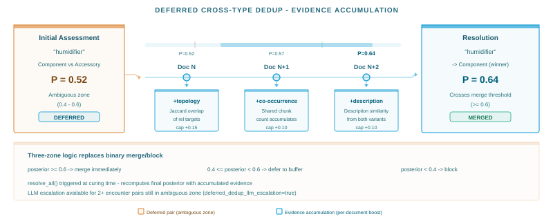

**Graph-side resolution** (`loader.py`, `resolve_against_graph()`): during cured-phase ingestion, incoming entities are resolved against existing graph nodes using the same Bayesian posterior model. The Neo4j query uses case-insensitive name matching via `toLower()` to prevent mismatches between "Headgear" in the graph and "headgear" in extraction. When the posterior exceeds the threshold, the incoming entity adopts the existing entity's type and ID. This prevents cross-type duplicates from accumulating across ingestion runs.

**Limitations**: the Bayesian model assumes signal independence which is approximate - embedding similarity and description similarity are correlated. The prior of 0.8 for identical names is empirically calibrated against the CPAP benchmark corpus and may need adjustment for other domains. Entities with no descriptions, no embeddings, and no shared chunks rely entirely on the name prior.

> **Note - original design**: the initial design specified a 4-step escalating-cost pipeline: (1) exact ID match, (2) SpaCy + Levenshtein pre-filter with Jaccard token overlap, (3) embedding similarity with ANN indexing (FAISS/hnswlib) for large entity sets, (4) LLM-based clustering for semantic equivalences. Benchmarking across 5 iterations (v03-v07) showed that name normalization in the ID hash eliminated 80%+ of duplicates before any fuzzy matching, making steps 2-4 largely unnecessary. The simpler three-layer approach (normalize + dual-threshold fuzzy + cross-type merge) achieved 98% deterministic accuracy and 4/5 generative quality on cross-document resolution. SpaCy, ANN indexing, and LLM clustering were not implemented. See `docs/experiments/entity_resolution_methods.md` for the full evaluation.

This entity resolution pipeline is shared between unstructured and structured ingestion (Section 7.5).

## 7. Structured Ingestion Pipeline

The structured pipeline transforms JSON/JSONL records into a knowledge graph using LLM-interpreted schema descriptions. Records already have defined fields, so the LLM's job shifts from "find entities in free text" to "interpret what these fields mean and map them to graph structure."

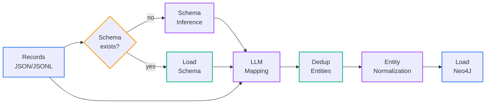

The structured pipeline is simpler than unstructured - no chunking, no ontology buffer feedback loop. Schema descriptions guide the LLM's interpretation of field semantics, and deterministic entity IDs from field values eliminate much of the fuzzy matching problem.

### 7.1 Pipeline Overview

Key differences from unstructured ingestion:
- No chunking - each record (or batch) is a discrete unit
- Schema description replaces the extraction prompt's general instructions
- Entity IDs can be derived deterministically from record fields rather than relying on LLM consistency
- Higher throughput - records are uniform, enabling larger batches per LLM call
- More predictable output - same schema applied uniformly across all records

Pipeline steps:

1. Read JSON/JSONL records
2. Load or infer the schema description
3. Send records (individually or in batches) to the LLM alongside the schema description
4. LLM interprets field semantics and produces entities and relationships
5. Deduplicate entities across records by deterministic `(type, id)` match
6. Normalize entity names and resolve remaining duplicates
7. Load merged graph into Neo4J

### 7.2 Schema Description Formats

The schema description is a human-readable file that explains what each field in the JSON records represents and how it maps to graph structure. The LLM interprets this generatively - it does not need to follow a rigid format. Stored in `.kgf/schemas/`.

A schema description should contain:
- What each field represents semantically
- Which fields map to entities (nodes) and what type
- Which fields create relationships and between which entity types
- Which fields become properties on entities rather than separate nodes
- Any special handling (arrays that expand to multiple entities, nested objects)

**Minimal example**:

```markdown
Each record is an employee. `name` is a Person, `department` is a Department.
The employee works in the department (WORKS_IN relationship).
`skills` is an array - each skill becomes a Skill entity linked by HAS_SKILL.
```

**Detailed example**:

```markdown
## Employee Records

Each JSON record represents an employee in the organization.

**Entities**:
- `name` -> Person entity (use as both name and id basis)
- `department` -> Department entity
- `manager` -> Person entity (same type as name, creates a second Person if different)
- `skills[]` -> one Skill entity per array element

**Relationships**:
- Person WORKS_IN Department (from name -> department)
- Person REPORTS_TO Person (from name -> manager)
- Person HAS_SKILL Skill (from name -> each skill)

**Properties**:
- `start_date` -> property on the WORKS_IN relationship
- `level` -> property on the Person entity
- `salary` -> do not extract (sensitive, exclude from graph)
```

**YAML format**:

```yaml
description: Employee directory records
entities:
  name:
    type: Person
    description: Full name of the employee
  department:
    type: Department
  skills:
    type: Skill
    array: true
relationships:
  - from: name
    to: department
    type: WORKS_IN
  - from: name
    to: manager
    type: REPORTS_TO
exclude:
  - salary
  - ssn
```

All three formats are valid. The LLM reads whichever format the user provides and applies it consistently across records.

### 7.3 Schema Inference

When no schema description is provided, the ingest pipeline infers one from the data itself. This eliminates the barrier to entry - a user can point the tool at a JSONL file and the schema inference checkpoint collaborates with the user to build the schema before ingesting.

#### Schema-as-Configuration Principle

The conversation that produces a schema is a UX convenience. Once the schema is confirmed and saved, the conversation history has zero influence on subsequent runs. The saved schema file is the sole authority for how records are mapped to graph structure. Re-running `--infer-schema` produces a fresh proposal that is diffed against the existing schema - it is not a continuation of the previous conversation.

#### Lockfile

Schema inference and adaptation acquire a lockfile at `.kgf/schema.lock` before modifying any schema file. The lock contains the process PID and timestamp. Only one process can perform schema discovery or adaptation at a time, ensuring the schema reaches a finalized state before ingestion proceeds. The lock is released when the schema is confirmed (interactive mode) or when the agent accepts it (autonomous mode).

#### Deterministic Baseline

Before any proposal is made, the pipeline generates a deterministic field profile that is saved alongside the schema as `.kgf/schemas/<source_name>.profile.yml`. This profile is reproducible - the same data always produces the same profile regardless of conversation flow. It contains:
- Field names, JSON types, and nesting depth
- Null rates and cardinality (unique value counts vs total records)
- Value distribution samples (first 5 unique values per field)
- Array field element types and average lengths
- Nested object structures flattened with dot notation
- Cross-field correlations (fields that always co-occur or are mutually exclusive)

The agent checks memory for prior inference sessions on structurally similar data. If a previous schema exists for a source with matching field signatures, the agent presents it as a starting point rather than inferring from scratch.

**Proposal phase**: based on the field profile, the agent generates a schema description including semantic interpretation of each field, entity type assignments, relationship mappings, fields recommended for exclusion, and suggested deterministic ID derivation patterns.

**Interactive refinement** (interactive checkpoint): the user reviews and directs changes through natural conversation:
- "Make `location` a separate entity instead of a property"
- "Ignore the `internal_id` and `updated_at` fields"
- "The `tags` array should create `Topic` entities with `HAS_TOPIC` relationships"
- "Merge `first_name` and `last_name` into a single `name` property on Person"

The agent validates each change against the data sample. After each round of changes, the agent presents the updated schema for confirmation.

**Persistence**: the confirmed schema is saved to `.kgf/schemas/<source_name>.md` and the inference session is recorded in agent memory. Running with `--infer-schema` re-triggers inference even if a schema exists - the new proposal is diffed against the existing schema and differences are presented for review.

#### Schema Versioning

Every confirmed schema receives an integer version, starting at 1. When a schema changes (via `--infer-schema` or `kgf update schema`), the previous version is archived to `.kgf/schemas/<source_name>_v<N>.md` and the current file is updated with an incremented version header. The version history enables migration when schema evolution affects existing graph data.

During loading, a `SchemaVersion` node is created (or matched) in Neo4J:

```cypher
MERGE (sv:SchemaVersion {version: $version, source: $source_name})
SET sv.timestamp = $timestamp, sv.hash = $schema_hash
```

Entities created during ingestion reference the schema version they were produced under:

```cypher
MATCH (sv:SchemaVersion {version: $version, source: $source_name})
MERGE (e:Entity {id: $id})-[:CREATED_UNDER]->(sv)
```

This enables downstream queries like "which entities were created under schema v2?" and targeted re-processing when a schema changes - only entities linked to the old `SchemaVersion` need re-evaluation.

#### Schema Recovery

The schema can always be rediscovered from the graph itself. The graph contains `OntologyType` nodes with `IS_A` relationships, Entity labels and property patterns, and relationship types between entities. `kgf init` uses this for recovery (see Section 3, Initialization).

### 7.4 LLM Mapping

**Prompt structure**:

```
You are a knowledge graph extraction system. Map structured records to graph
entities and relationships according to the schema description below.

Schema description:
{schema_description_content}

[If ontology provided:]
Constrain output to ONLY these entity types: {entity_types}
Constrain output to ONLY these relationship types: {relationship_types}

Rules:
- Each entity must have a deterministic id derived from the record field value
  (lowercase, underscores, type-prefixed, e.g. person_jane_smith)
- Preserve field values as entity names exactly as they appear in the record
- Array fields produce one entity per element
- Fields marked as properties attach to their parent entity, not as separate nodes
- Fields marked for exclusion must be ignored entirely

Records:
{json_records}

Return JSON:
{
  "entities": [{"id": "...", "name": "...", "type": "...", "properties": {}}],
  "relationships": [{"source": "...", "target": "...", "type": "...", "properties": {}}]
}
```

**Record batching**: structured records are uniform, so multiple records can be sent in a single LLM call. Recommended batch sizes:
- Simple records (5-10 fields): 20-50 records per call
- Complex records (nested objects, arrays): 5-10 records per call
- Records with long text fields: treat as hybrid, may need smaller batches

The batch size is auto-adjusted based on estimated token count per record. If a batch exceeds 80% of the configured `chunk_size` token limit, it is split.

**Deterministic entity IDs**: unlike unstructured extraction where the LLM must invent consistent IDs, structured data allows deterministic ID generation from field values:
- `{"name": "Jane Smith"}` -> `person_jane_smith`
- `{"department": "Engineering"}` -> `department_engineering`

This eliminates the fuzzy matching problem. The same field value always produces the same entity ID, ensuring natural deduplication across records.

### 7.5 Deduplication and Normalization

**Record-level deduplication**: many records reference the same entities (e.g., 50 employees in "Engineering" department). After mapping:
1. Collect all entities from all records
2. Group by `(type, id)` tuple
3. Merge properties (accumulate unique values for array-like properties)
4. Deduplicate relationships by `(source_id, target_id, type)`

**Load-time deduplication**: same `MERGE`-based strategy as unstructured ingestion. For structured data this is particularly effective because deterministic IDs mean the same entity from different batch runs will merge cleanly.

**Entity normalization**: even with deterministic IDs, structured data can contain variations ("Engineering Dept", "Engineering", "Eng."). A normalization pass uses the same escalating-cost pipeline described in Section 6.7 - exact ID match, then embedding similarity (0.85 threshold), then LLM clustering for ambiguous pairs. Because structured records produce fewer unique entities per type, this pass is cheap and effective.

Normalized entities store `name`, `normalized_name`, `normalized_score`, and `normalized_method`. When the source data is clean and consistent (values from a controlled dropdown or enum), normalization can be skipped - the schema description can indicate this.

### 7.6 Ontology Interaction

The schema description and ontology serve complementary roles:
- **Schema description**: tells the LLM what the input fields mean and how to map them
- **Ontology** (optional): constrains what entity types and relationship types the output may contain

When both are provided, the schema description guides field interpretation while the ontology acts as a validation filter. If the schema description suggests creating a "Team" entity but the ontology only allows "Department", the LLM should map to the closest allowed type.

When the ontology includes type hierarchies, the loader creates `OntologyType` nodes with `IS_A` relationships and `INSTANCE_OF` links from entities. This enables hierarchical queries: asking for all instances of "NeurologicalDisorder" returns Migraines, Epilepsy, and any other subtype without the query needing to enumerate them explicitly.

### 7.7 Hybrid Scenario

Some records contain both structured fields and free-text fields (e.g., a product record with a `description` field containing paragraphs of text). In this case:

- Structured fields are mapped according to the schema description
- Free-text fields can optionally be processed through the unstructured extraction pipeline
- The schema description indicates which fields are free-text: "the `description` field contains unstructured text - extract additional entities and relationships from it"

This is handled by the same LLM call - the schema description instructs the LLM to treat certain fields generatively while mapping others deterministically.

## 8. Graph Structure in Neo4J

The graph model distinguishes between unstructured and structured provenance while sharing common entity, ontology, and index infrastructure.

### Canonical Entity Node Contract

Every entity node in the graph carries these mandatory properties regardless of provenance (unstructured or structured), extraction mode, or ontology configuration:

| Property | Type | Source | Description |
|----------|------|--------|-------------|
| `id` | string | deterministic hash (`{type}_{sha1_12}`) | Unique identifier, stable across re-ingestion |
| `name` | string | LLM extraction | Human-readable entity name |
| `type` | string | LLM extraction, enforced by ontology | Entity type label (also applied as Neo4j node label) |
| `description` | string | LLM extraction | Free-text description of the entity |
| `confidence` | float | LLM extraction, averaged on merge | Extraction confidence score (0.0-1.0) |
| `source_chunks` | list[string] | chunk IDs | Provenance: which chunks contributed to this entity |

**Optional properties** (present when enabled or applicable):

| Property | Type | Condition | Description |
|----------|------|-----------|-------------|
| `embedding` | list[float] | `use_embeddings: true` | 1024-dim vector from Titan v2 |
| `normalized_name` | string | post-resolution | Name after normalization (suffix stripping, lowercasing) |
| `merged_from` | list[string] | post-resolution | IDs of entities merged into this canonical entity |
| domain properties | varies | from extraction | Type-specific properties (e.g., `pressure`, `weight`, `frequency`) |

The loading pipeline filters reserved keys (`id`, `name`, `type`, `description`, `confidence`, `embedding`) from the entity's `properties` dict before spreading domain properties onto the Neo4j node with `SET n += properties`. This prevents property name collisions with the canonical fields.

### Unified Graph Schema

```
Unstructured provenance:

  (:Document {name, source, processed_at})
    <-[:PART_OF]- (:Page {number})
      <-[:PART_OF]- (:Chunk {id, text, index, page})
        -[:HAS_ENTITY]-> (:Entity:Person {id, name, embedding, description, ...})
        -[:HAS_ENTITY]-> (:Entity:Organization {id, name, embedding, description, ...})
        -[:HAS_FACT]-> (:FactNode {id, text, embedding})
        -[:HAS_ELEMENT]-> (:TableElement {markdown, embedding})
        -[:HAS_ELEMENT]-> (:ImageElement {description, path, embedding})
        -[:HAS_CHILD]-> (:Chunk {text, embedding, is_child: true})

  (:Page)-[:NEXT_PAGE]->(:Page)
  (:Chunk)-[:NEXT_CHUNK]->(:Chunk)
  (:Document)<-[:HAS_SECTION]-(:Section)<-[:HAS_SUBSECTION]-(:Subsection)

Structured provenance:

  (:Source {name, format, record_count, processed_at})
    <-[:FROM_SOURCE]- (:Entity:Person {id, name, level, ...})
    <-[:FROM_SOURCE]- (:Entity:Department {id, name, ...})

Shared entity layer:

  (:Entity:Person)-[:WORKS_AT]->(:Entity:Organization)
  (:Entity:Person)-[:REPORTS_TO]->(:Entity:Person)
  (:Entity:Person)-[:HAS_SKILL]->(:Entity:Skill)

Ontology hierarchy:

  (:Entity)-[:INSTANCE_OF]->(:OntologyType {name, description})
  (:OntologyType)-[:IS_A]->(:OntologyType)

Schema versioning:

  (:Entity)-[:CREATED_UNDER]->(:SchemaVersion {version, source, timestamp, hash})

Indexes:

  Vector index: entity_embeddings ON Entity.embedding (cosine, 1536d)
  Fulltext index: entity_names ON Entity.name
```

### Node Types

All node types are part of the core graph model:

`Document`, `Chunk`, `Entity`, `FactNode`, `OntologyType`, `Source`, `SchemaVersion`, `Page`, `Section`, `Subsection`, `TableElement`, `ImageElement`

**Key design points**:

- `Document` nodes track source file metadata for unstructured provenance
- `Source` nodes track input file metadata for structured provenance - no `Chunk` nodes since structured records do not need chunk-level provenance
- `Page` nodes sit between Document and Chunk, linked by `NEXT_PAGE` chain for page-level reconstruction
- `Chunk` nodes store original text and link to their parent document (or parent page)
- Child chunks are sub-chunks used for parent-child retrieval - embeddings live on child nodes only
- Entity nodes carry both the base `Entity` label and their type label (e.g., `Person`, `Organization`)
- `FactNode` stores atomic facts extracted from chunks (hybrid or graph_reader mode), each carrying an embedding for semantic search
- `TableElement` and `ImageElement` nodes store extracted tables and images linked to their source chunk
- `OntologyType` nodes represent the type hierarchy with `IS_A` edges and `INSTANCE_OF` links from entities
- `Section` and `Subsection` nodes capture document structural hierarchy
- Typed relationships connect entities as extracted by the LLM
- `HAS_ENTITY` relationships from chunks to entities enable provenance queries
- Dual indexing supports both semantic (vector) and keyword (fulltext) retrieval

## 9. Loading Strategy

### 9.1 Batch Cypher Loading

Entities and relationships are loaded in batches using parameterized Cypher.

**Node creation** (unstructured):

```cypher
MERGE (n:Entity {id: $id})
SET n.name = $name, n.description = $description
SET n += $properties
WITH n
CALL apoc.create.addLabels(n, $labels) YIELD node
RETURN node
```

When an entity carries multiple type labels (from multi-facet resolution, Section 6.7 H5g), `$labels` contains all types (e.g., `["Setting", "Specification"]`). For single-type entities, `$labels` is `[entity.type]`. This replaces the previous pattern of embedding the type directly in the MERGE label, enabling multi-label nodes without additional Cypher statements.

**Node creation** (structured, batched by type for reduced label-switching overhead):

```cypher
UNWIND $batch AS row
MERGE (n:Entity {id: row.id})
SET n.name = row.name
SET n += row.properties
WITH n, row
CALL apoc.create.addLabels(n, row.labels) YIELD node
RETURN node
```

**Relationship creation**:

```cypher
MATCH (a:Entity {id: $source_id}), (b:Entity {id: $target_id})
MERGE (a)-[r:{rel_type}]->(b)
SET r.description = $description
```

**Batch size**: configurable (default 500), balancing transaction overhead against memory usage. Deadlock retries (3 attempts with backoff) handle concurrent write conflicts.

### 9.2 Indexing

**Structural indexes**: auto-created on `Entity.id` and per-type label indexes for efficient MERGE operations. Without indexes, MERGE degrades to full scans as the graph grows.

**Dual indexing** for retrieval: beyond structural indexes, the loader creates a vector index and a fulltext index on entity nodes:

```cypher
CREATE VECTOR INDEX entity_embeddings IF NOT EXISTS
FOR (n:Entity) ON (n.embedding)
OPTIONS {indexConfig: {`vector.dimensions`: 1536, `vector.similarity_function`: 'cosine'}}

CREATE FULLTEXT INDEX entity_names IF NOT EXISTS
FOR (n:Entity) ON EACH [n.name]
```

The vector index enables semantic similarity search across entities (used by embedding-based entity resolution and by downstream retrieval queries). The fulltext index supports fast text-based lookup, autocomplete, and fuzzy name matching. Both indexes are created idempotently with `IF NOT EXISTS` so re-runs are safe. Indexes are created after the initial load completes to avoid write-time overhead during batch ingestion.

### 9.3 Post-Load Validation

After loading, a validation pass checks graph integrity using Cypher queries. This catches structural problems that individual entity or relationship loads would not detect:
- Orphan entities with no relationships
- Missing expected relationship types per entity type
- Node counts by label falling outside expected ranges
- Relationship type coverage against the ontology

Validation results are included in the extraction output JSON and logged as warnings. Failures do not block loading - they are advisory, allowing the user to decide whether to investigate or accept the current state. Configured via `validate: true` in the load section of config.

### 9.4 Post-Load OWL Reasoning

When the ontology buffer was seeded from an OWL file and `post_load_reasoning` is enabled, an inference pass runs after loading. See Section 5.6 for the full reasoning pipeline description.

## 10. Query Pipeline

The query pipeline translates natural language questions into graph queries, retrieves results using the appropriate retrieval strategy, and formats output for the user. The query agent operates interactively, maintaining context across questions for follow-up resolution.

### 10.1 Query Agent Architecture

The query agent receives a system prompt that instructs it to:
1. Inspect the current graph schema (labels, relationship types, property keys) via `query_graph` before generating any queries
2. Choose the appropriate retrieval strategy based on the question type
3. Generate valid Cypher constrained by the actual graph schema
4. Format results according to the user's requested output format

The agent has access to `query_graph` for graph queries and schema inspection. It uses the registered tool wrappers (Section 2) rather than the Neo4J driver directly.

Tool selection logic:
- **Schema inspection** - `query_graph` provides node labels, relationship types, property keys, and index metadata. The agent calls this at the start of each session and caches the result for the conversation duration
- **Query execution** - `query_graph` executes Cypher queries and returns results in structured format
- **Configuration** - reads `.kgf/config.yml` for connection details and query defaults

### 10.2 Natural Language to Cypher

The agent uses schema-aware prompt construction for Text2Cypher translation. The `langchain-neo4j` package provides `Neo4jGraph` for schema introspection and `Neo4jVector` for vector similarity queries.

The Text2Cypher prompt includes:
- Current graph schema (labels, relationships, property keys)
- Entity type descriptions from the ontology (if available)
- Any relevant index information (vector dimensions, fulltext fields)
- The user's natural language question

The agent validates generated Cypher against the known schema before execution - if the Cypher references labels or relationship types not present in the graph, the agent self-corrects and regenerates.

### 10.3 Dual Retrieval Strategy

The query agent routes questions to the appropriate retrieval path:

- **Direct Cypher** - structural questions ("how many Person entities exist?", "show all departments with more than 10 employees") are translated directly to Cypher graph traversals
- **Vector similarity** - semantic questions ("find companies similar to Acme Corp", "what entities relate to machine learning?") use the `entity_embeddings` vector index for approximate nearest-neighbor search
- **Fulltext lookup** - name-based questions ("find John Doe", "show all entities named 'Engineering'") use the `entity_names` fulltext index

The agent determines the routing by analyzing the question type. Questions about graph structure and counts use direct Cypher. Questions seeking semantic similarity use vectors. Questions with specific entity names use fulltext. Complex questions may combine strategies - first identifying entities via fulltext, then traversing relationships via Cypher.

### 10.4 Interactive Conversational Mode

When invoked without a question (`kgf query`), the agent enters a conversational loop where it maintains context across questions. This enables follow-up resolution:

- "Show me all engineers" -> returns Person entities with role = engineer
- "What skills do they have?" -> "they" resolves to the engineers from the previous query
- "Which departments are they in?" -> continues the context chain

The agent maintains a conversation context that tracks:
- Previous query results (entity IDs, types, counts)
- Referenced entity sets ("they", "those", "the first one")
- Active filters and constraints from previous questions

The context resets when the user starts a new topic or explicitly clears it.

### 10.5 Output Formatting

The `--format` option controls how results are presented:

- `table` (default) - tabular format with columns derived from returned properties, suitable for terminal display
- `json` - raw JSON output for programmatic consumption
- `graph` - graph visualization showing nodes and edges (ASCII art in terminal, or connection info for external visualizers)
- `text` - natural language summary of the results, generated by the LLM from the raw query output

## 11. Update Pipeline

The update pipeline manages schema evolution, ontology refinement, and graph re-processing. It ensures that knowledge graphs can evolve as data sources change without requiring full re-ingestion.

### 11.1 Schema Update

The `kgf update schema` command handles schema evolution by diffing current schema against fresh data, proposing changes, and generating migration plans for the existing graph.

**Change detection**: the update workflow samples fresh data and compares against the current schema:
- **New fields** - fields present in data but not described in schema
- **Removed fields** - fields in schema but absent from data sample
- **Type changes** - field type shifted (string to array, flat to nested)
- **Distribution shifts** - cardinality or null rate changed significantly

**Impact assessment**: before proposing changes, the pipeline queries the existing graph:
- How many entities and relationships are affected
- Whether changes create orphan nodes or broken relationships
- Whether new entity types conflict with existing labels

**Migration plan generation**: the agent generates a migration plan containing:
- Cypher statements for structural changes (new labels, relationship retyping, property migration)
- Re-ingestion scope for records that need reprocessing with the updated schema
- Rollback instructions in case migration produces unexpected results
- Estimated impact metrics (nodes affected, relationships modified)

### 11.2 Ontology Refinement

The `kgf update ontology` command triggers an ontology refinement pass using the buffer's accumulated frequency and coverage data. This is useful after multiple ingestion runs have produced a large ontology with potential redundancy.

The refinement pass:
- **Prunes low-frequency types** that did not reach the confirmation threshold (`min_frequency_to_confirm`)
- **Merges variants** by applying variant detection across all accumulated types
- **Re-evidence pass** (optional) - re-processes source data to gather fresh type evidence with `--source`

The output is an updated `ontology.yml` with cleaner, more focused type definitions.

### 11.3 Graph Re-processing

The `kgf update graph` command re-processes previously ingested data with updated schema or ontology. It supports two modes:

**Incremental** (default): uses the migration plan from `kgf update schema` to selectively re-process affected records. For structural changes (new entity types, relationship retyping), the pipeline executes Cypher transformations directly against Neo4J.

**Full** (`--full`): re-processes all records from scratch. Used when schema changes are too fundamental for incremental migration.

Execution runs in two phases:
1. **Graph-level changes** - Cypher transformations applied directly against Neo4J (rename labels, add properties, retype relationships)
2. **Data-level changes** via re-ingestion - records affected by semantic changes are re-processed through the extraction pipeline with the updated schema

The agent tracks migration state in memory so interrupted migrations can be resumed.

### 11.4 Migration Plan Format

Migration plans are saved to `.kgf/migrations/` with timestamped filenames (e.g., `2026-03-09_employees_v2.yml`). Each plan contains:

```yaml
timestamp: 2026-03-09T14:30:00Z
schema_file: .kgf/schemas/employees.md
source_data: data/records.jsonl

changes:
  - type: add_entity_type
    entity: Location
    from_field: office_location
  - type: add_relationship
    name: LOCATED_IN
    source: Person
    target: Location
  - type: remove_property
    entity: Person
    property: office_location

cypher_statements:
  - |
    MATCH (p:Entity:Person)
    WHERE p.office_location IS NOT NULL
    MERGE (l:Entity:Location {id: 'location_' + toLower(replace(p.office_location, ' ', '_'))})
    SET l.name = p.office_location
    MERGE (p)-[:LOCATED_IN]->(l)
  - |
    MATCH (p:Entity:Person)
    REMOVE p.office_location

re_ingest_scope:
  records_affected: 150
  strategy: incremental

rollback:
  - |
    MATCH (p)-[r:LOCATED_IN]->(l:Entity:Location)
    SET p.office_location = l.name
    DELETE r
  - |
    MATCH (l:Entity:Location)
    WHERE NOT (l)--()
    DELETE l
```

The user can review and approve before execution, or run with `--dry-run` to see the plan without applying it.

## 12. Agent Memory

Agent memory provides persistent operational knowledge stored in `.kgf/memory/`. It operates alongside the ontology buffer as a complementary persistence layer - the buffer tracks schema-level knowledge (entity types, relationship types, coverage scores, variant mappings), while memory tracks operational knowledge accumulated across runs.

### Memory vs Ontology Buffer

| Aspect | Ontology Buffer | Agent Memory |
|--------|----------------|--------------|
| Scope | Schema knowledge | Operational knowledge |
| Contents | Entity types, relationship types, frequencies, variants | Data profiles, user preferences, resolution history |
| Lifecycle | Per-ingestion run (initialize -> evolve -> flush) | Persistent across all runs |
| Authority | Authoritative for type definitions | Advisory hints for agent behavior |

### Memory Schema

Agent memory captures:
- **Data source profiles** - field distributions, quality patterns, anomalies observed in previous runs
- **User preferences** - schema decisions, entity mapping choices, fields marked for exclusion
- **Resolution history** - entity normalization decisions, disambiguation choices, merge/split outcomes
- **Pipeline context** - extraction parameters that worked well for specific data shapes, batch sizes, model performance observations

### TTL and Entry Management

Memory entries have a configurable time-to-live (`ttl_days`, default 90). Stale entries expire automatically. Entry counts are capped per data source (`max_entries_per_source`, default 100) to prevent unbounded growth.

### Memory-Aware Behaviors

Memory is consulted at the start of each agent invocation and updated at completion:
- **Schema inference** checks memory for prior inference sessions on structurally similar data
- **Migration tracking** references previous migration outcomes to calibrate recommendations
- **Entity resolution** recalls past disambiguation decisions for consistent handling

The ontology buffer and memory share a read path but write independently. The buffer is authoritative for type definitions and constraints - memory never overrides buffer decisions. Memory provides contextual hints that influence agent behaviour but do not hard-constrain it.

Memory is stored as structured YAML files organized by data source and operation type.

## 13. Error Handling and Resilience

The pipeline handles failures at multiple levels - LLM calls, Neo4J transactions, and pipeline orchestration - with strategies appropriate to each failure mode.

### LLM Retry Strategy

Three layers of protection handle LLM call failures, each operating at a different scope:

1. **Token bucket rate limiter (pre-call, global)** - optional, configured via `llm.rate_limit.requests_per_second`. Enforces a maximum request rate across all concurrent worker threads before any LLM call is made. When disabled (default), zero overhead. Uses `threading.Lock` and `time.monotonic()` from stdlib.

2. **litellm 429 backoff (per-request, reactive)** - handles API-level rate limit responses (HTTP 429) with exponential backoff based on `Retry-After` header. Connection timeouts trigger immediate retry with increasing delay. This is reactive - it fires after a rate limit is hit.

3. **Instructor retry (per-request, validation)** - retries when the LLM returns output that fails Pydantic validation. Instructor re-prompts with the validation error for self-correction. Retry limit configurable (default 3 attempts).

The token bucket limiter prevents rate limit errors proactively, while litellm backoff handles any that slip through. Together they eliminate the need to reduce `concurrency` below 4 for most API tiers.

### Neo4J Transaction Resilience

Deadlock retries follow the APOC pattern - 3 attempts with exponential backoff when concurrent writes conflict. The Neo4J driver connection pool is configured with appropriate timeouts and max connection counts to prevent resource exhaustion.

Transaction boundaries are drawn at the batch level - each batch of entities or relationships is a single transaction. If a batch fails, only that batch is retried, not the entire load.

### Partial Failure Handling

**Per-chunk extraction failures**: if extraction fails for a specific chunk (LLM timeout, validation failure after retries), the chunk is logged as failed and skipped. The pipeline continues with remaining chunks. Failed chunks are recorded in the extraction output for later re-processing.

**Per-batch loading failures**: if a batch fails to load into Neo4J (constraint violation, transaction timeout), the batch is logged and the pipeline continues. Failed batches are saved to a recovery file for manual re-processing.

### Idempotency Guarantees

The pipeline is designed for safe re-runs:
- **SHA1 chunk IDs** - re-processing the same document produces identical chunk IDs, so MERGE operations are idempotent
- **MERGE semantics** - all node and relationship creation uses MERGE, not CREATE, ensuring no duplicates
- **Deterministic entity IDs** - structured data IDs derived from field values are inherently idempotent
- **Idempotent indexes** - `IF NOT EXISTS` clauses on all index creation

### Pipeline Recovery

For long-running ingestion jobs, the agent tracks progress in memory:
- Last successfully processed document index
- Completed extraction chunks
- Loaded batch ranges

If the pipeline is interrupted and restarted, the agent checks memory for in-progress state and offers to resume from the last checkpoint rather than starting over.

### Confidence Propagation Model

Every entity carries a `confidence` float (0.0-1.0) that originates at extraction and transforms through each pipeline stage. The propagation path:

**Stage 1 - Extraction** (`extract_chunk`): the LLM assigns initial confidence per entity based on how clearly the source text supports the extraction. This is the raw extraction confidence stored on the `Entity.confidence` field. Typical range: 0.7-1.0 for well-supported entities, 0.3-0.6 for inferred or ambiguous ones.

**Stage 2 - Within-type deduplication** (`deduplicate`): when entities merge within the same type block, confidences are averaged across all merged instances. An entity mentioned in 3 chunks with confidences [0.9, 0.85, 0.92] merges to 0.89. The `merged_from` list records which entities contributed.

**Stage 3 - Entity resolution** (`resolve_entities`): multi-signal merge combines entities across name variants. The merged entity takes the weighted average of confidences from its constituent entities. Resolution does not inflate confidence - it preserves the extraction-time signal.

**Stage 4 - Cross-type resolution** (`_resolve_cross_type`): Bayesian posterior decides whether to merge entities with the same name but different types. The merge/block decision is based on the posterior threshold (0.6), but the merged entity's confidence remains the average of the input confidences. The posterior itself is not written to the entity - it is a resolution decision signal, not a confidence score.

**Stage 5 - Type enforcement** (`_enforce_ontology_types` / `_resolve_types_bayesian`): type remapping does not alter the entity's confidence. The confidence reflects extraction quality, not type assignment quality. Type resolution entropy (from Bayesian resolver) is logged separately but not persisted on the entity.

**Stage 6 - Graph insertion** (`load_extraction`): the confidence value is written to the Neo4j node as-is. On MERGE updates (re-ingestion), confidence is updated to the new value. The `update_count` property tracks how many times the node has been updated.

The design deliberately keeps confidence as a single float representing extraction quality rather than a compound score mixing extraction, resolution, and type assignment signals. Pipeline-internal signals (Bayesian posterior, resolution similarity, type entropy) are logged at DEBUG level for diagnostics but not persisted on entities, keeping the graph schema simple and the confidence value interpretable.

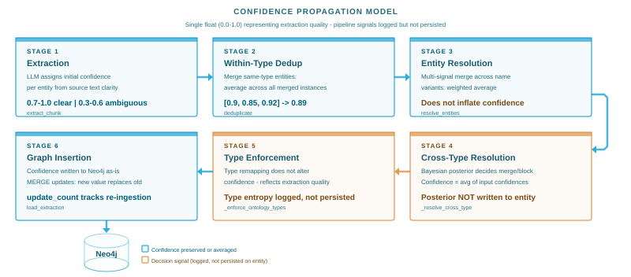

## 14. Pipeline Lifecycle

The graph has a lifecycle that spans multiple ingestion runs. A fresh graph begins empty, establishes its ontology through curing - whether types are discovered via fluid extraction or prescribed via a seed - stabilizes when calibration converges, and matures as subsequent runs add documents against the established schema. The FSM formalizes this evolution from empty graph to mature knowledge base, tracking ontological maturity rather than extraction mechanics.

The control plane lives in the graph itself as a `(:KGFControl)` metanode. Recovery requires only a config file and a graph connection - no serialized ontology files, no local state directories. The graph knows what state it is in, what ontology it has evolved, and what happened in previous runs.

### 14.1 Graph States

The FSM tracks the **ontology lifecycle** - what state is the graph's schema in? Run management (active process, run count, run history) is tracked via metanode properties, not FSM states. Six states govern the graph from cradle to grave.

| State | Description | Entry From | Exits To |
|-------|-------------|------------|----------|
| **EMPTY** | Fresh graph, no entities, no control plane | Graph creation / full wipe | INITIALIZING |
| **INITIALIZING** | Config loading, Neo4j verification, graph state detection, ontology conflict resolution | EMPTY (first run), STABLE (subsequent run) | CURING, STABLE, FAILED |
| **CURING** | Ontology establishment and calibration. Evidence accumulation regardless of extraction mechanism (fluid or direct). See below | INITIALIZING (first run, or subsequent with new seed), RECURING (drift re-entry) | STABLE, FAILED |
| **STABLE** | Well-calibrated ontology with robust posteriors, populated resolution guides, and consistent type assignments. Active runs extract with type enforcement; between runs, the graph is idle. Drift always monitored during active extraction | CURING (calibration converged) | INITIALIZING (next run), RECURING (sustained drift), FAILED |
| **RECURING** | Drift deliberation. Sustained remap rates detected, system evaluates whether ontology revision is warranted. Two exits: proceed to CURING or dismiss back to STABLE | STABLE (sustained drift during active run) | CURING, STABLE |
| **FAILED** | Unrecoverable error requiring operator attention | Any active state | (terminal within run) |

EMPTY is the state before the first-ever run. After the first successful run, the graph reaches STABLE and never returns to EMPTY unless explicitly wiped. STABLE serves as both the "active extraction" and "idle between runs" state - the distinction is tracked by `run_id` on the metanode (null when idle, uuid when a run is active). FAILED can occur from any active state and requires operator intervention to recover (fix config, restart Neo4j, etc.). Drift is always monitored during active extraction in STABLE state, regardless of how the ontology was established.

**Fluid and direct are extraction mechanisms, not lifecycle states.** Previous iterations modeled FLUID and DIRECT as separate FSM states. These are configuration parameters that control how the LLM extracts entities - fluid lets types emerge freely, direct enforces prescribed types. Both are mechanisms within the CURING state. The FSM tracks ontological maturity, not extraction mechanics.

**CURING means ontology establishment and calibration, not just type discovery.** Even with a strict seed (direct mechanism), the first run goes through CURING because the graph needs to calibrate Bayesian posteriors with real entity evidence, build adaptive resolution guides for ambiguous type pairs, accumulate cross-type dedup evidence, and resolve assignment ambiguities. A graph with prescribed types but uncalibrated posteriors is not yet stable. In fluid mode, convergence metrics (JSD, entropy, Chao1) drive the CURING -> STABLE transition. In direct mode, calibration metrics (posterior variance, guide population, resolution consistency) determine stability. Consolidation (type clustering, ontology freeze, batch flush to Neo4j) is the final activity within CURING. The KGFControl metanode tracks consolidation progress via `consolidation_started_at` (null during discovery/calibration, set to timestamp when consolidation begins), enabling crash recovery detection without a separate FSM state.

**RECURING is a deliberation state with branching exits.** RECURING has two exit paths: proceed to CURING (ontology revision needed) or dismiss back to STABLE (drift was synonyms/variants). This branching decision - potentially involving an LLM advisory call - requires a real state. Without it, drift-dismissed events leave no audit trail. The path STABLE -> RECURING -> STABLE in the transition log tells a clear story: drift was detected, evaluated, and dismissed.

### 14.2 Transition Table

Illegal transitions are any not listed. The trigger column names the `transitions` library trigger method. The actions column describes work performed during the transition.

| From | To | Trigger | Condition | Actions | Event |
|------|----|---------|-----------|---------|-------|
| EMPTY | INITIALIZING | `start_run` | First `kgf ingest` | Create KGFControl metanode | `phase_transition` |
| STABLE | INITIALIZING | `start_run` | Subsequent `kgf ingest` | Set `run_id`, increment `run_count` | `phase_transition` |
| INITIALIZING | CURING | `begin_curing` | `_needs_calibration`: first run, or subsequent run with new seed in non-strict mode | Initialize FluidAccumulator or direct calibrator based on config | `phase_transition` |
| INITIALIZING | STABLE | `begin_stable` | `_already_calibrated`: subsequent run with no seed or strict seed, graph already calibrated | Load existing ontology from graph | `phase_transition` |
| CURING | STABLE | `stabilize` | Convergence detected (fluid) or calibration thresholds met (direct). 6 trigger paths from Section 5.8: convergence, plateau, heuristic, generative, failsafe, force | Type clustering, ontology freeze, batch flush to Neo4j, build exemplar index | `phase_transition`, `curing_triggered` |
| CURING | FAILED | `fail` | Unrecoverable error during discovery, calibration, or consolidation | Record error on metanode | `phase_transition` |
| STABLE | RECURING | `detect_drift` | `_drift_exceeds_threshold`: sustained remap rates above threshold | Snapshot current ontology state for comparison | `phase_transition`, `drift_detected` |
| RECURING | CURING | `authorize_revision` | LLM advisory or heuristic confirms ontology revision needed | Reset accumulator, prepare for re-calibration | `phase_transition`, `recuring_authorized` |
| RECURING | STABLE | `dismiss_drift` | Drift evaluated as synonyms/variants, not genuine ontology gap | Resume extraction with current ontology | `phase_transition`, `drift_dismissed` |
| * | FAILED | `fail` | Unrecoverable error from any active state | Record error, set `last_error` | `phase_transition` |

### 14.3 Entry Scenarios and Graph State Detection

During INITIALIZING, the system determines the graph's current state and decides the entry path.

**Detection algorithm**:
1. Query for `(:KGFControl)` metanode - if exists, read `fsm_state`, `run_count`, `ontology_type_count`
2. If no metanode, query for entity nodes - if found, this is a legacy graph (pre-FSM)
3. If no entities, graph is EMPTY

**Ontology seed semantics**: a provided ontology seed can serve two roles:
- **Prior** (default): the seed informs fluid discovery - types from the seed get elevated priors in the ontology buffer, but the LLM can still discover additional types from data. The system enters CURING with the seed pre-loaded as initial type signals
- **Strict enforcement** (explicit): the seed constrains extraction - only seed types are allowed, no discovery. Requires explicit config flag (`ontology.strict: true` or `--strict-ontology` CLI flag). On an empty graph, the system enters CURING with direct mechanism (types prescribed but calibration needed). On an existing graph, the graph ontology wins (Section 14.4)

| Graph State | Ontology Seed | Strict Mode | Result | Rationale |
|-------------|---------------|-------------|--------|-----------|
| EMPTY | None | - | CURING (fluid) | Pure discovery from data |
| EMPTY | Provided | No (default) | CURING (fluid, seed as prior) | Discovery informed by seed types as initial signals |
| EMPTY | Provided | Yes | CURING (direct) | Types prescribed, but posteriors and guides still need calibration |
| STABLE | None | - | STABLE | Graph already calibrated, process docs directly |
| STABLE | Provided | No | CURING (fluid, graph ontology + seed merged as priors) | Continued evolution with merged priors |
| STABLE | Provided | Yes | WARNING + STABLE (use graph ontology) | Graph ontology wins, seed ignored (Section 14.4) |

### 14.4 Ontology Prior Conflict Rules

**Default (non-strict) mode**: seed and graph ontology are **merged as priors** for continued fluid evolution. The seed adds type signals to the buffer alongside the graph's existing types. Both inform discovery, neither constrains it. This enables incremental ontology enrichment across runs.

**Strict mode** (`ontology.strict: true`): the graph's evolved ontology always wins over a provided seed. The graph ontology was empirically derived from actual data through curing. Overriding it would invalidate existing entities and break relationships.

Strict mode resolution:
- Seed subset of graph ontology -> proceed with graph ontology, INFO log
- Seed adds types not in graph -> proceed with graph ontology, WARN log listing ignored types
- Seed contradicts graph -> proceed with graph ontology, WARN with full diff
- Future `--force-seed` + `--wipe` -> override (requires explicit graph wipe)

### 14.5 Graph Control Plane

All control plane nodes carry `:KGFControl` as a shared secondary label for namespace isolation. The `KGF` prefix alone could collide with domain data extracted from sources that mention "KGF". The shared label enables clean wipe (`MATCH (n:KGFControl) DETACH DELETE n`), exclusion from domain queries (`WHERE NOT n:KGFControl`), and index optimization without substring matching.

The `(:KGFControl:KGFState)` metanode is the authoritative state store.

**Metanode properties**:
- `graph_id` - unique identifier for this KG instance
- `fsm_state` - current state (EMPTY, INITIALIZING, CURING, STABLE, RECURING, FAILED)
- `run_id` - active ingestion run identifier (null when idle in STABLE)
- `run_count` - total completed runs
- `ontology_source` - provenance of current ontology (discovered/seed/graph)
- `extraction_mechanism` - how CURING was conducted (fluid/direct)
- `consolidation_started_at` - null during discovery/calibration, set to timestamp when consolidation begins
- `ontology_type_count` - number of types in evolved ontology
- `ontology_hash` - SHA256 hash (16 hex chars) of sorted confirmed entity and relationship type names
- `created_at` - graph creation timestamp
- `last_completed_at` - last successful run completion
- `last_error` - most recent error if in FAILED state

**Control plane node inventory**:

| Node | Labels | Purpose |
|------|--------|---------|
| Metanode | `:KGFControl:KGFState` | FSM state, run history, ontology hash |
| Run | `:KGFControl:KGFRun` | Per-ingestion run record |
| Transition | `:KGFControl:KGFTransition` | State change audit trail |
| Ontology type | `:KGFControl:KGFOntologyType` | Type definition with description and properties |
| Resolution guide | `:KGFControl:KGFResolutionGuide` | Type pair disambiguation rules |
| Type calibration | `:KGFControl:KGFTypeCalibration` | Per-type Bayesian calibration state |

Domain nodes (`(:Entity)`, `(:Document)`, `(:Chunk)`) never carry `:KGFControl`. All domain queries include `WHERE NOT n:KGFControl` to exclude control plane nodes from entity counts, type distributions, validation, graph resolution, and curing graph queries.

**Graph-authoritative schema persistence**: at each stabilize point (CURING -> STABLE), the system persists the full ontology schema to graph control plane nodes. `(:KGFControl:KGFOntologyType)` nodes store type definitions with descriptions and properties, linked by `[:IS_A]` relationships encoding the type hierarchy. `(:KGFControl:KGFResolutionGuide)` stores the evolved disambiguation rules string. `(:KGFControl:KGFTypeCalibration)` nodes store per-type entity counts, mean posteriors, observation counts, remap counts, and prior strengths, linked to the metanode via `[:HAS_CALIBRATION]`.

**OntologyBuffer.from_graph()**: reconstructs a full `OntologyBuffer` from graph-resident data without reading `ontology.yml`. Seven queries extract entity type frequencies from domain nodes, relationship types from domain relationships, type definitions from `KGFOntologyType` nodes, hierarchy from `IS_A` relationships, resolution guide from `KGFResolutionGuide`, exemplars from entity samples, and calibration state from `KGFTypeCalibration` nodes.

**Ontology hash and seed dedup**: `buffer.compute_hash()` produces a deterministic 16-character hex hash from sorted confirmed entity and relationship type names. When a seed ontology is provided on a subsequent run, the system compares the seed's hash against the metanode's `ontology_hash`. If identical, the seed is recognized as already consumed and skipped. If different, the seed's new types merge as additive priors into the existing buffer.

**Cache-first pattern**: when no seed is provided against an existing graph, the system first checks if `ontology.yml` exists and its hash matches the metanode. If matched, the file is loaded directly (avoiding graph round-trips). If mismatched or missing, `from_graph()` reconstructs the buffer from graph data. The `ontology.yml` file is a disposable cache - the graph is the sole authority.

**Document and entity tagging**: all `(:Document)` and `(:Entity)` nodes carry a `run_id` property matching the FSM run that created them. This enables targeted cleanup during crash recovery (wiping partial entities from an interrupted run by `run_id`).

**Crash recovery**: three interruption scenarios are detected and handled at FSM initialization:

| Scenario | Detection | Action |
|----------|-----------|--------|
| Pre-consolidation | `fsm_state=curing`, `consolidation_started_at` is null | Force re-cure, clear stale `run_id` |
| Mid-consolidation | `consolidation_started_at` is non-null | Wipe entities by stale `run_id`, force re-cure |
| Post-consolidation | `fsm_state=stable`, `run_id` is non-null | Query loaded `(:Document)` nodes, skip already-loaded, resume |

**Split responsibility**:
- Graph metanode: authoritative control plane (FSM state, run history, ontology hash, schema, calibration)
- Local filesystem: non-authoritative artifacts only (logs, benchmark outputs, event dumps, ontology.yml cache)

### 14.6 FSM Implementation

The FSM is implemented in `kg_builder_cli/fsm/` using the `transitions` library (pytransitions/transitions). The package has four modules: `states.py` (state and transition definitions), `context.py` (PipelineContext model with guards and callbacks), `metanode.py` (Neo4j CRUD operations), and `__init__.py` (public API).

**State and transition definitions** (`fsm/states.py`):

```python
from transitions import Machine

states = [
    {"name": "empty"},
    {"name": "initializing", "on_enter": ["_on_enter_initializing"]},
    {"name": "curing", "on_enter": ["_on_enter_curing"]},
    {"name": "stable", "on_enter": ["_on_enter_stable"]},
    {"name": "recuring", "on_enter": ["_on_enter_recuring"]},
    {"name": "failed", "on_enter": ["_on_enter_failed"]},
]

transitions = [
    {"trigger": "start_run", "source": ["empty", "stable"], "dest": "initializing"},
    {"trigger": "begin_curing", "source": "initializing", "dest": "curing",
     "conditions": ["_needs_calibration"]},
    {"trigger": "begin_stable", "source": "initializing", "dest": "stable",
     "conditions": ["_already_calibrated"]},
    {"trigger": "stabilize", "source": "curing", "dest": "stable"},
    {"trigger": "detect_drift", "source": "stable", "dest": "recuring",
     "conditions": ["_drift_exceeds_threshold"]},
    {"trigger": "authorize_revision", "source": "recuring", "dest": "curing"},
    {"trigger": "dismiss_drift", "source": "recuring", "dest": "stable"},
    {"trigger": "fail", "source": "*", "dest": "failed"},
]
```

A `GraphState` constants class provides type-safe state name references (`GraphState.CURING`, `GraphState.STABLE`, etc.) used throughout the codebase instead of string literals.

**PipelineContext model** (`fsm/context.py`):

The `PipelineContext` is a `@dataclass` carrying all metanode properties (`graph_id`, `run_id`, `run_count`, `ontology_source`, `extraction_mechanism`, `consolidation_started_at`, etc.) plus runtime flags. The `transitions` Machine attaches via mixin through `create_fsm()`, which also wraps each trigger method to capture `_prev_state` before the transition fires - this enables `on_enter_*` callbacks to know the source state.

**Guard conditions** are simple boolean properties set by `cli.py` before calling triggers:
- `needs_calibration: bool` - set True for first runs, False for subsequent runs with existing ontology
- `drift_confirmed: bool` - set True by `cli.py` when CuringDetector reports sustained drift

When a guard returns False, the `transitions` library silently skips the transition (no exception). The caller checks `ctx.state` after the trigger to verify the transition occurred. This is intentional - guards are safety nets, not primary flow control. The pipeline logic in `cli.py` determines which trigger to call based on graph detection results.

**State entry callbacks** emit `phase_transition` blinker signals and log the transition. They do not drive pipeline logic - all extraction, curing, and loading behavior remains in `cli.py`. The FSM is an observability and state-tracking overlay, not a control-flow replacement.

**Integration pattern** (`cli.py`):

The FSM integrates as a backward-compatible overlay via two helper functions:

- `_init_fsm(config, curing_enabled, has_seed)` - detects graph state via `detect_graph_state()`, creates `PipelineContext` with appropriate initial state (EMPTY or STABLE), transitions through INITIALIZING to CURING or STABLE, writes the KGFControl metanode and KGFRun node. **Returns None on any failure** - the pipeline proceeds without FSM tracking if Neo4j is unavailable at detection time or the `transitions` library is not installed.

- `_update_metanode_safe(config, ctx)` - writes the full FSM context to the KGFControl metanode. Swallows all exceptions. Called at each transition point (initialization, consolidation start/end, stabilization, run completion).

The FSM context is passed as an optional keyword argument `fsm_ctx=None` to `_ingest_fluid()`. All FSM operations are guarded by `if fsm_ctx:` checks. The existing boolean `cured` flag and phase string tracking remain unchanged - the FSM runs alongside them, not instead of them.

**Consolidation crash recovery**: at the start of consolidation (type clustering + batch flush), `cli.py` calls `fsm_ctx.mark_consolidation_start()` and updates the metanode. On successful completion, `mark_consolidation_end()` clears the marker. If the process crashes mid-consolidation, the metanode retains `consolidation_started_at` with a timestamp, enabling the next process to detect the partially-consolidated state.

### 14.7 Event Mapping

The `phase_transition` signal's `from_state` and `to_state` fields must match states defined in 14.1. The transition table in 14.2 is the authoritative source for valid event payloads. See Section 15 for the full event architecture.

## 15. Observability

### Logging

loguru provides structured logging with configurable levels. The pipeline logs at multiple granularities:
- `INFO` - pipeline stage transitions, document processing start/end, load completion
- `DEBUG` - individual chunk extraction results, batch loading details, entity resolution decisions
- `WARNING` - validation failures, coverage drops, partial failures, disjoint constraint violations
- `ERROR` - unrecoverable failures, connection errors, API errors

Log format includes timestamps, pipeline stage, document/chunk identifiers, and structured metadata for machine parsing.

### Pipeline Progress Tracking

During ingestion, the pipeline tracks and reports:
- Document progress (N of M documents processed)
- Chunk progress within each document
- Entity and relationship counts (running totals)
- Ontology buffer state (confirmed types, pending candidates, coverage trend)

Progress is reported to the terminal via loguru and optionally persisted for long-running jobs.

### Extraction Metrics

After each ingestion run, the pipeline computes:
- **Coverage scores** per document and overall
- **Type distribution** - entity counts by type, relationship counts by type
- **Resolution statistics** - entities resolved by each method (exact, embedding, LLM), resolution confidence distribution
- **Validation results** - orphan entities, missing relationships, type coverage

### Performance Telemetry

The pipeline measures and reports:
- **LLM call latency** - per-call and aggregate (p50, p95, p99)
- **Token usage** - input and output tokens per extraction call, total for the run
- **Batch throughput** - entities loaded per second, relationships loaded per second
- **Pipeline duration** - wall clock time per stage (parse, chunk, extract, dedup, resolve, load)

### Event Architecture

The pipeline accumulated significant implicit coupling as features were added: `resolve_entities()` stored results on module-level function attributes (`_last_id_map`, `_last_cross_type_stats`) that callers retrieved via `getattr`, `record_cross_type_stats()` auto-called `_maybe_evolve()` as a hidden side effect, and `cli.py` contained 4 redundant `_maybe_evolve()` calls at different pipeline stages with no clear ownership. 27+ explicit triggers and 15+ implicit callbacks were scattered across 6 modules with no way to trace which actions caused which effects. Debugging curing decisions required reading 4 files and reconstructing the execution order mentally. Adding new observability (e.g. tracking why curing didn't trigger on a specific document) meant adding more `logger.info` calls in the middle of business logic, further mixing concerns.

The event system replaces this implicit coupling with a typed, observable signal layer. Every significant pipeline action emits a signal with a Pydantic payload, making the execution flow visible and traceable without changing pipeline behavior. The `ResolutionResult` NamedTuple replaces the module-attribute hack, and evolution triggers are explicit rather than buried in side effects.

**Signal dispatch**: Named `Signal` instances in `kg_builder_cli/events/signals.py`. One signal per event type (41 signals across 10 categories). Synchronous dispatch via `signal.send(signal, event=payload)`. All 41 signals are wired into business logic - every signal has at least one `.send()` call site. Two signals (`llm_call_failed`, `drift_detected`) are condition-dependent and only fire when the condition occurs (all LLM calls succeed or all drift checks pass).

**Event payloads**: Pydantic `BaseModel` subclasses in `kg_builder_cli/events/types.py` (~50 event types). Passed as `event=` kwarg to `signal.send()`. Document extraction events carry `doc_index` and `total_docs` fields for progression tracking.

**Handler registration**: At pipeline startup in `cli.py` via `register_default_handlers()` (always) and `register_verbose_handlers()` (when `--verbose`). Default handlers log 13 key signals at INFO level. Verbose handlers log full Pydantic payloads at DEBUG level for every signal.

**Event log**: When `--event-log PATH` is provided, each event is streamed as a JSONL line to the specified file as it's emitted (not batched at the end). This enables real-time monitoring with `tail -f` during long ingestion runs. The config option `extract.event_log: true` enables streaming with a default path of `.kgf/events.log`.

**Signal categories** (10):

| Category | Signals | Coverage |
|----------|---------|----------|
| Pipeline phase | 3 | ingestion start/complete, phase transitions |
| Extraction | 4 | document extraction start/complete, resolution, type enforcement |
| Resolution decisions | 4 | Bayesian cross-type decisions, deferred pairs, evidence updates |
| Ontology evolution | 6 | hierarchy discovery, guide rules, evolution triggers, flush |
| Stability metrics | 2 | per-document metrics recording, periodic snapshots |
| Curing detection | 6 | detector method results, blocked conditions, drift, patience |
| LLM invocations | 3 | call start/complete/fail for all LLM call types |
| Blocked/skipped | 5 | merge rejections, validation failures, skipped pairs |
| Buffer mutations | 4 | type pruning, exemplar updates, snapshots, consolidation |
| Loading | 4 | graph load start/complete, resolution applied, validation |

**CLI flags**:

- `--verbose / -v` - enables verbose event logging with full Pydantic payloads at DEBUG level
- `--event-log PATH` - streams JSONL event log to the specified file continuously during the run
- `--processing-log PATH` - redirects loguru execution log to the specified file (default: stdout)

**Event bus architecture**: The event bus is a flat, synchronous dispatch layer - there is no message queue or async processing. When a component calls `signal.send(signal, event=payload)`, all connected handlers execute inline before control returns to the caller. This keeps the pipeline deterministic and preserves execution order while making every decision point observable.

At pipeline startup, `cli.py` registers three handler layers:

1. **Default handlers** (always active) - connected to 13 key signals, produce INFO-level log output with document progression (e.g., "extraction started: doc.pdf (2/10) [fluid, 15 chunks]")
2. **Verbose handlers** (when `--verbose`) - connected to all 41 signals, log full Pydantic payloads at DEBUG level
3. **Event log writer** (when `--event-log PATH`) - streams each event as a JSONL line to the specified file as it's emitted, enabling real-time `tail -f` monitoring

Handlers are plain functions connected via `signal.connect(handler)`. Blinker uses weak references by default, so handler functions must be module-level or stored in a collection to prevent garbage collection.

**Example - curing detection flow**: When the curing detector evaluates whether the ontology has stabilized, the event bus captures every sub-decision:

```
stability_metrics_recorded     # StabilityMetrics.record() emits ~20 metrics
  -> curing_check_performed    # detector.is_cured() result: False
     -> curing_condition_blocked  # "jsd > 0.05" (actual=0.12, threshold=0.05)
     -> curing_condition_blocked  # "chao1_coverage < 0.85" (actual=0.72)
  -> curing_check_performed    # detector.patience_exceeded() result: False
  -> drift_check_passed        # remap_rate=0.02 below threshold=0.15

# ... 3 documents later, conditions met:
stability_metrics_recorded     # entropy stabilized, JSD < threshold
  -> curing_check_performed    # detector.is_cured() result: True
  -> curing_triggered          # trigger="convergence", doc_index=7, types=12
  -> phase_transition          # from="fluid", to="cured", trigger="convergence"
```

Each event carries its full Pydantic payload. With `--verbose`, the `curing_condition_blocked` event logs exactly which sub-condition failed and by how much, eliminating guesswork when debugging why curing did not trigger.

**Why blinker**: Synchronous, lightweight (~40KB, zero deps), well-maintained (official Pallets signal library), supports sender filtering and weak references.

## 16. Security

### Credential Management

Secrets are managed through environment variable interpolation:
- Neo4J passwords use `\${VAR}` syntax in `config.yml`, resolved from `.env` (loaded by `python-dotenv`) or environment variables
- AWS credentials for Bedrock use AWS profiles (`profile: default` in config) or standard AWS environment variables (`AWS_ACCESS_KEY_ID`, `AWS_SECRET_ACCESS_KEY`)
- The `.env` file should be gitignored and never committed to version control
- `config.yml` itself should never contain plaintext secrets

### Neo4J Authentication

The driver connects using credentials from `config.yml`. The password is always resolved from environment variables. The connection URI, username, and database name are committed with the config since they are not sensitive.

### Sensitive Field Exclusion

Schema descriptions can mark fields for exclusion from the graph. The `exclude` list in schema descriptions (e.g., `salary`, `ssn`) instructs the LLM to ignore these fields entirely during mapping. The extraction output should never contain values from excluded fields.

Additionally, the extraction pipeline does not persist raw source text in the graph by default - only extracted entities, relationships, and chunk text. The original source documents remain on the filesystem and are not copied into Neo4J.

### Extraction Output Sanitization

Extraction outputs written to `.kgf/extractions/` may contain entity properties derived from source data. These files should be treated with the same sensitivity as the source data itself. The `--keep-extractions` flag is `false` by default, meaning extraction JSON is not persisted unless explicitly requested.

## 17. Module Structure

The package is organized by domain responsibility with explicit interface contracts between modules. A shared `types/` module defines all Pydantic models that cross module boundaries, ensuring every data handoff is typed and validated. The dependency graph is acyclic - modules import types and call downstream, never upstream.

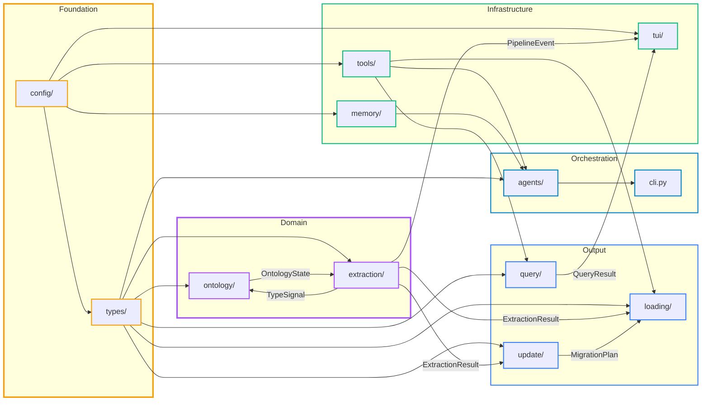

The only bidirectional data flow is between `ontology/` and `extraction/` - mediated through distinct types (`OntologyState` downstream, `TypeSignal` upstream) with no circular imports.

### Package Layout

```
kg_builder_cli/
  __init__.py
  cli.py                          # typer entry points, argument parsing, agent spawning

  types/                          # shared Pydantic models - zero logic, pure data contracts
    __init__.py                   # re-exports all types for convenience
    config.py                     # AppConfig, Neo4jConfig, LLMConfig, ExtractConfig, LoadConfig
    document.py                   # TextSegment, Chunk, ChunkMetadata, DocumentMetadata
    extraction.py                 # Entity, Relationship, Fact, ExtractionResult, ExtractionMetadata
    ontology.py                   # OntologyState, TypeDef, RelationshipDef, TypeSignal, NormDiagnostic
    resolution.py                 # ResolvedEntity, NormalizationMeta (method, scores)
    loading.py                    # LoadBatch, LoadResult, ValidationReport
    query.py                      # QueryResult, QueryContext (conversation state for follow-ups)
    pipeline.py                   # PipelineEvent, PipelineStats, RunReport (for TUI and batch logging)
    migration.py                  # MigrationPlan, MigrationStep, RollbackStep

  config/                         # configuration loading and validation
    __init__.py
    loader.py                     # config.yml loading, .env resolution, ${VAR} interpolation
    schema.py                     # Pydantic validators that produce types/config.py models
    defaults.py                   # built-in default values

  tools/                          # Strands agent tool wrappers
    __init__.py
    registry.py                   # tool registry setup for Strands SDK
    query_graph.py                # query_graph tool - wraps graph_query.query_graph()
    query_buffer.py               # query_buffer tool - wraps buffer.snapshot()
    inspect_metrics.py            # inspect_metrics tool - stability metrics history

  agents/                         # Strands agent definitions (escalation only)
    __init__.py
    curing.py                     # curing agent - replaces two-phase generative curing
    resolution.py                 # resolution agent - replaces fixed-context type/dedup resolution
    query.py                      # query agent - kgf query conversational Cypher generation

  ontology/                       # ontology buffer and normalization
    __init__.py
    buffer.py                     # in-memory buffer state, feedback accumulation, refinement triggers
                                  #   accepts: TypeSignal (from extraction)
                                  #   exposes: OntologyState (frozen snapshot for extraction)
    normalizer.py                 # three-tier normalization (programmatic parse -> LLM repair -> full LLM)
                                  #   accepts: raw file content (any format)
                                  #   returns: OntologyState + NormDiagnostic
    owl_import.py                 # owlready2 OWL/RDF programmatic import
                                  #   accepts: OWL file path
                                  #   returns: OntologyState
    yaml_schema.py                # YAML ontology validation
                                  #   accepts: YAML file path
                                  #   returns: OntologyState
    dag.py                        # DAG validation - topological sort, cycle detection
                                  #   accepts: OntologyState
                                  #   returns: OntologyState (cleaned) + list of resolved cycles
    reasoning.py                  # post-load OWL reasoning (HermiT, Cypher-based subclass propagation)
                                  #   accepts: OntologyState + Neo4J connection
                                  #   side effect: writes inferred triples to Neo4J

  extraction/                     # ingestion pipelines (unstructured and structured)
    __init__.py
    unstructured.py               # unstructured pipeline orchestration
                                  #   accepts: DocumentMetadata, AppConfig, OntologyState
                                  #   returns: ExtractionResult + List[TypeSignal]
    structured.py                 # structured pipeline orchestration
                                  #   accepts: file path, schema description, AppConfig, OntologyState
                                  #   returns: ExtractionResult
    parsing.py                    # document parser adapter layer (PDF, TXT, MD, DOCX, XLSX, CSV, HTML)
                                  #   accepts: file path
                                  #   returns: List[TextSegment]
                                  #   extensible via format-to-parser registry dict
    chunking.py                   # chunking strategies (token, semantic, parent-child)
                                  #   accepts: List[TextSegment], ExtractConfig
                                  #   returns: List[Chunk]
    prompts.py                    # extraction prompt construction from ontology state
                                  #   accepts: Chunk, OntologyState, coverage score
                                  #   returns: str (formatted prompt)
    response_models.py            # Pydantic response model generation from ontology types
                                  #   accepts: OntologyState
                                  #   returns: Type[BaseModel] (dynamic Pydantic class)
    facts.py                      # atomic facts extraction (FactNode track)
                                  #   accepts: Chunk, AppConfig
                                  #   returns: List[Fact]
    dedup.py                      # entity deduplication
                                  #   accepts: List[Entity] (from all chunks of a document)
                                  #   returns: List[Entity] (merged by type+id)
    resolution.py                 # entity resolution (escalating-cost pipeline)
                                  #   accepts: List[Entity] (all documents)
                                  #   returns: List[ResolvedEntity]

  loading/                        # Neo4J graph loading
    __init__.py
    loader.py                     # batch Cypher loading orchestration
                                  #   load_extraction(): accepts ExtractionResult, LoadConfig, skip_doc_chunks flag
                                  #   load_doc_chunks(): loads Document + Chunk nodes only (preserves per-document linkage)
                                  #   resolve_against_graph(): queries Neo4j for existing entities, remaps types/IDs, rewires relationships
                                  #   returns: LoadResult
    indexes.py                    # index creation (structural, vector, fulltext)
                                  #   accepts: LoadConfig
                                  #   side effect: creates indexes in Neo4J
    validation.py                 # post-load validation checks
                                  #   accepts: LoadConfig
                                  #   returns: ValidationReport

  query/                          # graph querying
    __init__.py
    text2cypher.py                # natural language to Cypher translation
                                  #   accepts: str (question), graph schema metadata
                                  #   returns: str (Cypher query)
    retrieval.py                  # dual retrieval routing (vector, fulltext, direct Cypher)
                                  #   accepts: str (question or Cypher), retrieval strategy
                                  #   returns: QueryResult
    formatter.py                  # output formatting
                                  #   accepts: QueryResult, format type (table/json/graph/text)
                                  #   returns: str (formatted output)

  update/                         # schema evolution and graph re-processing
    __init__.py
    schema_diff.py                # schema change detection
                                  #   accepts: current schema, fresh data sample
                                  #   returns: List[MigrationStep]
    migration.py                  # migration plan generation and execution
                                  #   accepts: List[MigrationStep], LoadConfig
                                  #   returns: MigrationPlan (with rollback)
    ontology_refine.py            # ontology refinement pass
                                  #   accepts: OntologyState, refinement config
                                  #   returns: OntologyState (refined)

  memory/                         # agent operational memory
    __init__.py
    store.py                      # YAML-based memory read/write
                                  #   accepts: source key, memory entry
                                  #   returns: List[memory entries] by source
    ttl.py                        # entry expiration and cap management
                                  #   accepts: memory store, TTL config
                                  #   side effect: prunes expired entries

  tui/                            # terminal UI harness
    __init__.py
    app.py                        # textual App - main harness entry point
                                  #   accepts: AppConfig, interactive/batch mode flag
    panels.py                     # stats panel, buffer panel, chat panel widgets
                                  #   accepts: PipelineStats, OntologyState
    events.py                     # pipeline event handlers that update panels
                                  #   accepts: PipelineEvent stream
```

### Interface Contracts

Every data handoff between modules uses a Pydantic model from `types/`. The table below lists each boundary crossing:

| From | To | Type | Key fields |
|------|----|------|------------|
| `extraction/parsing` | `extraction/chunking` | `List[TextSegment]` | `text`, `page`, `section`, `source_path`, `byte_offset` |
| `extraction/chunking` | `extraction/prompts` | `List[Chunk]` | `id` (SHA1), `text`, `index`, `metadata` |
| `ontology/buffer` | `extraction/prompts` | `OntologyState` | `entity_types`, `relationship_types`, `coverage`, `variants` (frozen snapshot) |
| `extraction/` | `ontology/buffer` | `List[TypeSignal]` | `type_name`, `frequency`, `source_chunk`, `is_relationship` |
| `extraction/` | `loading/` | `ExtractionResult` | `metadata`, `entities`, `relationships`, `facts`, `validation` (Section 20 format) |
| `extraction/resolution` | `loading/` | `List[ResolvedEntity]` | extends `Entity` with `normalized_name`, `normalized_score`, `normalized_method` |
| `loading/validation` | caller | `ValidationReport` | `orphan_entities`, `missing_relationships`, `type_coverage`, `warnings` |
| `query/retrieval` | `query/formatter` | `QueryResult` | `records`, `columns`, `cypher_used`, `retrieval_strategy` |
| `update/schema_diff` | `update/migration` | `List[MigrationStep]` | `type` (add/remove/rename), `entity`, `field`, `cypher` |
| `update/migration` | `loading/` | `MigrationPlan` | `steps`, `rollback_steps`, `re_ingest_scope`, `estimated_impact` |
| `extraction/` | `tui/events` | `PipelineEvent` | `stage`, `document_idx`, `chunk_idx`, `entity_count`, `timestamp` |
| `ontology/normalizer` | caller | `NormDiagnostic` | `tier_used`, `types_count`, `rels_count`, `depth`, `issues_resolved` |

The `OntologyState` passed from `ontology/` to `extraction/` is a frozen snapshot - extraction reads it but cannot mutate it. Feedback flows back as `TypeSignal` objects that the buffer processes independently. This prevents race conditions during parallel chunk extraction.

### Dependency Rules

- **`types/`** depends on nothing except `pydantic`. Every other module may import from `types/`
- **`config/`** depends on `types/config` for model definitions. Produces validated `AppConfig` at startup
- **`tools/`** depends on `config/` for connection details. Wraps external libraries behind factory functions
- **`agents/`** depends on `tools/` and `config/`. Each agent defines a system prompt and tool subset, delegates to Strands SDK for escalation decisions only
- **`ontology/`** depends on `types/ontology` and `types/extraction` (for `TypeSignal`). Self-contained otherwise. `buffer.py` is the primary interface
- **`extraction/`** depends on `types/` (document, extraction, ontology types) and `ontology/` (for `OntologyState`). Top-level orchestrators (`unstructured.py`, `structured.py`) compose the internal submodules
- **`loading/`** depends on `types/` (extraction, loading types) and `tools/neo4j_driver`. Receives `ExtractionResult` - does not import from `extraction/` directly
- **`query/`** depends on `types/query` and `tools/neo4j_mcp`. Independent of extraction pipeline
- **`update/`** depends on `types/migration` and `tools/`. Re-processing invokes `extraction/` functions
- **`memory/`** depends on `config/` for TTL settings. Provides read/write interfaces consumed by `agents/`
- **`tui/`** depends on `types/pipeline` for event types and `config/` for layout preferences
- **`cli.py`** depends on `config/` and `agents/` only. Thin entry point

### Dependency Injection Points

- **LLM provider**: configured in `types/config.LLMConfig`, loaded in `config/loader.py`, injected into agents and extraction modules. Swapping between Bedrock, OpenAI, and Anthropic requires no code changes
- **Neo4J connection**: configured in `types/config.Neo4jConfig`, loaded in `config/loader.py`, injected into `tools/neo4j_driver.py` and `tools/neo4j_mcp.py`
- **Embedding model**: configured alongside the LLM provider in `types/config.LLMConfig`, used by `extraction/resolution.py` and `loading/indexes.py`

### Configuration Validation

All configuration is validated at startup using Pydantic models from `types/config.py`, with validators in `config/schema.py`. Invalid configuration fails fast with actionable error messages. The validation covers:
- Required fields (Neo4J URI, LLM model)
- Type constraints (batch_size must be positive integer)
- Path resolution (ontology file exists if specified)
- Secret interpolation (\${VAR} resolves to non-empty value)

## 18. Testing Strategy

### Unit Test Scope

Unit tests cover self-contained logic that does not require external services:
- **Ontology buffer** - initialization modes, type accumulation, variant detection, coverage scoring, DAG validation, buffer flush
- **Entity resolution** - fuzzy matching, embedding similarity thresholding, cluster merging
- **Config validation** - Pydantic model validation, \${VAR} interpolation, resolution order
- **Normalization** - entity name normalization, deterministic ID generation
- **Chunking** - token-based splitting, chunk ID generation, overlap handling
- **Prompt construction** - prompt template rendering with different buffer states and coverage levels
- **DAG validation** - cycle detection, topological sort on known graph structures
- **Migration plan** - plan generation from schema diffs, rollback statement generation

### Integration Test Scope

Integration tests verify component interaction with external services:
- **Neo4J loading** - batch loading entities and relationships into a test database, index creation, MERGE idempotency
- **End-to-end small pipeline** - ingest a small document (3-5 pages), verify graph structure matches expected output
- **Schema inference** - provide a JSONL file and verify the agent produces a valid schema description
- **Query pipeline** - load a known graph and verify Text2Cypher produces correct results for a set of test questions

Integration tests use a dedicated Neo4J test instance (Docker container or testcontainers) that is created fresh for each test run.

### Mock Strategy

- **LLM cassettes** - pre-recorded LLM sessions stored as JSON files in `tests/fixtures/llm_cassettes/`. A `ReplayClient` replays responses in sequence with thread-safe indexing, supporting both instructor call patterns (`client.chat.completions.create()` and `client.create()`). A `RecordingClient` wraps a real instructor client to capture live sessions for new cassettes. Cassettes store serialized Pydantic response models (ExtractionResponse, CureProbe, CureDecision, RecureDecision, TypeClusteringResult, SchemaSignals) plus inline models (_TypeChoice from type_resolver, _CrossTypeMergeDecision from deferred_dedup) with method and model metadata. This replaces ad-hoc MagicMock patterns for LLM-dependent tests
- **Direct MagicMock** - lightweight unit tests still use `unittest.mock.MagicMock` for simple cases where a full cassette is unnecessary (error paths, config validation, single-call assertions)
- **Neo4J driver** - the driver is mocked for unit tests. Integration tests use a real database
- **File system** - `tmp_path` fixtures provide isolated file systems for config loading and extraction output tests

### Test Data Fixtures

Test fixtures are organized in `tests/fixtures/`:
- `llm_cassettes/` - pre-recorded LLM response sessions for deterministic replay (extraction, curing, re-curing, schema signals, type clustering, type resolver escalation, deferred dedup escalation)
- `documents/` - small PDF, TXT, MD files for parsing and extraction tests
- `records/` - JSONL files with known schemas for structured pipeline tests
- `ontologies/` - YAML and OWL files for buffer initialization tests
- `extractions/` - known-good extraction JSON for loading and validation tests
- `schemas/` - schema description files for structured mapping tests

## 19. Dependencies

| Package | Purpose |
|---------|---------|
| `strands-agents` | Strands Agents SDK for agent orchestration, tool registry, and conversational loops |
| `strands-agents-tools` | Standard tool implementations for agent escalation points |
| `typer` | CLI entry points and argument parsing |
| `neo4j` | Neo4J Python driver for bulk Cypher operations and transactions |
| `boto3` | AWS Bedrock access |
| `langchain-text-splitters` | Document chunking (token-based splitting) |
| `langchain-aws` | Bedrock LLM integration |
| `langchain-neo4j` | Neo4J graph/vector integration (Neo4jGraph, Neo4jVector, GraphDocument) |
| `pymupdf4llm` | PDF to structured Markdown with layout, tables, and image extraction |
| `python-docx` | DOCX parsing |
| `pyyaml` | YAML config and ontology parsing |
| `python-dotenv` | Environment variable loading from `.env` |
| `owlready2` | OWL/RDF ontology loading and HermiT reasoning |
| `instructor` | Structured LLM output with Pydantic model enforcement and retry handling |
| `pydantic` | Entity schema definition, extraction validation, config validation, response models |
| `chonkie` | Semantic chunking (embedding similarity-based splitting) |
| `textual` | Terminal UI framework for live pipeline display, interactive agent communication, and progress tracking (built on `rich`) |
| `transitions` | Lightweight FSM library for pipeline lifecycle state machine (Section 14) |
| `loguru` | Structured logging |
| `ruff` | Linting and formatting (dev dependency) |
| `pytest` | Testing framework (dev dependency) |

## 20. Extraction Output Format

Extraction files are written to `.kgf/extractions/` with timestamped filenames.

```json
{
  "metadata": {
    "source": "path/to/document.pdf",
    "model": "us.anthropic.claude-sonnet-4-20250514",
    "ontology": ".kgf/ontology.yml",
    "timestamp": "2026-03-09T12:00:00Z",
    "chunk_count": 15
  },
  "entities": [
    {
      "id": "person_john_doe",
      "name": "John Doe",
      "type": "Person",
      "properties": {"role": "CTO"},
      "source_chunks": [0, 3],
      "confidence": 0.92,
      "extraction_model": "us.anthropic.claude-sonnet-4-20250514",
      "evidence_span": {"start": 142, "end": 210},
      "source_count": 2,
      "document_count": 1
    }
  ],
  "relationships": [
    {
      "source": "person_john_doe",
      "target": "org_acme_corp",
      "type": "WORKS_AT",
      "properties": {},
      "source_chunks": [3],
      "confidence": 0.88,
      "extraction_model": "us.anthropic.claude-sonnet-4-20250514",
      "evidence_span": {"start": 315, "end": 378},
      "source_count": 1,
      "document_count": 1
    }
  ],
  "facts": [
    {
      "statement": "John Doe was diagnosed with Type 2 Diabetes on 2024-01-15",
      "source_chunks": [3],
      "confidence": 0.95,
      "extraction_model": "us.anthropic.claude-sonnet-4-20250514",
      "evidence_span": {"start": 891, "end": 962},
      "source_count": 1,
      "document_count": 1,
      "triplet": {
        "subject": "person_john_doe",
        "predicate": "DIAGNOSED_WITH",
        "target": "disease_type_2_diabetes"
      }
    }
  ],
  "validation": {
    "orphan_entities": 0,
    "missing_relationships": 2,
    "type_coverage": 0.85
  }
}
```

The `facts` array captures atomic factual statements alongside the entity-relationship graph. Each fact records a natural language statement, the source chunks it was derived from, and a triplet mapping it back to extracted entities. During loading, each fact becomes a `FactNode` linked to its subject and target entities, preserving the original statement text for retrieval-augmented generation queries.

**Confidence scoring**: every extracted element (entity, relationship, fact) carries a `confidence` score (0.0-1.0) and an `extraction_model` identifier. Confidence is derived from three signals:

- **LLM self-assessment** - the extraction prompt requests a confidence estimate alongside each extracted element
- **Cross-chunk corroboration** - entities appearing in multiple chunks receive a confidence boost proportional to occurrence count
- **Ontology match** - entities matching a confirmed buffer type score higher than `NEW_`-prefixed types, which start at a lower baseline

Confidence scores propagate to Neo4J as properties on Entity and FactNode nodes, enabling downstream query ranking ("show high-confidence relationships only") and graph pruning ("remove entities below confidence threshold").

**Evidence spans** (`evidence_spans: true` in extract config): when enabled, the extraction prompt requests character offsets (`start`, `end`) into the chunk text for each extracted element. The `evidence_span` field on entities, relationships, and facts records the exact character range in the source chunk that supports the extraction. This enables exact source traceability - a consumer can slice the original chunk text to retrieve the precise passage that produced each triple. The trade-off is increased latency: the extraction prompt is larger (includes offset instructions), the LLM must produce structured offset output alongside entities, and validation must confirm offsets fall within chunk boundaries. Default is `false`. Enable when auditability and source provenance are critical.

**Source frequency** (`source_frequency: true` in extract config): when enabled, a post-extraction aggregation pass counts how many independent chunks and documents corroborate each triple. The `source_count` field records the number of distinct chunks that produced the same entity or relationship. The `document_count` field records the number of distinct source documents. This adds a dedup-time computation step that cross-references all extracted elements across chunks and documents before loading. Entities mentioned in many chunks across multiple documents are more trustworthy than those appearing once. Default is `false`. Enable when extraction confidence needs cross-document corroboration signals.

## 21. Supported Input Formats

| Format | Type | Library |
|--------|------|---------|
| PDF | unstructured | `pymupdf4llm` (structured Markdown with images, tables, layout) |
| TXT / MD | unstructured | built-in |
| DOCX | unstructured | `python-docx` |
| XLSX | unstructured / structured | `openpyxl` (sheet-per-segment) |
| CSV | unstructured / structured | built-in (row batches) |
| HTML | unstructured | `beautifulsoup4` |
| JSON | structured | built-in |
| JSONL | structured | built-in |

## 22. Design Lessons

Approaches that were tried and abandoned or significantly reworked during development. Documented to prevent re-introducing patterns that already proved problematic.

**Pre-clustering type pruning** - early iterations pruned low-frequency types before LLM-assisted clustering, using a percentage threshold (e.g. 0.5% of total entities). This deleted semantically important types that appeared infrequently but consistently across documents. A type like Mode with 5 entities across all 10 documents was pruned because the absolute count fell below threshold, breaking downstream relationships. The LLM clustering step handles consolidation better than frequency-based pruning because it considers semantic meaning rather than count alone.

**Static cross-type resolution priority** - cross-type duplicate resolution initially used a hardcoded 8-type priority list to decide which type wins when two entities share the same name. This failed when document domains introduced types outside the static list and when the "correct" type depended on document context rather than a universal ranking. Replaced with dynamic frequency-based priority from the ontology buffer.

**Binary cross-type merge threshold** - the initial Bayesian cross-type resolution used a single threshold (0.6) creating a permanent merge/block decision. Pairs in the ambiguous zone (posterior 0.4-0.6) were blocked immediately, losing the opportunity to accumulate evidence across documents. Replaced with three-zone deferred dedup: merge (>= 0.6), defer (0.4-0.6), block (< 0.4). Deferred pairs accumulate evidence and resolve at curing time.

**Double type enforcement** - type clustering at curing time and Levenshtein-based `_enforce_ontology_types()` ran sequentially on the same entities. The Levenshtein pass overrode correct LLM clustering decisions with low-confidence string matches (e.g. Mode->Role at 0.50 similarity). Fixed by skipping enforcement when clustering has already produced canonical assignments, and adding a minimum similarity threshold (0.7) for enforcement.

**No domain intent during free extraction** - early fluid mode discovered types without any domain guidance. The LLM invented ad-hoc types that fragmented the graph across documents (33 emergent types for a domain that needs 8-12). Adding `ontology_buffer.intent` as a use-case prompt was the single largest quality improvement - it constrains the LLM's type hypothesis space so even the first document produces domain-appropriate types.

**Concurrency without rate limiting** - the original design relied solely on the `concurrency` setting and litellm's per-request 429 backoff for rate control. With concurrency > 1, all workers submitted requests freely after initial staggering, overwhelming API rate limits on large documents. Adding a token bucket rate limiter at the call site enforces a global rate regardless of concurrency level.

**Document-count evolution threshold** - the original `GUIDE_EVOLUTION_MIN_DOCUMENTS` threshold counted how many distinct source documents contributed to a cross-type pattern before triggering hierarchy evolution. This is inconsistent because a single long PDF with 26 chunks produces many cross-type encounters but counts as one document, while 10 short PDFs with one encounter each count as 10 documents. The threshold should measure evidence strength (encounter frequency), not file boundaries. Replaced with `GUIDE_EVOLUTION_MIN_ENCOUNTERS` which counts cross-type pair encounters regardless of document origin. v23 confirmed the problem: zero hierarchy merges occurred across 10 documents because evolution only ran post-ingestion and the document-count threshold failed for the corpus structure.

**Hierarchy auto-merge without evidence gates** - the original H5g design made sibling types under a shared parent auto-merge without computing the Bayesian posterior. This bypassed the evidence model entirely - hierarchy was treated as an override rather than a signal. Shared lineage (both types under "Part") does not guarantee identity. "AHI" appearing as both Specification and Interface under a shared "Measurement" parent should not auto-merge if descriptions are completely different. The hierarchy should boost the Bayesian prior (0.95 for siblings vs 0.8 for name identity alone), giving the model a strong merge signal while still allowing evidence from descriptions and embeddings to block merges where the entities are genuinely distinct. The model decides, hierarchy is one of several signals the model receives.
